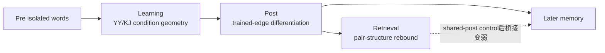
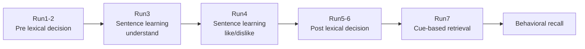

# 将隐喻学习研究提升到 Nature Communications 或 PNAS 的分析与投稿路线

**执行摘要：** 你当前最强证据已经足以支持“learning 调动条件几何、post 出现 YY trained-edge 分化、retrieval 发生部分重绑”的阶段性机制链，但不足以宣称完整因果链。最优策略不是继续扩散分析，而是先锁定主线、用 network composite 与成分分解重建行为桥，再把 learning reactivation 与 directional mapping 降为控制严格的补充分析。 fileciteturn0file0 fileciteturn0file15

## 当前证据链的最佳定位

你的实验是一个被试内、阶段清晰的学习—记忆设计：pre（run1/2 单词前测）→ learning（run3/4 两遍句子学习）→ post（run5/6 单词后测）→ retrieval（run7 线索回忆），材料包括 40 条隐喻句、40 条空间句和 baseline 词对。就你现在已经完成的结果看，最稳的主发现不是“隐喻让两个词越来越像”，而是三段式的表征重组：行为上 YY 记忆优于 KJ；post 阶段 YY trained edge 出现特异性分化；retrieval 阶段同一 pair 的结构又以 rebound 的形式部分回升。相反，same-pair learning-edge trace、global semantic→edge 模型转移，以及 shared-post 控制后的 item-level post→retrieval bridge 都不够稳定。fileciteturn0file1 fileciteturn0file0 fileciteturn0file15

这不是一个“结果散了”的局面，而是一个需要重新命名的问题。与你当前结果最贴近的，不是单纯的“语义靠近”，而是 overlapping-memory 文献中反复出现的双计算框架：一方面，海马和场景/情境系统可以把相关事件区分开以降低干扰；另一方面，提取时又能基于任务要求把关系重新绑定出来。近年的工作明确表明，整合与分离可以在同一任务中并存，而且往往分别服务于推理与事件特异性记忆；更近一步，海马回路和海马—皮层耦合还能以图结构或 geodesic 距离的方式承载这种“边—网络”层面的组织。citeturn17view0turn17view1turn20view0turn20view3

因此，我对你当前数据的总判断是：**不建议暂停并全面返工 Stage1–4.5**。Stage 4.5 已经完成了最关键的 accuracy audit：它把 behavior bridge 从“retrieval 更高”收束到“remembered YY item 的 post similarity 更低”，同时确认 Stage2b 的 learning effect 不是简单 amplitude artifact，也确认 Stage3 的 global RDM null 不是编码方向错误。更合理的做法，是把 Stage1–4.5 作为 accuracy-checked base version 锁定，然后只开展少量、顺序清楚、理论上最能补链条的分析。fileciteturn0file15 fileciteturn0file17

就投稿叙事而言，你现在最值得坚持的主文核心、边界结果和审稿人补充，可以这样分层：

| 层级 | 建议保留内容 | 当前含义 |
| --- | --- | --- |
| 主文核心 | YY 行为优势；post trained-edge differentiation；single-word stability；retrieval pair-structure rebound | 组成一个阶段性机制链 |
| 边界条件 | weak same-pair learning trace；global RDM semantic→edge 未支持；relation-vector 方向混合且 temporal pole 更偏 KJ；shared-post 后 post→retrieval bridge 不稳 | 用来缩窄机制，而不是削弱论文 |
| 审稿人补充 | univariate sanity；novelty/repetition；strict/lenient memory sensitivity；KJ fair characterization | 排除简单解释，保护主线 |

真正的破局点，不再是“再找一个显著 ROI”，而是把主问题从“隐喻语义是否增强”改写为：**隐喻学习如何把原先的 constituent semantics 重新组织为一个 learned relational edge，并在 retrieval 中按任务需求被部分重绑。** 这一定义同时更符合你现有结果，也更接近 entity["scientific_concept","Pattern Separation","episodic memory computation"]、任务驱动重绑与跨网络协调的当代记忆理论。citeturn20view0turn3search0turn17view0turn20view4

## 关键文献与最可借鉴的方法

下面我按“可直接迁移到你当前数据”的优先级来整理，而不是按学科分门别类。真正能直接改写你的分析与叙事的，多数是英文原始论文；中文相关公开研究更多提供上下文、隐喻处理和控制成分的理论线索。你最该看的不是“有没有人做过相同任务”，而是“别人如何把分离、重组、再激活和后续记忆串成可发表的机制链”。citeturn16view0turn16view1

### 记忆整合、分离与网络组织

**Schlichting et al., 2015, Nature Communications**：相关事件学习后，海马与前额叶能够同时显示分离与整合签名。这篇文献对你最重要的启发，是不要把“分离”和“整合”当成互斥解释，而要把它们看成阶段和网络上的互补计算。直接可借的是“两个预定义网络分别建 composite，而不是在 18 个 ROI 上平均扫显著”。优先级：高。citeturn0search1

**Favila et al., 2016, Nature Communications**：学习会让海马中相似事件的表征更彼此远离，而更低的重叠有助于后续学习并减少干扰。这篇文献直接支持你把 Step5C 解释为 targeted differentiation，而不是“失败的相似性增加”。方法上可以借鉴“把相似 pair 与其他 item 的相对距离变化作为主体，而不是只盯同一 pair 的绝对相似度”。优先级：高。citeturn3search0

**Bein et al., 2020, Nature Communications**：先验知识促使海马中配对表征分离，但在左 IFG 中出现有方向的同化，且这种同化是“新信息向旧知识吸附”，而不是对称变化。它几乎是你当前故事的最佳外部参照：海马/空间系统可以写 separation，语义/语言系统可以写重组或定向同化。对你最直接的分析借鉴，是把 directional mapping 限定在 semantic network，而不要把它当成全脑统一机制。优先级：高。citeturn20view0turn20view1

**Audrain & McAndrews, 2022, Nature Communications**：entity["scientific_concept","Schema","memory integration framework"] 一方面促进 mPFC 中的新记忆整合，另一方面 anterior hippocampus–mPFC 的 post-encoding coupling 还能预测之后较粗粒度、但更稳定的 congruent memory。对你最可借的是两个点：第一，post-stage 指标本身就可能是行为桥的关键端点；第二，behavior bridge 不一定非要发生在 retrieval 当下。优先级：高。citeturn20view2turn20view3

**Liu et al., 2026, Nature Communications**：整合表征与分离表征可以在同一关联学习任务中并存，而且分别支持 AC inference 与 source memory；时间分辨 RSA 还显示这些表征会随着重复学习逐步形成。对你非常重要，因为它告诉你：**post differentiation 与 retrieval rebound 并不矛盾**，而是可能各自服务于干扰控制与任务性重建。它还提示你当前 run3/run4 只有一个 whole-trial beta/项时，same-pair learning trace 弱，可能是时间分辨率的问题，不一定是否定机制。优先级：高。citeturn17view0

**Sun et al., 2026, Communications Biology**：海马回路可同时编码语义特征与小世界网络结构，DG-CA3 更偏 differentiation，CA3-CA1 更偏 integration，且海马—retrosplenial 耦合与行为相关。对你最有价值的是“graph / geodesic”角度：如果后期还有精力，可以把 YY 学习写成 relation edge 在局部图上的重塑，而非单纯 pair 相似性下降。优先级：中。citeturn17view1

**Garvert et al., 2023, Nature Neuroscience**：海马中的空间/预测性认知地图可以随任务相关性更新，并可与行为变化共同进入正式路径模型。它是你做“network-level staged path、但不声称 mediation”的最好模板之一。可直接借的是：用一个更保守的 path，把 neural map change、behavioral reliance change 和 inference performance 放进同一框架，而不是先做一堆 ROI 相关再事后拼故事。优先级：中。citeturn20view6

### 学习再激活、后续记忆与表征变化

**Pacheco Estefan et al., 2019, Nature Communications**：海马与 lateral temporal cortex 的 reinstatement 可以在 trial level 上协同，且二者的 trialwise coupling 与记忆相关。它对你最直接的启发，不是再做一个“平均 ERS”，而是做 **representational coupling**：比如 semantic network 的 rebound 与 hpc-spatial rebound 是否在 item/trial 上共同波动。优先级：高。citeturn20view4

**Morton et al., 2023, Cerebral Cortex**：这篇文献非常接近你要补的 learning cue。它把 overlapping encoding 中的 item reactivation 定义成 `r_self - r_within`，并进一步看 reactivation 与 suppression 如何预测后续 inference。你可以直接借鉴 matched-control ERS 的核心公式：`Sim(learning, true pre item) - Sim(learning, within-condition control)`，而不是用宽泛的 raw ERS。它还提供了 representational coupling 的实现逻辑。优先级：高。citeturn19view5turn19view6

**Zou et al., 2025, Cell Reports**：spaced learning 的记忆优势不是因为简单重复，而是因为 re-learning 时“把过去经验重新取回并重新编码”；这种 re-encoding 的 vmPFC 表征变化还能预测行为收益。对你最有价值的不是 vmPFC 本身，而是理论结构：如果 YY 的决定性计算发生在 post 阶段，那很可能是“新关系对旧 constituent 的再编码”，而不是 run3/4 中立刻形成稳定 pair trace。优先级：高。citeturn17view2turn20view5

**Becker et al., 2025, Nature Communications**：顿悟中的 representational change 与海马活动可以共同预测 subsequent memory；随后 Becker & Cabeza 的 2025 综述进一步把这一现象组织成“entity["scientific_concept","Prediction Error","learning signal"] 触发的表征重排与记忆更新”框架。它给你的一个新角度是：你不必执着于在 learning 中找到很强的 same-pair trace。隐喻材料真正增强记忆的关键操作，可能是 post isolated-word 阶段发生的“重新解读”或“关系性再编码”。优先级：高。citeturn19view7turn16view1

**Greco et al., 2024, Nature Communications**：predictive learning 会改变前额叶中的任务表征几何，而且这种几何转移与学习率和任务结构更新有关。它提示你，learning 阶段观察到的 YY/KJ condition-level geometry 也许更像“任务模型被调动”，而不一定是成型的 pair-specific edge。如果你要为 Stage2b 写一句最稳的理论话语，这篇比“learning 已形成强 edge trace”更适配。优先级：中。citeturn11view3

**Naspi et al., 2021 与 Morales-Torres et al., 2024, Journal of Neuroscience**：前者说明 encoding 时 semantic/perceptual representation 以不同方式贡献 true/false memory；后者示范了 item-wise hierarchical mixed-effects，把脑—模型拟合值直接放进项目层模型。对你最可借的是建模层面：brain–behavior bridge 尽量上升到 item-wise crossed model，而不是 subject-average correlation。优先级：中。citeturn18search1turn18search4

### 隐喻、常规化与关系映射

**Hartung et al., 2020, NeuroImage**：novel metaphor 在 supportive context 中可以像 literal sentence 一样被更顺畅地处理，真正决定处理方式的是“有意义的上下文”，而不是“隐喻标签”本身。这与你 learning 阶段只看到 condition geometry、但不见强 same-pair trace 的结果很一致：run3/run4 可能主要调动了语境和控制网络，而不是已经稳定生成 pair edge。优先级：高。citeturn19view2

**Yoon et al., 2021, Scientific Reports**：metaphor comprehension 的瓶颈之一是 interference control；支持性语境通过补足 topic 与 vehicle 的 ground 来帮助映射，冲突语境则阻断这一过程。这篇文献非常适合帮你把“从隐喻语义到关系边重组”的实现问题写清楚：这个过程可能不是自然融合，而是一个受控制、抗干扰的抽取—重映射过程。优先级：高。citeturn19view3

**Liu et al., 2019, Journal of Neurolinguistics**：新词的 metaphorical meaning 可以在语境中被快速学习。这篇更偏行为/ERP，但它提醒你：如果学习发生在句子语境里，而 pre/post 测的是孤立词，那么机制真正出现的位置很可能就是“语境中学到的关系在后测单词上如何被重新施加”。这直接支持你把 post 阶段当作关键 mechanistic endpoint。优先级：中。citeturn13search0

**Cardillo et al., 2012, NeuroImage**：虽然超出 10 年，但与“隐喻常规化”最同构，仍值得保留为基础文献。它表明熟悉化/常规化并不必然等于 source–target 相似度上升，而是可能伴随加工重心向经典左侧 perisylvian 语言网络内移。它能帮助你解释为什么“初始假设是相似性增加，但现在看见的是关系边分化与网络重组”并不等于理论失败。优先级：中。citeturn19view1

### 从文献中提炼出的三条新思路

第一，**把故事从“线性因果链”改成“互补计算链”**。你现在最像的不是一个单线模型，而是“semantic/task model 被调动 → post 出现 adaptive separation → retrieval 出现 task-dependent rebinding”，而且 separation 与 rebound 可能分别服务于干扰控制与记忆提取。citeturn17view0turn17view1turn20view0turn3search0

第二，**把 post 阶段提升为 mechanistic endpoint**。Becker 和 Zou 的工作都在提示：关键的记忆增强操作，可能发生在 representational change 或 re-encoding 时，而不是最初学习时。因此，你现在最有希望做强的，不是“learning pair trace”，而是“post reorganization 与 later memory / retrieval rebound 的关系”。citeturn19view7turn16view1turn17view2

第三，**把单 ROI 预测转成跨网络协调预测**。Pacheco 与 Morton 都说明，trialwise reactivation/reinstatement 的协同，往往比单点激活或单点 similarity 更贴近记忆成败。这意味着你最该补的 brain–behavior bridge，不一定是再找一个单 ROI 相关，而是做 semantic network 和 hpc-spatial network 间的 representational coupling。citeturn20view4turn19view5

## 优先补分析清单

下面这份清单严格按“可行性 × 理论价值 × 与现有结果兼容性”排序。默认策略是：**先在两个 network composite 上做 confirmatory，再把单 ROI 当 follow-up；不要一开始就在 18 个 ROI 上扩散。** 你现在的 cleaned summary 已经接近每条件 35 个 item，而 run7 神经可用样本是 26 人；在这种规模下，我会把 subject-level 相关要求抬高到 |r|≈0.50 才当成可信主文证据，而所有脑—行为桥尽量先走 crossed item model 或 network composite。fileciteturn0file0

| 排序 | 分析 | 目的 | 具体实现 | 预期结果与功效判断 | 放置 | 工时 |
| --- | --- | --- | --- | --- | --- | --- |
| 首要 | **Post component subsequent-memory** | 把 behavior bridge 从“retrieval 更高”改写为“post 更低/更分化” | `memory ~ condition*(post_pair_similarity_z + retrieval_pair_similarity_z) + covariates + (1|subject) + (1|condition_item_id)`；memory 用 `successes in 2 trials` 的 binomial 规格，另做 strict/lenient sensitivity | 最可能稳定；因为它直接对应 Stage 4.5 审计结论。network 层面有希望，单 ROI 不一定稳 | 主文 | 8–12h |
| 很高 | **Network-level staged path** | 把结果压成一条简洁的 staged direct-path | semantic: learning geometry；hpc-spatial: post separation、rebinding；再连到 memory。模型只写 direct paths，不叫 mediation | 至少应得到“YY → post separation”和“post separation → rebound”；memory path 可能弱但可留边界 | 主文 | 10–14h |
| 很高 | **Crossnobis robustness for Step5C** | 证明 post trained-edge differentiation 不是相关系数度量或噪声归一化 artifact | 在 top ROIs 与两个 network 上重算 cross-validated Mahalanobis / crossnobis RDM；与原 Fisher-z correlation 版本并列 | 方向应保持一致、效应略变小。若一致，会显著提高审稿说服力 | 补充，但很重要 | 8–16h |
| 很高 | **Representational coupling across networks** | 用跨网络协同替代脆弱的单 ROI brain–behavior 桥 | item-level 或 subject-level：`semantic_metric ~ hpc_metric*condition + ...`；优先做 retrieval rebound coupling，其次做 learning-reactivation ↔ post separation | 若显著，会是最漂亮的新桥；若不显著，也可降级为边界 | 主文候选 / 补充 | 6–10h |
| 高 | **Matched-control learning reactivation** | 回答学习阶段到底“重激活了什么” | `Sim(learning_sentence, true_pre_constituent) - Sim(learning_sentence, matched_control_pre_words)`；run3/run4 分开；控制 `pre_pair_similarity_z` 和词汇协变量 | 若 run4 在 semantic network 稳定，为“语义 constituent 被调用”提供上游证据；若仍弱，也很有信息 | 补充 | 12–18h |
| 高 | **Learning edge trace robustness** | 给 weak same-pair trace 一个更公平的检验 | `Sim(run3_i,run4_i) - Sim(run3_i,run4_other_same_condition_matched)`；加入 amplitude/quality covariates；最好附 crossnobis 版本 | 可能仍弱，但这能明确表明“不是没测，只是目前证据弱” | 补充 | 8–12h |
| 中高 | **Local variance partitioning of semantic vs edge** | 把 Stage3 的 global null 变成 local/focal 检验 | 只在两个 network 和 4–6 个 top ROI 做 commonality / variance partitioning：`unique_edge`, `unique_embedding`, `shared` | 我不预期全局 shift 会翻盘，但局部 `post unique_edge > pre` 可能成立 | 补充 | 10–14h |
| 中 | **Ordinal / binomial memory sensitivity** | 让 0/0.5/1 的 memory coding 更无可挑剔 | 主版 binomial `cbind(successes, 2-successes)`；如资源允许，再上 ordinal cumulative link / Bayes multilevel | 它更像“防守”，不太会创造新机制，但能保护主文 | 审稿人补充 | 8–12h |
| 中 | **KJ fair characterization package** | 主动处理“只挑 YY 讲”的审稿风险 | 定向汇总 KJ 的稳定特征：relation-vector 方向、weak rebound、学习几何等；与 YY 并列呈现 | 几乎一定有用；它提升的是论文可信度，不是显著数目 | 审稿人补充 | 4–6h |
| 中 | **Within-trial / early-late learning split** | 提供一个真正新的角度，解释为什么 same-pair learning trace 弱 | 若你有足够时间分辨率，可对 run3/4 句子做 early vs late window/FIR split，看效应是否集中在关系关键词或句尾整合窗口 | 高风险高回报；不建议作为两周内主任务，但可作为 2–3 个月延伸 | 补充 / 备选新稿亮点 | 12–20h |

我建议的实际执行顺序是：**先锁 dataset 和 shared-post QC，再做 Post component subsequent-memory、Network staged path、Crossnobis robustness、Representational coupling；只有这四项跑完，才进入 matched-control reactivation 和 learning-edge trace。** 这个顺序的逻辑是：前四项最可能直接提高主文质量，后两项更像“上游补链”和“审稿保护”。

这里再给一个明确的 stop rule：**如果前四项里没有任何一项给出更干净的 network-level bridge，就不要把 Stage 6/7 扩成论文核心。** 那时最好的策略不是继续加分析，而是把负结果明确写成边界条件，把论文收束为“隐喻学习驱动的 relation-edge reorganization 与 retrieval rebound”。

## 统计修正与代码质控框架

你现在最需要的不是更复杂的统计，而是**让每个统计对象的定义都无歧义**。下面这套修正方案，基本对应你已经识别出来的五个关键风险：shared-post coupling、item_id 冲突、pre-similarity 污染、global RDM 共线性以及样本量/多重比较问题。Stage 4.5 和 stagewise spec 已经把问题识别得很准，接下来要做的是把它们写成“固定规则”。fileciteturn0file15 fileciteturn0file17

### 强制锁定的数据规则

**条件化 item ID**

```python
df["condition_item_id"] = (
    df["condition"].str.lower().str.replace(r"[^a-z]+", "", regex=True)
    + "_"
    + df["original_pair_id"].astype("Int64").astype(str)
)

# 必须保证 YY_28 与 KJ_28 不会相遇
assert df.groupby(["subject", "stage", "roi", "condition_item_id"]).size().max() == 1
```

这一步应该在所有 stagewise 表、memory bridge 表、run7 表上统一执行一次，并输出一个 `id_audit.tsv`，列出每个 stage 的 `n_subjects / n_condition_items / duplicates / dropped rows`。fileciteturn0file17

**run 映射与样本交集**

```python
RUN_MAP = {
    "pre": ["run1", "run2"],
    "learning": ["run3", "run4"],
    "post": ["run5", "run6"],
    "retrieval": ["run7"],
}
```

run7 的所有 neural-behavior 分析都必须基于 26 名被试的交集版本单独导出，不允许与 27/28 名的表混用。fileciteturn0file0

### shared-post coupling 的修正

Stage 4.5 已经说明，`rebinding = retrieval - post` 与行为的关系，很容易被共同的 `post` 项驱动。以后不要再把 difference score 当独立机制，而要把 component model 当主模型。fileciteturn0file15

**建议主模型**

```r
m_post_retr <- glmer(
  cbind(memory_successes, 2 - memory_successes) ~
    condition * post_pair_similarity_z +
    condition * retrieval_pair_similarity_z +
    sentence_char_len_z + word_frequency_mean_z + stroke_count_mean_z +
    valence_mean_z + arousal_mean_z + pre_pair_similarity_z +
    (1 | subject) + (1 | condition_item_id),
  family = binomial,
  data = dat
)
```

**difference-score 只能做 sensitivity**

```r
m_diff <- lmer(
  rebinding_z ~ condition * post_separation_z +
    sentence_char_len_z + word_frequency_mean_z + stroke_count_mean_z +
    valence_mean_z + arousal_mean_z + pre_pair_similarity_z +
    (1 | subject) + (1 | condition_item_id),
  data = dat
)
```

报告时只要 `m_post_retr` 与 `m_diff` 方向不一致，就以 component model 为准。R 端优先用 urllme4 文档turn14search5；Python 复核可参考 urlstatsmodels MixedLM 文档turn14search2。citeturn14search5turn14search2

### pre-similarity 污染与 matched-control ERS

Morton 的实现逻辑非常适合你：学习期要问的不是“像不像 pre”，而是“是否比 matched control 更像真正 constituent”。citeturn19view5

**推荐指标**

```python
reactivation_true = sim(learning_pattern, true_pre_constituent_pattern)
reactivation_ctrl = sim(learning_pattern, matched_same_condition_pre_pattern)
constituent_reactivation = reactivation_true - reactivation_ctrl
```

匹配时至少满足四条：

1. 同 condition  
2. 同 role（source/target 或首词/末词）  
3. `abs(pre_pair_similarity_true - pre_pair_similarity_ctrl)` 尽量小  
4. 词频、笔画、情绪价性、唤醒度平衡

如果 `constituent_reactivation` 在控制 `pre_pair_similarity_z` 后仍成立，才可以往“learning reactivation”方向写；否则就把它当成 pre legacy contamination 的边界结果。fileciteturn0file17 citeturn19view5

### global RDM 共线性与 variance partitioning

Stage 4.5 已经说明：`unique_edge_r2` 本身没有方向，不能直接解释为“same-pair 更近/更远”；再加上 embedding、condition、lexical covariates 高度共享方差，global model-RSA 很容易出现“没有 unique fit，但局部 pair effect 很强”的情况。这里最好的做法不是继续解释 beta 正负，而是直接做 commonality / variance partitioning。fileciteturn0file15 citeturn10search5turn1search8

```python
def variance_partition(y, X_cov, X_embed, X_edge):
    r2_full = cv_r2(np.c_[X_cov, X_embed, X_edge], y)
    r2_cov  = cv_r2(X_cov, y)
    r2_no_edge  = cv_r2(np.c_[X_cov, X_embed], y)
    r2_no_embed = cv_r2(np.c_[X_cov, X_edge], y)

    unique_edge  = r2_full - r2_no_edge
    unique_embed = r2_full - r2_no_embed
    shared_embed_edge = r2_full - r2_cov - unique_edge - unique_embed
    return unique_edge, unique_embed, shared_embed_edge, r2_full
```

执行规则也要固定：

- 先做两个 network composite  
- 再做 4–6 个 top ROI follow-up  
- leave-one-subject-out 或 bootstrap by subject  
- 同时报 `model correlation matrix`, `VIF`, `condition number`

如果 `corr(edge, embedding) > .70` 或 VIF 明显过高，就不要再解释单个 beta，只解释 unique/shared variance。对这类模型，建议直接使用 urlrsatoolbox 文档turn1search6、urlPCM toolbox 文档turn1search1 和相应 inference API。citeturn1search6turn1search8turn1search1

### network composite 的建议写法

这是你现在最该做的降维。按 stage spec 的固定网络来，不再新增主 ROI。fileciteturn0file17

```python
SEMANTIC = [
    "temporal_pole", "IFG", "AG", "pMTG_pSTS"
]
HPC_SPATIAL = [
    "hippocampus", "PPA_PHG", "RSC_PCC", "PPC_SPL", "precuneus"
]

df["metric_z_ws"] = (
    df.groupby(["subject", "roi", "metric"])["value"]
      .transform(lambda x: (x - x.mean()) / x.std(ddof=0))
)

net = (
    df.assign(
        network=df["roi"].map(roi_to_network)
    )
    .groupby(["subject", "condition_item_id", "stage", "network", "metric"], as_index=False)
    .agg(metric_value=("metric_z_ws", "mean"))
)
```

默认使用等权平均；只有当你有稳定 split-half 或 same-word stability 指标时，才考虑 reliability-weighted composite。否则不要为了“更高级”而引入第二轮噪声。fileciteturn0file0

### FDR 分层与 evidence tier

这一点如果做好，会极大提升稿件的可信度。

| evidence tier | 推荐用途 | 校正方式 |
| --- | --- | --- |
| Tier A | 预先锁定的两个 network composite 主效应/交互 | 单独 family 内 BH-FDR，q < .05 |
| Tier B | 在 Tier A 成立后才展开的 ROI follow-up | 每个网络内单独 BH-FDR，q < .05 |
| Tier C | exploratory Stage 6/7、directional mapping、单 ROI 边界结果 | 独立 family，q < .10 仅作趋势，或未校正但明确标边界 |
| Reviewer tier | M2/M6/M9/M11 这类防守分析 | 分模块独立 BH-FDR，不回灌主文 |

一句话规则：**不要把 confirmatory、exploratory、reviewer-supplement 的 p/q 混在一张总表里。**

### 最少必做的 QC 清单

- `condition_item_id` 是否全程一致  
- run 映射是否固定为 pre=1/2、learning=3/4、post=5/6、retrieval=7  
- run7 neural-behavior 是否只用 26 人交集  
- matched control 是否在 pre similarity 与词汇属性上平衡  
- Mixed model 是否 singular / convergence warning  
- distance metric 的方向审计是否通过  
- shuffled predictor / pseudo-edge negative control 是否为阴性  
- 所有输出是否只写入 sandbox，并附 manifest / log / sha256

你现有 reviewer-supp sandbox、append-only 流程和 isolation check 其实非常值得保留；这已经很接近高水平期刊想看到的“可复核分析轨迹”。fileciteturn0file11 citeturn22search28

## 投稿结构与可视化方案

### 主文要怎么写才更像 Nature Communications 或 PNAS

按官方标准，Nature Communications 最看重的是：结论有强证据支撑、能影响领域思考，而且有理由获得比专业子领域期刊更大的可见度；PNAS 则要求作者额外写一个面向广义科学读者的 50–120 词 significance statement。换言之，**你不能只说“我们做了很多 ROI 分析”，而必须说这项工作回答了一个更一般的记忆问题。** citeturn22search17turn22search20turn23search10

你最适合的 broad message 不是“隐喻提升了语义相似性”，而是：

> **学习新颖隐喻关系时，大脑并不主要通过让 source 与 target 更相似来建立记忆；更稳的机制是，学习先调动条件/任务几何，随后在 post 阶段把 trained relational edges 重新分化，最终在 retrieval 中按任务要求部分重绑。**

这个表述为什么更有望打动编辑和审稿人？因为它把隐喻研究从一个相对窄的语言问题，提升成了一个更一般的 entity["academic_field","Cognitive Neuroscience","memory and language research"] 问题：**抽象关系学习如何改变 episodic memory representation。** 这与你的海马—语义双网络结果、与整合/分离共存的当代记忆模型、以及顿悟/重编码框架都能对上。fileciteturn0file0 citeturn17view0turn20view0turn19view7

如果按现实可行性排序，我会建议：**先按 Nature Communications 的标准组织全文**；只有当 top four 补分析给出一个更干净的 network-level brain–behavior bridge 时，再把稿子往 PNAS 的广义 significance 去抬。当前直接冲 PNAS 不是不可能，但需要你在 cover letter 和 significance statement 中把“隐喻学习”翻译成“general mechanism of representational change in memory”。citeturn22search9turn23search10

### 主文结构建议

**Introduction**

核心不是铺满隐喻理论，而是用三步推进：

1. figurative / relational learning 常被默认为“远距离概念靠近”，但这一假设缺少阶段分解的神经证据。  
2. 记忆文献提示，相关事件的学习常同时涉及分离、整合和后期再提取，这三者未必在同一阶段体现。  
3. 因此，本研究要问的不是“YY 是否整体更强”，而是：YY 是否诱发一种从 constituent semantics 到 learned relational edge 的阶段性重组。citeturn19view1turn19view2turn20view0turn17view0

**Results**

严格按 stage 组织，而不是按分析脚本组织：

- behavior  
- learning-stage geometry  
- post-stage trained-edge differentiation  
- retrieval-stage rebound  
- network-level staged path and subsequent-memory endpoint  
- boundary analyses

**Discussion**

讨论要坚持三个关键词：

- relation-edge reorganization  
- adaptive separation  
- task-dependent rebinding

不要再回到“为何没看到相似性增加”这一旧框架里打转，而要说明：你通过一系列更强假设的失败，把机制从 broad semantic convergence 缩窄到了 stage-specific representational reorganization。fileciteturn0file0 fileciteturn0file15

### 五张主图草案

| 图 | 核心要素 | 数据来源 | 图示类型 |
| --- | --- | --- | --- |
| Figure 1 | 任务设计、材料结构、行为 YY 优势 | 设计文件 + 行为主表 | 流程图 + 条形/雨云图 |
| Figure 2 | post 阶段 Step5C 与 edge specificity；显示 trained edge、pseudo-edge、KJ 对照 | 现有主结果表 | ROI 轨迹图 + coefficient forest |
| Figure 3 | learning-stage condition geometry 与 Stage2b quality audit | learning profile + stage4.5 audit | network trajectory + control-model forest |
| Figure 4 | retrieval rebound、post/retrieval component decomposition、remembered vs forgotten | retrieval geometry + Stage4.5 + reworked memory model | 轨迹图 + component coefficient plot |
| Figure 5 | network-level staged path；主线与边界条件并列 | staged path、variance partition、coupling | 路径图 + heatmap / stacked variance bars |

### 补充材料清单

补充部分要主动拥抱负结果，而不是藏起来：

- ROI 生成与 meta 来源说明  
- 全 ROI Step5C / edge-specificity 表  
- single-word stability  
- relation-vector、global RDM model competition  
- run7 MVPA 与 cross-role null  
- Stage 4.5 accuracy audits  
- reviewer-supp 的 M2/M6/M9/M11  
- sandbox manifest、isolation report、代码说明  

这会让审稿人更容易接受你的核心结论，因为他们能看到：你不是在“挑显著”，而是在系统检验更强解释后，保留了最合理论证链。你现有的 reviewer-supp README、隔离输出与附录脚本已经非常适合发展成这一部分。fileciteturn0file11 citeturn22search28

### 封面信与审稿回复里怎样写边界条件

封面信最重要的一句话，建议写成：

> We show that metaphor learning does not primarily manifest as a global increase in source–target similarity. Instead, it produces stage-specific reorganization of trained relational edges, with post-learning differentiation and retrieval-stage rebound distributed across hippocampal-spatial and semantic networks.

PNAS 风格的 significance statement 核心也应是这个方向，而不是“隐喻有趣、语言很重要”。citeturn23search10turn23search7

针对负结果，最好的回复框架不是辩解，而是“主动限定”：

- 我们测试了更强的 global model replacement 假设，但未获支持。  
- 我们测试了 learning 阶段已形成稳定 item-specific edge 的假设，但证据较弱。  
- 我们测试了 retrieval-stage bridge 是否独立于 post similarity，但 Stage 4.5 显示主要由 post component 驱动。  

这三条不是弱点，而是让你最终的机制判定更精确：**不是 semantic convergence，不是 role-invariant code，不是纯 retrieval reinstatement，而是 stage-specific relational reorganization。** fileciteturn0file0 fileciteturn0file15

### 可复用可视化模板

下面这些模板足够支撑主文和补充图，而且都能直接落地。

**机制主线 mermaid 流程图**



**阶段时间线 mermaid 图**



这两个模板都可以直接贴到 urlMermaid Live Editorturn14search4 或参考 urlMermaid.js 官方文档turn14search0 生成图。citeturn14search4turn14search0

**ROI 对比条形 / 轨迹图**

- x 轴：stage（pre, post, retrieval）  
- y 轴：pair similarity 或 trained-edge drop  
- 分面：semantic network / hpc-spatial network  
- 颜色：YY vs KJ  
- 只画 top 4–6 ROI，其他全放补充表

**RDM variance-partition 堆叠图**

- 每个柱：一个 network 或 top ROI  
- 分段：`unique_edge`, `unique_embedding`, `shared`, `residual`  
- pre/post 各一组  
- 只在 local model 上作图，不做全 18 ROI 大拼盘

**network coupling 热图**

- 行：semantic learning geometry / semantic rebound / semantic reactivation  
- 列：hpc-spatial post separation / hpc-spatial rebound / memory  
- 颜色：β 或 robust r  
- 单元格标注：effect + q tier

如果你要把 RDM 比较和模型推断标准化，建议直接用 urlrsatoolbox 文档turn1search6 与其 inference 页面；如果你要试更正式的 component model，可以看 urlPCM toolbox 文档turn1search1。citeturn1search6turn1search8turn1search1

## 两阶段工作计划与投稿可行性

### 短期两周计划

| 时间 | 负责人 | 任务 | 所需资源 | 里程碑 | 可交付物 |
| --- | --- | --- | --- | --- | --- |
| 第一天到第二天 | 你 | 锁定 dataset 版本、condition_item_id、run7 交集、shared-post sensitivity | 当前主表、stagewise 脚本、sandbox 结果 | 出版级 QC 通过 | `id_audit.tsv`、`subject_intersection.tsv`、`shared_post_review.md` |
| 第三天到第五天 | 你 | 跑 Post component subsequent-memory 与 staged path 的 network composite 版 | 两 network composite、binomial/continuous 双版本模型 | 至少一个稳的 behavior bridge 或明确 negative boundary | `post_memory_component.tsv`、`stage5_network_path_table.tsv` |
| 第六天到第九天 | 你 + 师兄复核 | 跑 Crossnobis robustness 与 representational coupling | top ROI 与 network 版本 | 主结果 robustness 锁定 | `crossnobis_step5c.tsv`、`repr_coupling.tsv` |
| 第十天到第十二天 | 你 | 重画 Figure 1–5 草图，清理主文与补充分层 | 现有图、结果表 | 全文逻辑定稿 | figure mockups、results skeleton |
| 第十三天到第十四天 | 你 + 师兄 | 决定是否进入 matched-control ERS；若不稳则降级 | 文献表、Stage 6 模板 | 进入中期方案或止损 | `go_no_go_stage6.md` |

### 中期两到三个月计划

| 阶段 | 负责人 | 任务包 | 所需资源 | 里程碑 | 可交付物 |
| --- | --- | --- | --- | --- | --- |
| 第一个月 | 你 | matched-control ERS、learning edge trace robustness、strict/lenient/ordinal memory sensitivity | learning beta 表、pre/post 词模式 | 上游补链是否值得进补充 | Stage 6 附录与 sensitivity tables |
| 第二个月 | 你 + 统计/方法同伴 | variance partition、local RDM、必要时 within-trial learning split | urlrsatoolbox 文档turn1search6、urlPCM toolbox 文档turn1search1 | 机制层模型是否需要升级 | RDM supplement、method appendix |
| 第三个月 | 你 + 师兄 | 全文写作、补充材料整理、代码与数据可用性、cover letter/significance statement | reviewer-supp sandbox、isolation report、投稿说明 | 投稿包完整 | main manuscript、supplement、cover letter、PNAS significance draft |

### 达到投稿质量的可行性与主要瓶颈

如果**现在就投**，我不建议瞄准 Nature Communications 或 PNAS，因为主线虽然有趣，但 behavior bridge 还不够干净，shared-post 问题也会被敏锐审稿人立刻指出。按照官方标准，Nature Communications 需要“足以影响该领域思考的 advance”与强证据；PNAS 还要求你把贡献翻译成跨学科的 significance。citeturn22search17turn22search20turn23search10

如果你完成上面排序最靠前的四项补分析，并且得到以下任一结果，我认为 **Nature Communications 的可行性是中等偏上**：

- network-level 的 post component subsequent-memory 稳定；  
- staged path 至少出现“YY → post separation → retrieval rebound”；  
- Crossnobis 复核不改变 Step5C / edge-specificity 的主方向；  
- representational coupling 给出一个比单 ROI 更像机制桥的结果。  

在这种情况下，PNAS 也不是不能冲，但前提通常要再多一层更广义的理论抓手，例如更清楚的“general mechanism of representational change”定位、一个更漂亮的跨网络行为桥，或者一个更强的外部复核。citeturn19view7turn16view0turn22search17turn23search10

你真正的瓶颈并不是“结果不够多”，而是四件事：

- behavior bridge 目前更像 component effect，而不是单一 retrieval effect；  
- item-level 直接链条的统计功效有限；  
- global RDM 家族存在共线性，不适合作为主证据；  
- 故事容易因过多 exploratory branching 而失焦。  

只要你把这四件事主动收束，当前项目完全有希望从“分析很多但显得散”变成“一篇机制边界清楚、叙事克制、但理论高度足够的认知神经科学论文”。