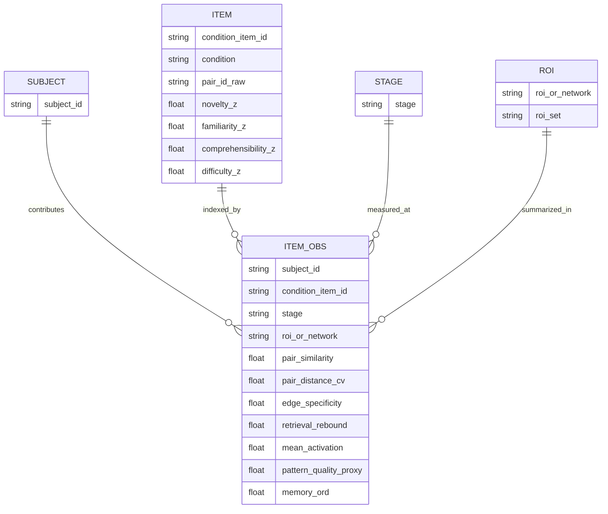
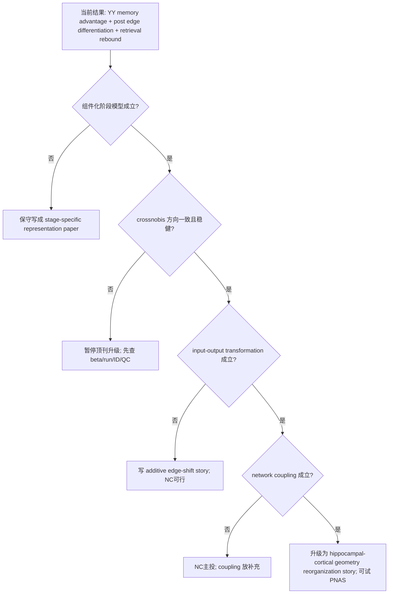
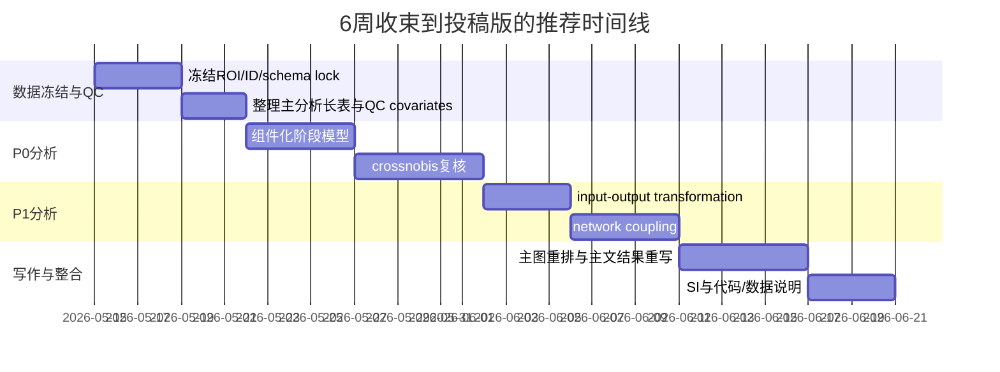

# 将当前隐喻联结 fMRI 工作提升到 NC/PNAS 水平的分析与投稿报告

## Executive summary

你当前的数据已经形成了一条**可发表但尚未“顶刊化”**的主线：YY 隐喻条件在学习后并非简单“更相似”，而是在 post 阶段出现**trained relation edge 的特异性分化**，并在 retrieval 阶段出现**task-driven pair-structure rebound**；行为上，YY 记忆优势稳定，但神经—行为桥接目前主要停留在“remembered YY items 有更强 prior post-stage separation”这一边界结论。fileciteturn0file0 fileciteturn0file13

如果目标是 NC/PNAS，最关键的提升不是继续扩 ROI，而是把论文从“ROI 显著结果堆叠”升级为**记忆/表征几何主导的机制论文**：以隐喻作为实验杠杆，回答“抽象关系学习如何重组 hippocampal-cortical representational geometry”。近五年高影响原始论文的重心也更集中在记忆表征几何、预测学习、学习期重构、以及表征变化与后续记忆的关系，而不是新的隐喻 fMRI 局部激活发现。citeturn14view0turn14view1turn14view3turn14view4turn14view6turn17view0

我建议把后续工作收束为 4 个最高优先级分析：**组件化阶段模型、crossnobis 稳健性复核、input-output transformation、跨网络表征耦合**。前 3 个成功即可支撑 NC；若第 4 个也稳定，并且叙事上能把“隐喻”提升为“抽象关系学习”的一般机制，则可以认真考虑 PNAS。citeturn14view7turn18search0turn14view8turn15view2turn13search0

## 当前主线、证据审计与投稿定位

### 当前主线的最稳版本

基于你当前的全局结果汇总、stagewise spec、以及结果终稿草案，最稳的主线应写成：

> **隐喻关系学习首先在学习阶段调动 YY/KJ condition-level geometry；随后在 post 阶段，YY trained relation edges 在 hippocampal-spatial / scene-context 系统及部分语义控制网络中发生特异性 differentiation；最终在 retrieval 阶段，pair-level structure 以 task-driven rebound 的形式重新出现。行为上，YY 记忆优势稳定，但 remembered YY items 的神经优势主要表现为更强的 prior post-stage separation，而不是 retrieval similarity 普遍更高。** fileciteturn0file0 fileciteturn0file13 fileciteturn0file27

这意味着：**当前不宜写成完整强因果链**（learning trace → post separation → retrieval re-binding → memory），而应写成**阶段性表征链**。这一点与你已完成的 Stage 4.5/终稿草案判断一致。fileciteturn0file0 fileciteturn0file13

### 已证实、未证实与边界条件

| 命题 | 当前状态 | 证据等级 | 当前建议 |
|---|---|---:|---|
| YY 有稳定行为优势 | 已证实 | 高 | 作为全文 behavioral anchor |
| learning 阶段存在 YY/KJ condition-level geometry | 已证实 | 中高 | 作为“学习期被调动的条件几何” |
| post 阶段 YY trained edge differentiation | 已证实 | 很高 | 当前主证据，保留为核心结果 |
| retrieval 阶段 pair rebound / YY-KJ decoding 再出现 | 已证实 | 中高 | 作为 task-driven rebound |
| remembered YY items 更受 prior post separation 支持 | 已证实但需谨慎 | 中 | 用 endpoint bridge 写法，不做强中介 |
| learning item-specific edge trace | 未稳定证实 | 低 | 不再作为主线核心 |
| semantic-to-edge global RDM shift | 未稳定证实 | 低 | 降为边界条件 |
| relation-vector 能解释 YY 优势 | 未证实，且部分方向偏 KJ | 低 | 只保留为边界/补充 |
| post differentiation 直接预测 retrieval rebound | 经共享 post 项复核后不稳 | 低 | 不写强桥接链 |
| hippocampal long-axis / subfield 机制 | 仅 exploratory | 低 | 只在通过 gate 后作为扩展 |

这些判断与你的分析总表、`nc_converge` 和 `hpc_subfield_three_axis` 方案说明是一致的。fileciteturn0file12 fileciteturn0file11 fileciteturn0file13

### 为什么要“memory/geometry first, metaphor second”

近五年直接以隐喻为对象的高影响 fMRI 原始机制论文并不密集；你在线索中最强的近期隐喻来源，实际上是 2023 年的 ALE/MACM 元分析，它总结的是一个**以左侧为主、右半球对 novel metaphor 更敏感**的前额-颞-顶网络框架，而不是一个新的学习—记忆机制模型。相反，2022–2025 年高影响论文的真正机制推进集中在：**schema scaffold、reactivation vs suppression、predictive learning shaping representational geometry、insight-related representational change、practice-related compositional→conjunctive shift**。因此，若瞄准 NC/PNAS，你的论文最有竞争力的定位是：**抽象关系学习如何重组 hippocampal-cortical representational geometry；隐喻是最强操纵，而不是唯一主题。** citeturn14view0turn14view1turn14view3turn14view4turn14view6turn17view0

### 优先参考文献清单

| 作用 | 优先原始/权威文献 |
|---|---|
| 隐喻网络总体框架 | Huang et al., 2023, *Cerebral Cortex*（ALE + MACM） |
| 隐喻熟悉化/novel-to-familiar | Cardillo et al., 2012, *NeuroImage* |
| hippocampal separation / cortical assimilation | Bein et al., 2020, *Nature Communications* |
| learning reactivation vs suppression | Morton et al., 2023, *Cerebral Cortex* |
| schema scaffold / hippocampal anterior-posterior organization | Audrain & McAndrews, 2022, *Nature Communications* |
| predictive learning 更新表征几何 | Greco et al., 2024, *Nature Communications* |
| representational change 与 subsequent memory | Becker et al., 2025, *Nature Communications* |
| compositional → conjunctive 学习转变 | Mill & Cole, 2025, *Nature Communications* |
| unbiased representational distance / crossnobis | Walther et al., 2016, *NeuroImage* |
| representational model inference | Schütt et al., 2023, *eLife* |
| RSA 经典框架 | Kriegeskorte et al., 2008 |
| pattern separation 的正确用法 | Yassa & Stark, 2011；Santoro, 2013 |
| subsequent-memory 因果谨慎性 | Halpern et al., 2023, *PNAS* |

以上文献分别支持你要升级的**理论措辞、统计严谨性、以及高影响叙事框架**。citeturn14view0turn5search6turn14view2turn14view3turn14view4turn14view1turn14view6turn17view0turn14view7turn18search0turn21search0turn21search1turn20search1

## 执行前必须统一的数据规则、预处理规则与 ID 规则

### 必须冻结的分析规则

| 规则 | 必须执行的操作 | 原因 |
|---|---|---|
| ROI 规则 | 主文固定使用 `meta_metaphor` 与 `meta_spatial`；不再新增“显著后补 ROI” | 避免 ROI-fishing，保持外部证据驱动 |
| item ID 规则 | 统一使用 `condition_item_id = paste(condition, pair_id)`；随机效应不使用裸 `pair_id` | 防止 YY/KJ 同 pair_id 混淆 |
| 阶段规则 | `stage ∈ {pre, learning, post, retrieval}`；若写 stage 轨迹，必须显式建模 stage，而非只用差值分数 | 避免 shared-term artifact |
| memory 规则 | `memory_ord ∈ {0, 0.5, 1}` 为主；`memory_strict` 与 `memory_lenient` 为敏感性分析 | 比单一二值化更合理 |
| difference-score 规则 | 所有 `post-to-retrieval` 或 `rebinding` 指标必须做 component decomposition | 当前你已发现共享 post 项会误导解释 |
| QC 协变量规则 | 所有主 LMM 至少纳入 `mean_activation_z` 与 `pattern_quality_proxy_z` 的敏感性版本 | 排除均值激活/信号质量解释 |
| 材料协变量规则 | novelty/familiarity/comprehensibility/difficulty/词频/字长全部预先 z 化，作为固定候选协变量池 | 审稿人最容易质疑材料驱动 |
| 交叉验证规则 | 凡进入“confirmatory geometry”主文的距离分析，优先使用独立 run 分区的 crossnobis / prewhitened distance | 提升结果可解释性与稳健性 |
| long-axis 规则 | 海马 head/body/tail 只在主分析通过 gate 后做 exploratory；不得上升为 definitive subfield claim | 当前掩膜与体素分布信息仍偏 exploratory |

这些规则和你现有的 non-destructive 输出规范、`nc_converge` 与 reviewer supplementary 思路是兼容的。fileciteturn0file12 fileciteturn0file24

### 建议建立的主分析总表

建议所有新分析先合并到一个**长表**，每行是 `subject × condition_item_id × stage × roi_or_network`：

```text
subject_id
condition                 # yy / kj / baseline(if used)
pair_id_raw
condition_item_id
stage                     # pre / learning / post / retrieval
roi_or_network            # e.g., R_HPC, meta_spatial, meta_metaphor
pair_similarity
pair_distance_cv          # if crossnobis available
edge_specificity
retrieval_rebound
mean_activation
pattern_quality_proxy
memory_ord
memory_strict
memory_lenient
novelty_z
familiarity_z
comprehensibility_z
difficulty_z
wordfreq_z
charlen_z
```

### 关键“未指定”细节

| 细节 | 当前状态 |
|---|---|
| 最终纳入样本量（是否所有模块都是 N=28） | **部分指定**：结果汇总中多处显示 28 名被试，但逐分析最终可用样本是否波动仍需最终 QC 明示。fileciteturn0file32 |
| 单 trial beta 估计方法（LSS / LS-A / 其他） | **未指定** |
| 预处理细节（fMRIPrep 版本、平滑核、去噪、scrubbing、高通） | **未指定** |
| item/pair 在各阶段的 run 分配与独立分区方式 | **部分指定**：pre/learning/post/retrieval 阶段已知，但 crossnobis 的可用独立分区需最终明示。fileciteturn0file14 |
| 各 ROI 的体素数阈值、是否 subject-level missing mask | **未指定** |
| run7 是否具备可靠 split-half / independent partition | **未指定** |
| memory 评分的最终写法（ordinal 还是 strict/lenient） | **未指定** |

这张“未指定”表必须在正式投稿前补齐；否则无论是 NC 还是 PNAS，都会在编辑或审稿环节因**可复现性信息不足**而被卡。Nature 体系也明确要求方法、数据、代码与分析设计可复现并可获取。citeturn15view3

### 数据结构 ER 图



## 最优先要做的 4 项分析

### 执行优先级总表

| 优先级 | 分析 | 主要目标 | 风险 | 预期收益 |
|---:|---|---|---|---|
| 1 | 组件化阶段模型 | 解决 current difference-score 解释歧义，明确 behavior bridge | 低 | 极高 |
| 2 | crossnobis / unbiased distance 复核 | 证明主效应不是 correlation-RSA 或信号强度假象 | 中 | 极高 |
| 3 | input-output transformation | 把“post similarity drop”升级为几何转换机制 | 中低 | 高 |
| 4 | network representational coupling | 从单 ROI 升级到跨网络机制 | 中高 | 高/极高 |

这一顺序与当前 `nc_converge` 套件最兼容：第一、二、四项分别对应你已在 spec 中准备的 A4/B2/B3 思路；第三项则是当前最值得新增的理论升级分析。fileciteturn0file12

### 分析一：组件化阶段模型

**目的**  
把你当前最容易被误读的地方——`retrieval_rebinding`、`post_edge_differentiation`、以及 memory difference score——拆成可解释的成分，明确：  
1) YY 的阶段轨迹是否真的是 **post↓ then retrieval rebound**；  
2) 行为主要由 **lower post similarity** 还是 **higher retrieval similarity** 驱动。  
这是当前最优先，因为它直接决定你能否把 Stage 4.5 的结论写得既准又强。你现在的终稿草案已经明确提醒：remembered YY items 的优势主要来自 **prior post-stage separation**，而不是 retrieval similarity 的普遍上升。fileciteturn0file0 fileciteturn0file13

**模型 A：阶段轨迹 LMM**  
网络级优先，ROI 级 follow-up。

```text
pair_similarity_z ~ condition * stage
                  + novelty_z + familiarity_z + comprehensibility_z + difficulty_z
                  + mean_activation_z + pattern_quality_proxy_z
                  + (1 + stage | subject)
                  + (1 | condition_item_id)
```

其中：
- `stage` 设为因子，基线为 `pre`；
- 主检验是 `condition:stage_post` 与 `condition:stage_retrieval`；
- 若随机斜率奇异，退化为 `(1|subject) + (1|condition_item_id)`。

**模型 B：memory component model**  
建议主模型用 ordinal mixed model，敏感性分析再做 strict/lenient logistic。

```text
memory_ord ~ condition * post_pair_similarity_z
           + condition * retrieval_pair_similarity_z
           + novelty_z + familiarity_z + comprehensibility_z + difficulty_z
           + mean_activation_z + pattern_quality_proxy_z
           + (1 | subject)
           + (1 | condition_item_id)
```

若用累积逻辑模型，可写为：

```text
logit[P(memory_ord <= k)] =
  θ_k - (β0 + β1*YY + β2*post_sim_z + β3*retrieval_sim_z
           + β4*YY:post_sim_z + β5*YY:retrieval_sim_z
           + u_subject + v_item)
```

敏感性分析：
- `memory_strict ∈ {1 vs 0/0.5}`
- `memory_lenient ∈ {1/0.5 vs 0}`

**预期结果**  
最理想结果是：
- YY 在 stage model 中显示 `pre → post` 显著下降、`post → retrieval` 部分回弹；
- memory model 中 `YY × post_pair_similarity_z` 为显著负向，而 `YY × retrieval_pair_similarity_z` 弱或不稳定。  
这会把你当前的 behavior bridge 从“模糊的 difference score”升级为**清晰的 component-level endpoint explanation**。fileciteturn0file0 citeturn16view1turn14view6turn20search1

**失败时的替代写法**  
如果 retrieval component 也不稳，不要再硬写“mnemonic reinstatement predicts memory”。改写为：

> memory-relevant neural variation was most clearly expressed as stronger prior post-stage separation of remembered YY items, while retrieval-stage rebound remained primarily a task-state signature rather than a robust independent predictor of memory.

**主可视化**
1. `stage × condition` 轨迹图（网络级，within-subject CI）  
2. memory component 系数森林图（post vs retrieval）  
3. remembered vs forgotten 的 post / retrieval raincloud 图

**优先引用**  
Shao et al., 2023 用 cross-stage pattern similarity 分析三阶段记忆变化；Becker et al., 2025 直接把 representational change 与 subsequent memory 联系起来；Halpern et al., 2023 提醒 subsequent-memory 结果不能轻易上升为“因果机制”。citeturn16view1turn14view6turn20search1

### 分析二：用 crossnobis / unbiased distance 复核 Step5C 主效应

**目的**  
你当前最强证据来自 correlation-RSA 的 post-stage trained-edge differentiation；这已经足够成为发现，但若要冲 NC/PNAS，必须证明它不是：
1) 相关系数度量的偏差；
2) 均值激活差异；
3) 运行间噪音或 pattern-quality 的假象。  
Walther et al. 证明了 crossvalidated Mahalanobis distance 在刻画表征几何时比分类准确率和相关距离更可靠，而且具有**无偏、可解释零点**。Schütt et al. 则进一步强调了 model/RDM inference 需要面向**新被试和新条件**的统计泛化。citeturn14view7turn18search0

**推荐做法**

#### 版本 A：主文 confirmatory 距离模型
如果 pre/post 各阶段有独立 run，可对每个 pair 在每个 stage 计算 `pair_distance_cv`：

```text
pair_distance_cv ~ condition * stage * edge_class
                 + mean_activation_z + pattern_quality_proxy_z
                 + (1 + stage | subject)
                 + (1 | condition_item_id)
```

其中：
- `edge_class ∈ {trained_edge, pseudo_edge, untrained_nonedge}`
- 关键检验是 `condition:stage_post:edge_class_trained`
- 如果 run7 也可独立切分，可额外加入 retrieval；否则主 confirmatory 先只做 pre/post

#### 版本 B：网络级 summary confirmatory
先为每个 subject × network 聚合：
`Δcv = post_cv(trained_edge) - pre_cv(trained_edge) - [post_cv(pseudo)-pre_cv(pseudo)]`

再做：

```text
delta_cv ~ condition + (1 | subject)
```

这比 item-level 弱，但更容易稳定。

**预期结果**  
YY trained edges 在 post 阶段表现为**更大的 crossnobis distance increase**，且这一变化仍强于 pseudo/untrained。若和相关-RSA 同向，会极大增强主文的技术可信度。citeturn14view7turn18search0

**失败时的替代写法**  
如果 crossnobis 方向一致但显著性不足，不必放弃主线。可写成：

> The correlation-based RSA effect replicated directionally with unbiased crossvalidated distances, but the latter was underpowered for item-level edge contrasts in the present design. Therefore, crossnobis results are reported as robustness-oriented convergence rather than the primary inferential basis.

如果方向反向，则必须暂停所有“顶刊升级”动作，先回头查：run 独立性、beta estimation、prewhitening、mask size、以及 pair indexing。

**主可视化**
1. correlation-RSA 与 crossnobis 的 effect size 对照图  
2. 各 network 的 `trained - pseudo` `Δcv` 小提琴图  
3. crossnobis coefficient forest

**优先引用**  
Walther et al., 2016；Schütt et al., 2023。citeturn14view7turn18search0

### 分析三：input-output transformation

**目的**  
你现在最漂亮但也最危险的写法，是把 `post similarity drop` 直接叫作 hippocampal pattern separation。顶刊审稿人很容易抓这一点。更严谨的说法应该是：  
**隐喻学习改变了“pre 输入相似性 → post 输出相似性”的转换函数。**  
这与 Yassa & Stark 的经典框架一致，也符合 Santoro 对 pattern separation 术语的限制：不要把一切相似性下降都直接称为 DG pattern separation。citeturn21search0turn21search1

**主模型**

```text
post_pair_similarity_z ~ condition * pre_pair_similarity_z
                       + novelty_z + familiarity_z + comprehensibility_z + difficulty_z
                       + mean_activation_post_z + pattern_quality_proxy_post_z
                       + (1 | subject)
                       + (1 | condition_item_id)
```

备选写法：

```text
delta_pair_similarity_z = post_pair_similarity_z - pre_pair_similarity_z

delta_pair_similarity_z ~ condition * pre_pair_similarity_z
                        + novelty_z + familiarity_z + comprehensibility_z + difficulty_z
                        + (1 | subject)
                        + (1 | condition_item_id)
```

如果 `pre_pair_similarity` 分布明显非线性，可用样条：

```text
post_pair_similarity_z ~ condition * ns(pre_pair_similarity_z, df = 3) + ...
```

**预期结果**  
若 YY 学习确实在“重组既有语义几何”，你应看到：
- YY 条件下 `pre_pair_similarity_z` 的 slope 更负，或 `delta` 与 `pre_pair_similarity` 的交互更明显；
- 这一效应在 hpc-spatial network 最强，在 semantic/metaphor network 次之。  
这样你就不再只是说“YY 更分化”，而是能说：**隐喻学习系统性改写了输入→输出几何映射。** 这会显著提升 story 的理论级别。citeturn14view1turn14view2turn21search0turn21search1

**失败时的替代写法**  
如果 `condition × pre_pair_similarity` 不显著，但 YY 仍有整体 offset，则改写为：

> YY learning induced an edge-specific post-learning shift that was largely additive rather than input-dependent.

这仍然是可发表结果，只是不能使用“input-output transformation”作为主机制升级。

**主可视化**
1. `post ~ pre` 分条件回归图  
2. `delta ~ pre` 的 partial effect 图  
3. network-level slope forest

**优先引用**  
Yassa & Stark, 2011；Santoro, 2013；Greco et al., 2024。citeturn21search0turn21search1turn14view1

### 分析四：semantic/metaphor network 与 hpc-spatial network 的 representational coupling

**目的**  
当前你的主文还是以单 ROI / network 内部效应为主。对 NC 来说已经可行，但对 PNAS 或更强的机制叙事，还需要一个更系统的问题：

> 学习阶段被调动的 semantic/metaphor condition geometry，是否与 post/retrieval 阶段 hpc-spatial system 的 edge differentiation / rebound 发生协同变化？

这与近期高影响记忆文献非常一致：Morton et al. 证明 overlapping memory encoding 中存在促进 integration 与 differentiation 的分离网络；Audrain & McAndrews 强调 schema scaffold 与 hippocampal 组织；Yu et al. 说明 repetition 会增强 hippocampal-cortical 协同 reactivation；Mill & Cole 则从更一般学习角度提出 subcortex→cortex 的 conjunctive strengthening 轨迹。citeturn14view3turn14view4turn16view3turn17view0

**建议先做 network composite，再决定是否下钻 ROI**

定义：
- `semantic_learning_geom_z`：learning 阶段在 `meta_metaphor` 网络中的 condition geometry 强度
- `hpc_post_sep_z`：post 阶段在 `meta_spatial` 网络中的 edge differentiation
- `semantic_rebound_z`：retrieval 阶段在 `meta_metaphor` 网络中的 rebound
- `hpc_rebound_z`：retrieval 阶段在 `meta_spatial` 网络中的 rebound

**模型 A：learning → post coupling**

```text
hpc_post_sep_z ~ condition * semantic_learning_geom_z
               + novelty_z + familiarity_z + comprehensibility_z + difficulty_z
               + (1 | subject)
               + (1 | condition_item_id)
```

**模型 B：retrieval 同阶段 coupling**

```text
hpc_rebound_z ~ condition * semantic_rebound_z
              + novelty_z + familiarity_z + comprehensibility_z + difficulty_z
              + (1 | subject)
              + (1 | condition_item_id)
```

**模型 C：subject-level representational connectivity**
若 item-level 不稳，退到 subject-level：
先算每位被试在每个 stage / condition 的两网络 RDM 相关（Fisher-z）：

```text
rdm_coupling_z ~ stage * condition + (1 | subject)
```

**预期结果**  
比较理想的是：
- YY 中 `semantic_learning_geom_z → hpc_post_sep_z` 为正；
- 或至少 retrieval 同阶段的 `semantic_rebound_z ↔ hpc_rebound_z` 为正。  
这样你就能把论文从“某些 ROI 里有 edge drop”升级为“**semantic-control / metaphor network 与 hippocampal-spatial system 协同支持抽象关系边重组**”。citeturn14view3turn14view4turn16view3turn17view0

**失败时的替代写法**  
若 coupling 不稳，主文不应继续强写“跨网络机制”。改成：

> The present data most strongly support stage-specific reorganization within hippocampal-spatial and semantic-control systems; direct evidence for item-level inter-network coupling remains inconclusive.

**主可视化**
1. network composite partial regression 图  
2. learning→post coupling 路径草图  
3. subject-level coupling violin/trajectory 图

**优先引用**  
Morton et al., 2023；Audrain & McAndrews, 2022；Yu et al., 2024；Mill & Cole, 2025。citeturn14view3turn14view4turn16view3turn17view0

## 次优先/可选分析与两个替代故事线

### 次优先/可选分析 4 项

| 分析 | 一句话目标 | 简式模型 |
|---|---|---|
| global similarity / representational centrality | 检查 remembered YY 是否在 post 阶段更“去中心化” | `global_similarity_change ~ condition * memory + (1|subject) + (1|item)` |
| novelty/familiarity moderation | 排除“YY 只是更新颖” | `post_edge_sep ~ condition * novelty_z + familiarity_z + comprehensibility_z + difficulty_z + ...` |
| learning-update proxy | 用 run3→run4 的 RT/判断变化估计学习更新量 | `post_edge_sep ~ condition * learning_update_z + ...` |
| hippocampal long-axis exploratory | 测试前后/长轴梯度，但只作 exploratory | `edge_sep ~ condition * axis_position + (1|subject)+(1|item)` |

关于这 4 项的理论来源分别是：Davis et al. 的 global similarity 框架；Cardillo 2012 与 Huang 2023 所体现的 familiarity/novelty 调节；Greco 2024 的 predictive-learning update；以及 Audrain 2022、Bein 2020、近期 hippocampal long-axis 文献对 anterior-posterior 组织的强调。citeturn9search0turn5search6turn14view0turn14view1turn14view2turn14view4turn2search8

### 替代故事线一：抽象关系学习重组记忆几何

这是**最可行、也最接近 NC/PNAS 的大改方向**。核心不再是“隐喻是否特殊”，而是：

> **两种关系学习（隐喻型与空间型）都可形成 relational memory，但隐喻型学习更强地将既有语义几何转化为 differentiated, task-retrievable relation-edge representations。**

**必须具备的关键分析**
1. 行为优势仍在  
2. post 阶段 YY edge differentiation 稳定  
3. crossnobis 复核方向一致  
4. component model 显示 remembered YY 主要依赖 post component  
5. 最好再加 network coupling

**最期待的证据组合**
- 主文写法从“metaphor processing”转向“abstract relational memory”
- KJ 不再作为 null control，而是 active spatial-relational comparison
- relation-vector 不做主证据，只保留为边界条件  
这个故事最符合当前资料生态：隐喻文献提供网络框架与材料意义，真正的新颖机制由记忆/表征几何文献提供。fileciteturn0file13 citeturn14view0turn14view2turn14view3turn14view4turn14view6turn17view0

### 替代故事线二：预测语义更新驱动的表征几何转化

这是**更偏理论、风险略高但也可能很漂亮**的方向。核心命题是：

> **隐喻学习通过更新既有语义预期，重写 pre→post 的表征几何；memory 只是更新成功后的下游结果。**

**必须具备的关键分析**
1. learning-update proxy 稳定  
2. input-output transformation 成立  
3. novelty/familiarity moderation 说明不是单纯材料新颖性  
4. 最好再有 remembered items 在 post 阶段更大 representational shift

**最期待的证据组合**
- `learning_update × condition` 预测 `post_edge_sep`
- `pre_pair_similarity × condition` 预测 `post_pair_similarity`
- remembered YY items 有更大 post shift  
这个故事与 Greco 2024、Becker 2025、以及 Morton 2023 的“更新/重构/representational change”框架高度一致，但对 learning 阶段行为和 trial-level 质量要求较高。若 run3/run4 数据质量一般，不建议把它作为第一替代线。citeturn14view1turn14view6turn14view3

### 机制与决策流程图



## 投稿策略、主文/补充分配、图表清单与预答辩

### 目标期刊与 go/no-go 建议

| 目标 | 何时考虑 | 你当前的现实判断 |
|---|---|---|
| Nature Communications | 前 3 项分析成功；主线清楚；图表收束 | **首选目标** |
| PNAS | 前 4 项都成功，且能把隐喻提升为一般性 abstract relational learning 机制 | **stretch target** |
| Cerebral Cortex / J Neurosci / NeuroImage | 若 crossnobis 或 component model 不稳，但主结果仍清楚 | **安全备选** |

这个判断也符合两本期刊的官方编辑逻辑：Nature Communications 会优先看**novelty、potential impact、conceptual/methodological advance、读者兴趣**；PNAS 则更强调**跨领域 broad significance**，并要求研究意义能以面向非本领域读者的 significance statement 表达。citeturn14view8turn15view2turn13search0

### 主文 vs 补充材料分配

#### 主文建议

| 图/表 | 内容 | 是否必须进主文 |
|---|---|---|
| Fig 1 | 任务设计 + behavior + 主线示意 | 必须 |
| Fig 2 | learning condition geometry（MVPA/RSA） | 必须 |
| Fig 3 | post edge differentiation（相关-RSA） + crossnobis confirmatory panel | 必须 |
| Fig 4 | stage trajectory + componentized memory model | 必须 |
| Fig 5 | input-output transformation | 强烈建议 |
| Fig 6 | network coupling（若阳性）或 KJ active comparison + novelty moderation（若 coupling 不稳） | 建议 |
| Table 1 | 关键模型公式与固定/随机效应摘要 | 建议 |

#### 补充材料建议

| 补充内容 | 去向 |
|---|---|
| 单 ROI 全表、所有 FDR 家族与 QC | SI |
| mean activation / novelty repetition sanity | SI |
| memory strict/lenient/logistic sensitivity | SI |
| relation-vector、directional mapping 边界结果 | SI |
| KJ fair characterization 全展开 | SI |
| hpc long-axis exploratory | SI，除非极强 |
| reviewer supplementary isolation / non-destructive pipeline | SI Methods / Code Availability |

### 图表与统计图的关键清单

| 可视化 | 用途 |
|---|---|
| 阶段轨迹折线图 | 一眼展示 pre→post→retrieval 变化 |
| coefficient forest | 展示 post vs retrieval component、novelty moderation、input-output slopes |
| raincloud / violin | remembered vs forgotten、YY vs KJ |
| partial regression scatter | input-output transformation、network coupling |
| effect-size comparison chart | relatedness/correlation RSA vs crossnobis |
| schematic flow figure | 帮编辑快速理解抽象含义 |

### 预判审稿人质疑与预先答辩要点

| 可能质疑 | 预答辩要点 |
|---|---|
| 你把 similarity drop 过度解释成 pattern separation | 只有在 input-output transformation 成立后才使用该术语；否则统一使用 differentiation / edge reorganization。citeturn21search0turn21search1 |
| 结果是否只是 correlation-RSA 度量偏差或均值激活差异 | 提供 crossnobis confirmatory、mean activation sanity、pattern-quality covariates。citeturn14view7 |
| YY 效应是否只是 novelty/familiarity 造成 | 在主模型中显式加入 novelty/familiarity/comprehensibility/difficulty。citeturn14view0turn5search6 |
| KJ 为什么可以当对照 | 不把 KJ 写成 null control，而写成 active spatial-relational learning comparison |
| 你是否过度上升为完整行为中介 | 不写 full mediation；component model 明确显示行为桥接主要落在 post-stage separation。fileciteturn0file0 |
| ROI 是否后验挑选 | 主文固定外部 meta ROI，避免新增 ROI-fishing。fileciteturn0file13 |
| 代码/数据是否可复现 | 按 Nature 体系要求提供 data/code availability、报告模板、非破坏式输出与复现实验脚本。citeturn15view3 |

### 写作层面的三条硬建议

1. **题目与摘要中优先写 “relational memory / representational geometry / abstract learning”**，不要第一句就写“metaphor processing”。  
2. **在主文里避免 “reinstatement” 与 “pattern separation” 的强词**，除非组件模型和 input-output transformation 都支持。  
3. **把 KJ 写成 active comparison，不是 control/null。**  

如果这样改，你的稿件会更像近五年的 high-impact cognitive neuroscience 论文，而不是传统 figurative language 论文。citeturn14view0turn14view1turn14view3turn14view6turn17view0

### 期刊适配与格式现实

Nature Communications 官方对 Article 的建议非常适合你这种稿件：主文理想上约 5,000 词、最多约 10 个 display items，并允许 Methods 置于主文中；同时编辑会优先看概念推进和方法推进。PNAS 则需要一个 50–120 词、对本科生也可理解的 significance statement，这意味着如果投 PNAS，你必须把“隐喻”翻译成更一般的脑—认知问题。citeturn15view2turn14view8turn13search0turn13search7

## 执行时间表、资源估计与最终建议

### 推荐时间线



### 资源估计

| 项目 | 估计投入 |
|---|---:|
| 数据表整合与 QC | 2–3 天 |
| 组件模型 | 1–2 天编码 + 1 天解释 |
| crossnobis | 2–3 天编码/验证 + 1–2 天计算 |
| input-output | 1–2 天 |
| coupling | 2 天 |
| 图表与写作重构 | 5–7 天 |
| 总计 | 约 3–4 周净工作量 |

### 最后的执行建议

**最重要的总判断是：不要再发散。**  
你现在距离 NC/PNAS 的差距，不在于“结果太少”，而在于：
1. 还缺**一层机制化重写**；
2. 还缺**一层方法稳健性确认**；
3. 还缺**对行为桥接的收敛表述**。  

因此，从今天开始最优策略不是继续扩展新角度，而是按下面顺序推进：

1. **先做组件化阶段模型**，把 Stage 4.5 的逻辑彻底固定；  
2. **再做 crossnobis**，决定这篇稿子是否值得继续顶刊升级；  
3. **然后做 input-output transformation**，把“drop”升级成“geometry transformation”；  
4. **最后做 network coupling**，决定是否从 NC 进一步冲 PNAS。  

如果前 3 项都成功，**NC 已经是现实目标**；如果第 4 项也成功，而且你愿意把论文整体重写为“abstract relational learning reorganizes hippocampal-cortical representational geometry”，那就可以认真尝试 **PNAS**。若第 2 项失败，就应立即停止“顶刊升级”并回到结果准确性核查，而不是继续添加新分析。fileciteturn0file0 fileciteturn0file12 fileciteturn0file13 citeturn14view7turn14view8turn15view2turn13search0

## Open questions / limitations

1. 目前**单 trial beta 估计法、预处理细节、以及各分析最终有效样本量**仍有未指定项；这是投稿前必须补齐的信息。  
2. run7 是否支持真正独立分区的 crossnobis 仍未明确；若不支持，retrieval 的 confirmatory 几何分析应降级为 correlation-RSA 或 split-half exploratory。  
3. hippocampal long-axis / subfield 叙事目前仍是 exploratory，不应在主文中承担决定性机制角色。fileciteturn0file11  
4. 如果 learning-stage item-specific trace 继续不稳，不要再硬写“learning 已形成强 pair-selective edge”；应坚持当前更稳的写法：**learning 调动的是 condition-level geometry，而非稳定 item-specific edge**。fileciteturn0file13