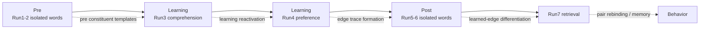

# fMRI隐喻学习实验的因果链补强报告

## 执行摘要

你现有结果已经稳定支持一个“后段机制”：YY 条件在行为记忆上优于 KJ；post 阶段 trained edge 在右海马、PPA/PHG、PPC/SPL、颞极、IFG 等区出现特异性 differentiation；run7 又出现 pair-structure rebound。真正缺的是前段与中段：学习阶段是否已发生 constituent reactivation 与 edge formation，以及这种变化是否把静态语义几何转成 relation-edge 几何，并最终通向 retrieval/memory。文献最一致的结论是：重叠学习会同时招募 integration 与 separation；先验知识和 schema 往往促进皮层整合，而海马分离可降低干扰；再激活可在学习期触发整合，也可在抑制条件下导向分离；隐喻理解本身依赖结构映射与方向性对齐，不是单纯 feature overlap。基于此，最值得优先补的是六类分析：learning constituent reactivation、learning edge trace、semantic→edge model shift、directional mapping、post→run7 re-binding coupling，以及 network-level path modeling。它们能把现有 strongest result——learned-edge differentiation——嵌入一条更完整但仍克制的机制链：learning reactivation / integration–separation → post edge reorganization → retrieval rebinding / memory。citeturn17view3turn17view2turn13view2turn0search2turn13view3turn13view4turn14view1turn15view0turn15view2 fileciteturn0file0

## 文献综合与当前结果定位

从隐喻理论看，你的实验更适合被放进“关系映射”而不是“语义增强”的框架。citeturn0search5turn0search6 的核心主张是：类比/隐喻的关键不是把两个对象的表面属性拉近，而是把 base/source 的**关系结构**映射到 target/topic；而 citeturn0search6turn7search0 进一步指出，新颖隐喻尤其依赖 alignment 和 contextual constraint，而不是一开始就拥有稳定、去语境化的抽象类别表征。fMRI 结果也支持“隐喻有生涯”：novel metaphor 的反复接触会调谐 bilateral inferior prefrontal cortex、left posterior middle temporal gyrus 及右后部枕叶等区。中文研究也显示，新颖汉语隐喻较常规隐喻更依赖右半球和双侧协同，而传统语言区参与的是共享语言加工，而非隐喻专属成分。citeturn13view0turn15view3

从学习与记忆角度，最重要的不是“整合或分离二选一”，而是二者可以在同一任务中并行出现且服务不同目标。citeturn17view3turn17view2 证明，重叠经验在编码期可经 hippocampus–midbrain 与 hippocampus–vmPFC 回路被整合成可推广、可推理的记忆网络；但 citeturn13view2turn0search2turn13view3 同时显示，posterior/anterior hippocampus 与不同 PFC 子区可以分别偏向 separation 与 integration，且 prior knowledge 会把学习推向“海马分离 + 皮层同化”的双通路。citeturn13view3 更进一步把这件事做成 trial-wise RSA：pmPFC 中的 semantic reactivation 和 aHPC 中的 semantic integration 预测后续 inference，而 pHPC / amPFC 的 suppression 则更像“阻断整合、保留分离”的机制。

从 schema、巩固与语义重塑看，文献也与您的数据非常贴合。已有图式可在编码与编码后静息期维持 hippocampal–neocortical connectivity，并促进 congruent 信息向新皮层整合；72 小时到 1 周尺度上，hippocampus 与 mPFC 会逐渐表征跨项目的 overlap/structure，而不是只保留离散事件细节。与此同时，episodic learning 不只是“记住 pair”，还会**不对称地重塑语义空间**，让 cue 对 target 更具预测性、减少干扰；与此一致，insight 研究表明，representational change 本身和 hippocampal activity 都能预测更好的随后记忆。更近期的学习研究甚至直接显示：随着练习推进，神经相似性会下降、conjunctive representation 会增强，而这种 representational geometry 的变化与行为进步相关。citeturn19search0turn18search0turn1search2turn17view0turn13view4turn14view1turn14view2turn14view3turn15view0turn15view1turn15view2

把这些文献与您当前数据并置，当前最有力的结论已经很清楚：你的主版本 ROI 已改为 18 个外部 meta-driven ROI；YY 在行为记忆上优于 KJ；post 阶段最强证据不是整体 YY 增强，而是 learned-edge differentiation，且该效应强于 baseline pseudo-edge、KJ trained edge 与 untrained non-edge；single-word stability 说明该效应不像是 identity collapse；run7 已有 retrieval rebound 与 YY/KJ decoding；但 learning 阶段主要仍停留在 condition-discriminative geometry，relation-vector 方向复杂，brain–behavior link 目前偏弱。也就是说：你最缺的不是“再多找显著 ROI”，而是把 learning、post 和 run7 串成同一套 representational chain。fileciteturn0file0 fileciteturn0file1 fileciteturn0file2

下面这条链，是你现有设计最值得追求的、同时也最不容易过度宣称的版本。它不是 intervention-level causality，而是**stage-wise mechanistic support**：如果六项新增分析中有四项以上按预期成立，这条链就足以写成主线。citeturn17view2turn13view2turn15view0turn15view2 fileciteturn0file0

```mermaid
flowchart LR
    R[Learning constituent reactivation] --> T[Learning edge trace]
    T --> U[Post learned-edge differentiation]
    U --> V[Run7 pair rebinding]
    V --> W[Memory success]
    M[Directional mapping] --> U
    S[Semantic-to-edge model shift] --> U
```





## 六项优先新增分析

建议先冻结记号。对被试 \(s\)、ROI \(R\)、词 \(w\)、pair \(i=(a_i,b_i)\)：

\[
x^{pre}_{sRw},\; x^{post}_{sRw}
\]
表示前后测 isolated-word pattern；  
\[
x^{learn,3}_{sRi},\; x^{learn,4}_{sRi}
\]
表示 run3/run4 学习句 pattern；  
\[
x^{run7}_{sRi}
\]
表示 run7 retrieval 的 pair-level pattern；  
\[
corr_z(u,v)=\operatorname{atanh}(corr(u,v))
\]
表示 Fisher-z 变换后的相似度。  
若两项实验材料不同，优先“**每实验独立估计 → inverse-variance random-effects meta-analysis**”；若材料和 trial structure 可合并，则在 pooled mixed model 中加入 `Experiment` 及其关键交互项。

你当前最该优先投入时间的六项分析如下。优先级综合考虑了**因果链价值、可实现性、与现有结果的一致性、以及 n≈26–30 的功效现实**。fileciteturn0file0

| 优先级 | 分析 | 主要目的 | 关键输入 | 主要 ROI 范围 | 复杂度 | 预期功效 |
|---|---|---|---|---|---|---|
| 高 | 学习阶段 constituent reactivation | 证明 learning 阶段已在调用 pre 语义表征 | pre + run3/run4 | 18 meta ROIs；重点 meta_metaphor | 中 | 中 |
| 高 | 学习阶段 edge trace | 证明 learning 阶段已形成 pair/edge code，而非只有 YY/KJ decoding | run3 + run4 | 18 meta ROIs；重点 HPC/PPA/PPC + TP/IFG | 中 | 中高 |
| 高 | semantic→edge model shift | 直接展示“静态语义 → 学习后 edge 几何”的转化 | pre + post；可扩展 run7 | 18 meta ROIs | 中高 | 中 |
| 中高 | directional mapping asymmetry | 证明隐喻更新是方向性的，不是双向拉近 | pre + post + role annotation | 8 meta_metaphor ROIs 为主 | 中 | 中 |
| 中高 | post differentiation → run7 rebinding | 把 edge reorganization 串到 retrieval | pre + post + run7 | 18 meta ROIs；重点 HPC/PPA/PPC/TP/IFG | 中 | 中高 |
| 中 | network-level path / subsequent-memory | 把脑机制与行为优势连接起来 | 分析 1–5 的 composite 指标 + run7 memory | 两个预定义网络 composite | 高 | 直接路径中等；中介偏低 |

**分析一｜学习阶段 constituent reactivation**

最直接补“learning 阶段发生了什么”的方法，不是再做一次 YY/KJ decoding，而是量化学习句在多大程度上**重新激活**了 pre 阶段 constituent word 的表征。重叠学习、retrieval-mediated learning 与 reactivation 研究都指出：旧经验在新学习中的再激活，是随后 integration、differentiation 和 inference 的入口变量；而你当前学习阶段最大的空缺，正是没有一个可以和 post edge 指标同构的学习期指标。citeturn17view2turn13view3turn5search1 fileciteturn0file0

| 项目 | 具体方案 |
|---|---|
| 计算定义 | 对 run3/run4 中每个 pair \(i=(a_i,b_i)\)：\(\displaystyle Reac_{sRir}= \frac{1}{2}\Big[(corr_z(x^{learn,r}_{i},x^{pre}_{a_i})-\overline{corr}_z^{ctrl,a})+(corr_z(x^{learn,r}_{i},x^{pre}_{b_i})-\overline{corr}_z^{ctrl,b})\Big]\)。控制项为同条件、同位置、非真实 constituent 的词模板均值。 |
| 需要输入 | pre isolated-word beta；run3/run4 single-trial sentence beta；pair 的 constituent 标注；meta ROIs。 |
| 统计检验 | 首选 LMM：`Reac ~ Condition * Run * Experiment + lexical_cov + (1 + Run | Subject) + (1 | Item)`；primary contrast 为 `YY_run4 > KJ_run4`，secondary 为 `Δ(run4-run3)` 的 condition interaction。 |
| 多重比较 | confirmatory：18 meta ROIs 上仅校正一个 primary contrast，BH-FDR；secondary 结果单列。 |
| 预期模式 | TP/IFG/AG/pMTG、海马/PPA/PHG 中 `Reac > 0`，且 YY 在 run4 更强。 |
| 解释 | 学习期已调用 constituent semantics；若后续还能预测 post edge drop，则可把“learning → post”真正接上。 |

```python
# Analysis 1: constituent reactivation
for s in subjects:
    for R in rois:
        pre_word = load_patterns(stage="pre", subj=s, roi=R)   # dict[word] -> voxel vector
        for r in [3, 4]:
            learn_pair = load_patterns(stage=f"run{r}", subj=s, roi=R)  # dict[pair] -> vector
            for i, (w1, w2) in pairs.items():
                ctrl1 = matched_control_words(w1, condition=cond[i], position=1)
                ctrl2 = matched_control_words(w2, condition=cond[i], position=2)
                reac1 = zcorr(learn_pair[i], pre_word[w1]) - np.mean([zcorr(learn_pair[i], pre_word[w]) for w in ctrl1])
                reac2 = zcorr(learn_pair[i], pre_word[w2]) - np.mean([zcorr(learn_pair[i], pre_word[w]) for w in ctrl2])
                reac[s, R, r, i] = 0.5 * (reac1 + reac2)

fit_lmm("reac ~ condition * run * experiment + sent_len + freq + arousal + valence + (1 + run|subject) + (1|item)")
fdr_primary(rois)
```

建议可视化：主文用**两网络 composite 的 run3→run4 轨迹图**，补充材料给 18 ROI 的 raincloud + q-value heatmap；另给一个代表性 ROI 的 same vs control 相似度条形图。

**分析二｜学习阶段 edge trace**

如果分析一回答“learning 调用了什么”，分析二回答“learning 有没有形成 edge”。你目前 learning 阶段最大的漏洞，是所有结果还可以被解释为“YY/KJ sentence category 不同”；只有证明 run3 和 run4 对同一 pair 的跨次呈现具有**真实配对选择性**，learning 才不只是语义加工，而是开始形成 relation-edge trace。Molitor 等工作非常适合做理论背书：再激活可同时推动 DG/CA2,3 differentiation 和 CA1 integration；2026 的时间分辨 RSA 也说明 integrated 和 separated code 在编码中可以并存。citeturn5search0turn15view2turn13view2

| 项目 | 具体方案 |
|---|---|
| 计算定义 | \(\displaystyle LET_{sRi}=corr_z(x^{learn,3}_{i},x^{learn,4}_{i})-\frac{1}{|N_i|}\sum_{j\in N_i}corr_z(x^{learn,3}_{i},x^{learn,4}_{j})\)。其中 \(N_i\) 为同条件、位置匹配、但非真实 pair 的 pseudo/non-edge 集合。 |
| 需要输入 | run3/run4 sentence beta；pair 清单；pseudo-edge / non-edge 匹配规则；meta ROIs。 |
| 统计检验 | `LET ~ Condition * Experiment + lexical_cov + (1|Subject) + (1|Item)`；primary contrast `YY > KJ`；secondary 为 `YY > 0`。 |
| 多重比较 | 18 meta ROIs 上 primary contrast 做 BH-FDR。 |
| 预期模式 | 右海马、PPA/PHG、PPC/SPL 和 TP/IFG 中 YY 的 LET 为正且高于 KJ。 |
| 解释 | learning 阶段已形成 pair-selective code；这是从“impure semantic activation”走向“edge formation”的关键证据。 |

```python
# Analysis 2: learning edge trace
for s in subjects:
    for R in rois:
        run3 = load_patterns("run3", s, R)   # dict[pair] -> vector
        run4 = load_patterns("run4", s, R)
        for i in pairs:
            true_sim = zcorr(run3[i], run4[i])
            pseudo = []
            for j in matched_pseudo_pairs(i, condition=cond[i]):
                pseudo.append(zcorr(run3[i], run4[j]))
            let[s, R, i] = true_sim - np.mean(pseudo)

fit_lmm("let ~ condition * experiment + sent_len + freq + arousal + valence + (1|subject) + (1|item)")
fdr_primary(rois)
```

建议可视化：**true pair vs pseudo/non-edge 的配对 violin**；主文给 composite，补充材料给 ROI-level forest plot。

**分析三｜semantic→edge model shift**

这是最直接回应“没有体现从隐喻语义转向关系边重组”的分析。你当前 relation-vector 结果方向复杂，不能承担主机制；更好的策略是做**模型竞争**：在 pre/post isolated-word RDM 上，直接比较静态 embedding/语义模型与 trained-edge adjacency 模型的解释力变化。如果 post 中 edge model 上升、embedding model 下降或相对弱化，就能把“语义→edge”的转化写成数据事实，而不是理论解释。近期行为与神经研究都支持“学习会重塑既有相似性空间”“practice 会把表示从较松散的 compositional geometry 推向更干扰抵抗的 conjunctive geometry”。citeturn13view4turn15view1turn15view0 fileciteturn0file0

| 项目 | 具体方案 |
|---|---|
| 计算定义 | 对 pre/post word-level neural RDM：\(\displaystyle vec(D^{neural,t})=\beta_1 M_{emb}+\beta_2 M_{edge}+\beta_3 M_{cond}+\beta_4 M_{lex}+\epsilon\)。主指标：\(\displaystyle Shift_{sR}=(\beta^{post}_{edge}-\beta^{pre}_{edge})-(\beta^{post}_{emb}-\beta^{pre}_{emb})\)。 |
| 需要输入 | pre/post isolated-word pattern；词向量或 sentence/word embedding；trained-edge adjacency matrix；条件与词汇控制矩阵。 |
| 统计检验 | ROI 内先对每位被试估计 \(\beta\)，再做 `Shift ~ Condition * Experiment + (1|Subject)`；也可在每个条件内先算 subject-level shift 再做 experiment-level meta。 |
| 多重比较 | 18 meta ROIs 上 BH-FDR；只把 `Shift > 0` 作为 primary hypothesis。 |
| 预期模式 | YY 在 TP/IFG/AG 及 HPC/PPA/PHG 中 `Shift > 0`；KJ 较弱或缺失。 |
| 解释 | 学习后神经几何不再主要由静态词义解释，而越来越体现 learned edge。 |

```python
# Analysis 3: semantic-to-edge model shift
for s in subjects:
    for R in rois:
        for stage in ["pre", "post"]:
            word_patterns = load_word_patterns(stage, s, R)  # n_words x n_vox
            neural_rdm = rsatoolbox.rdm.calc_rdm(word_patterns, method="correlation")
            M_emb  = build_embedding_rdm(words, emb)
            M_edge = build_trained_edge_rdm(words, pairs, condition="within")
            M_cond = build_condition_rdm(words, cond_map)
            M_lex  = build_lexical_cov_rdm(words, freq, length, valence, arousal)
            betas = regress_rdm(neural_rdm, [M_emb, M_edge, M_cond, M_lex])
            beta_emb[s, R, stage], beta_edge[s, R, stage] = betas[0], betas[1]

shift = (beta_edge[..., "post"] - beta_edge[..., "pre"]) - (beta_emb[..., "post"] - beta_emb[..., "pre"])
test_subject_level(shift, by="condition_or_experiment")
fdr_primary(rois)
```

建议可视化：**二维相图**最有效——横轴 `Δembedding fit`，纵轴 `Δedge fit`，每个 ROI 一个点；主文再配一张 stage-wise beta slopegraph。

**分析四｜directional mapping asymmetry**

这项分析用来回答“为什么这是隐喻，而不是普通 pair-binding”。隐喻理论的核心不是双向相似，而是 source/vehicle 对 target/topic 的**方向性更新**。若你能证明 post 阶段是 target 更靠近 source，而不是 source 同样程度地靠近 target，那么“关系边重组”就从普通 associative learning 升级成更像 metaphorical mapping。这个方向直接继承 structure-mapping 和 alignment-first 的理论传统，也与 novel metaphor 的方向依赖、语境依赖相吻合。citeturn0search5turn0search6turn7search0turn13view0turn15view3

| 项目 | 具体方案 |
|---|---|
| 计算定义 | 假设每个 YY item 已标注 target/topic \(t_i\) 与 source/vehicle \(s_i\)：\(\displaystyle Map_{sRi}=[corr_z(x^{post}_{t_i},x^{pre}_{s_i})-corr_z(x^{pre}_{t_i},x^{pre}_{s_i})]-[corr_z(x^{post}_{s_i},x^{pre}_{t_i})-corr_z(x^{pre}_{s_i},x^{pre}_{t_i})]\)。 |
| 需要输入 | pre/post isolated-word pattern；source/target 或 topic/vehicle 的 role annotation；YY/KJ 条件标签。 |
| 统计检验 | primary 仅在 8 个 `meta_metaphor` ROI 上检验 `Map > 0` 与 `YY > KJ`；LMM 或 subject-level t 检验均可。 |
| 多重比较 | 只在 `meta_metaphor` 8 ROI 上做 BH-FDR；spatial ROIs 作为 exploratory。 |
| 预期模式 | YY 在 temporal pole、IFG、AG 最明显；KJ 接近 0。 |
| 解释 | 说明学习不是简单把两个词对称地拉近，而是 target/topic 沿 source/vehicle 方向被更新，这更接近真正的 metaphor mapping。 |

```python
# Analysis 4: directional mapping asymmetry
for s in subjects:
    for R in meta_metaphor_rois:
        pre = load_word_patterns("pre", s, R)
        post = load_word_patterns("post", s, R)
        for i, (src, tgt) in yy_pairs_with_roles.items():
            forward = zcorr(post[tgt], pre[src]) - zcorr(pre[tgt], pre[src])
            reverse = zcorr(post[src], pre[tgt]) - zcorr(pre[src], pre[tgt])
            mapping[s, R, i] = forward - reverse

fit_lmm("mapping ~ condition * experiment + lexical_cov + (1|subject) + (1|item)")
fdr_primary(meta_metaphor_rois)
```

建议可视化：**方向性箭头图 / slopegraph**。对每个代表 ROI 画出 `target→source` 与 `source→target` 的变化量；主文只放 2–3 个 ROI，其他进补充。

**分析五｜post edge differentiation 到 run7 rebinding 的耦合**

这项分析最关键，因为它把既有 strongest result 和 run7 直接接起来。你已经有 `post-pre drop` 和 `run7-post rebound` 两段结果，但它们目前主要是“描述上连得上”。真正需要补的是：同一个 item / pair 上，**更强的 post differentiation 是否真的预测更强的 retrieval rebinding**，以及这二者是否一起关联记忆成功。Tompary & Davachi 的结果提示，随巩固推进，overlap representation 与 episodic reinstatement 会出现 trade-off；而你的设计不是长时巩固研究，但很适合检验“post differentiation 并非遗失，而是 retrieval 时被选择性重绑”。citeturn17view0turn14view1turn14view2 fileciteturn0file0

| 项目 | 具体方案 |
|---|---|
| 计算定义 | 先定义 post differentiation：\(\displaystyle D_{sRi}=corr_z(x^{pre}_{a_i},x^{pre}_{b_i})-corr_z(x^{post}_{a_i},x^{post}_{b_i})\)。再定义 rebinding：\(\displaystyle B_{sRi}=corr_z(x^{run7}_{i})-corr_z(x^{post}_{a_i},x^{post}_{b_i})\)；若 run7 有两种 cue 方向，先在 item 内均值。主模型：\(\displaystyle B_{sRi}\sim D_{sRi}\times Condition_i\)。 |
| 需要输入 | pre/post word pattern；run7 pair similarity metric；memory accuracy / RT；26 名 run7 neural 交集被试。 |
| 统计检验 | item-level LMM：`B ~ D * Condition * Experiment + lexical_cov + (1|Subject) + (1|Item)`；secondary 为 `logit(Memory) ~ D + B + Condition + interactions + (1|Subject) + (1|Item)`。 |
| 多重比较 | `D→B` 斜率在 18 ROI 上做 BH-FDR；`Memory` 模型建议只在两个 composite 上做 confirmatory。 |
| 预期模式 | 右海马、PPA/PHG、PPC/SPL 及 TP/IFG 中 `β_D>0`，而且 YY 更强；remembered YY items 的 \(D\) 与 \(B\) 同时更大。 |
| 解释 | post differentiation 是一种有功能的“去干扰重组”，而不是遗忘；retrieval 时这些 edge 被任务性重绑。 |

```python
# Analysis 5: post differentiation -> run7 rebinding
for s in run7_subjects:
    for R in rois:
        for i, (w1, w2) in pairs.items():
            pre_sim  = zcorr(pre[s,R,w1],  pre[s,R,w2])
            post_sim = zcorr(post[s,R,w1], post[s,R,w2])
            run7_sim = load_run7_pair_similarity(s, R, i)  # average over cue directions if needed
            D[s,R,i] = pre_sim - post_sim
            B[s,R,i] = run7_sim - post_sim

fit_lmm("B ~ D * condition * experiment + sent_len + freq + arousal + valence + (1|subject) + (1|item)")
# composite-only memory model
fit_glmm("memory ~ D_comp + B_comp + condition + experiment + interactions + (1|subject) + (1|item)")
fdr_primary(rois)
```

建议可视化：主文最适合**二维耦合图**——横轴 `D`，纵轴 `B`，分别画 YY 与 KJ 的回归线；再配 remembered vs forgotten 的 raincloud。

**分析六｜network-level path 与 subsequent-memory 桥接**

脑—行为桥接不该再以 18 个 ROI 到处找相关。n≈26–30 时，被试层相关和中介非常脆弱；但如果把 ROI 压成两个**预定义网络 composite**，再用 multilevel path 把分析一到分析五的指标串起来，仍然可以得到一条相对克制、统计上可跑的 mechanistic path。这里最自然的分法，就是把 `meta_metaphor` 作为 semantic/reactivation network，把 `meta_spatial` 作为 hippocampal-spatial binding network。citeturn17view3turn17view2turn19search0turn1search2 fileciteturn0file0

| 项目 | 具体方案 |
|---|---|
| 计算定义 | \(\displaystyle Reac^{Sem}_{si}=mean_z(Reac_{TP,IFG,AG,pMTG})\)；\(\displaystyle D^{HPC}_{si}=mean_z(D_{HPC,PPA/PHG,RSC/PCC,PPC/SPL,Prec})\)；\(\displaystyle B^{HPC}_{si}=mean_z(B_{same\ spatial\ network})\)。路径：\(D^{HPC}\leftarrow Reac^{Sem}\times Condition\)；\(B^{HPC}\leftarrow D^{HPC}+Reac^{Sem}\times Condition\)；\(Memory\leftarrow B^{HPC}+D^{HPC}+Reac^{Sem}+Condition\)。 |
| 需要输入 | 分析 1、5 产生的 item-level 指标；run7 memory；网络 ROI 预定义清单。 |
| 统计检验 | 首选 Bayesian multilevel path / frequentist MSEM；若实现成本高，退而求其次做三步 LMM/GLMM，并以 cluster bootstrap by subject 计算 indirect effect。 |
| 多重比较 | 不做 ROI 级多重比较；因为 composite 预定义。只把 direct paths 作为 confirmatory，indirect effects 作为 exploratory。 |
| 预期模式 | `Reac^{Sem} → D^{HPC} > 0`；`D^{HPC} → B^{HPC} > 0`；`B^{HPC} → Memory > 0`，且 YY stronger。 |
| 解释 | 这是最接近“因果链收口”的统计表达，但结论表述应为“与 stage-wise mediation 一致”，而不是“证明中介”。 |

```python
# Analysis 6: network-level path
sem_rois = ["L/R_temporal_pole", "L/R_IFG", "L/R_AG", "L/R_pMTG_pSTS"]
hpc_rois = ["L/R_hippocampus", "L/R_PPA_PHG", "L/R_RSC_PCC", "L/R_PPC_SPL", "L/R_precuneus"]

for s in subjects:
    for i in items:
        reac_sem[s,i] = zmean([reac[s,R,4,i] for R in sem_rois])
        diff_hpc[s,i] = zmean([D[s,R,i] for R in hpc_rois if (s,R,i) in D])
        bind_hpc[s,i] = zmean([B[s,R,i] for R in hpc_rois if (s,R,i) in B])

# direct paths first
fit_lmm("diff_hpc ~ reac_sem * condition + experiment + (1|subject) + (1|item)")
fit_lmm("bind_hpc ~ diff_hpc * condition + reac_sem + experiment + (1|subject) + (1|item)")
fit_glmm("memory ~ bind_hpc + diff_hpc + reac_sem + condition + experiment + (1|subject) + (1|item)")

# optional indirect effects
bootstrap_indirect(by="subject", paths=[("reac_sem","diff_hpc","memory"),
                                        ("diff_hpc","bind_hpc","memory")])
```

建议可视化：主文用**路径图 + standardized coefficients**；补充材料给 bootstrap 分布和 LOO/WAIC 模型比较表。

## 网络级脑—行为连接策略

你当前的 brain–behavior 问题，不是“相关不够显著”，而是“层级不对”。现有 strongest neural result 明显是网络级的：一组是 temporal pole / IFG / AG / pMTG 所代表的 semantic-integration / selection system，一组是 hippocampus / PHG / PPA / PPC / precuneus 所代表的 binding / scene / contextual system。文献也基本如此组织：hippocampus-vmPFC 支持 integrative encoding 与 inference，pmPFC/schema 支持语义性重激活与新皮层整合，posterior hippocampus 和相关控制区则更偏 differentiation / interference reduction。citeturn17view3turn17view2turn13view2turn19search0turn1search2

建议把脑—行为部分分成四条路线，只保留两条为 confirmatory，其余两条为 exploratory：

| 路线 | 推荐模型 | 最适合回答的问题 | 功效建议 |
|---|---|---|---|
| 被试层 YY 优势 composite | \(\Delta Memory_s \sim \Delta Reac^{Sem}_s + \Delta D^{HPC}_s + \Delta B^{HPC}_s\) | 为什么有的人 YY 优势更大 | 只做 2 个 composite，不再逐 ROI 相关 |
| item-stratified subsequent-memory | `NeuralMetric ~ MemoryOutcome * Condition + (1|S) + (1|Item)` | remembered vs forgotten item 在哪一段开始分化 | 对直接效应最稳，建议为 confirmatory |
| multilevel path / mediation | `Reac → D → B → Memory` | 是否能形成阶段链条 | direct path 可做 confirmatory；indirect effect 列 exploratory |
| representational coupling | `D^{HPC}_{si} ~ Reac^{Sem}_{si}` 或 `B^{HPC}_{si} ~ D^{HPC}_{si}` | 语义网络与海马网络是否 trial-wise 协同 | 适合做机制补图，少做多重 ROI 检验 |

具体建议如下。

首先，把**subject-level composite**仅用于解释整体 YY 行为优势，不要再用它去代替 item-level 机制。被试层模型最稳的 outcome 是 \(\Delta Memory_s = Memory_{YY} - Memory_{KJ}\)。它适合回答“谁会从隐喻学习中获益更多”，但不适合证明学习链条。由于你实际样本在行为、Step5C 与 run7 neural 之间并不完全一致，最好先在实验内对 composite 指标 z 标准化，再做 experiment-stratified 回归或小型 meta。fileciteturn0file0

其次，把**item-level subsequent-memory**设为脑—行为部分的主力。具体做法不是 `memory ~ 18 ROI × 10 neural metrics`，而是只选 3 个预注册 neural metric：`learning reactivation`、`post differentiation`、`run7 rebound`。模型可写为：

\[
logit(P(Memory_{si}=1))=\beta_0+\beta_1 Reac^{Sem}_{si}+\beta_2 D^{HPC}_{si}+\beta_3 B^{HPC}_{si}+\beta_4 Condition_i+\beta_5 Experiment_e+u_s+v_i
\]

然后再看 `Condition × NeuralMetric` 是否显著。这个策略和 Zeithamova / Morton 型 trial-wise 框架更接近，也比被试层相关更有统计效率。citeturn17view2turn13view3

再次，**中介/路径模型**应当降级为“最强的 stage-wise 支持”，而不是最终王牌。因为在 n≈26–30 下，被试层间接效应通常很脆；但 item-level 多层模型对直接路径更友好。所以我建议你把 `Reac→D`、`D→B`、`B→Memory` 三条 direct paths 设为 confirmatory，把 product-of-coefficients 的 indirect effect 设为 exploratory，并用 cluster bootstrap by subject 或 Bayesian credible intervals 报告区间，而不是只报 p 值。

最后，**representational coupling**是一个很值得补的网络级分析，但不要把它和行为强行绑死。最推荐的做法，是在每位被试内估计 item-wise slope：

\[
D^{HPC}_{si} = \alpha_s + \lambda_s Reac^{Sem}_{si} + \epsilon_{si}
\]

或

\[
B^{HPC}_{si} = \alpha_s + \kappa_s D^{HPC}_{si} + \epsilon_{si}
\]

再把 \(\lambda_s\) 或 \(\kappa_s\) 作为 subject-level summary 去解释 \(\Delta Memory_s\)。这样分两步做，通常比一步到位的大而全中介更稳，也更容易解释。

## 稳健性、校正与预注册文本

为了避免 p-hacking，新增分析必须遵守“**固定 ROI、固定 primary contrast、固定校正家族、探索性分析单列**”四条硬规则。你当前最好的基础，是主版本 ROI 已切换到 meta peaks 和理论 atlas，而ไม่再依赖 learning-stage GLM ROI；因此 confirmatory analysis 就应该锁定在这套 ROI 上，legacy 或 atlas 扩展只做 sensitivity。fileciteturn0file0

建议至少做以下稳健性检查，并全部写入 Supplementary Methods：

1. **ROI 冻结**：confirmatory 只用当前 `meta_metaphor + meta_spatial` 18 个 ROI；理论 atlas 与旧 functional ROI 仅作敏感性分析。  
2. **primary outcome 冻结**：每个新增分析只指定一个 primary contrast；例如分析一只报 `YY_run4 > KJ_run4`，分析三只报 `Shift > 0`。  
3. **控制边界**：所有 edge 相关分析都必须同时保留 `baseline pseudo-edge`、`same-condition untrained non-edge` 和 `single-word stability` 三个控制。  
4. **统计一致性**：默认相似度使用与主文一致的相关指标与 Fisher-z；补充材料复核 Spearman 和 cross-validated distance/crossnobis。  
5. **试次与被试剔除标准预先写死**：例如某 cell 有效 trial 少于预定阈值则剔除；run7 只用 neural-behavior 交集被试。  
6. **材料协变量固定**：length、frequency、valence、arousal 以及必要时的 sentence-level ratings 在所有 mixed model 中以同一集合进入。  
7. **实验合并规则固定**：两实验若 item 不共用，则先实验内标准化，再 meta-analysis；若合并，则必须显式建 `Experiment` 主效应和关键交互。  
8. **探索性标签固定**：searchlight、relation-vector 扩展、全脑新 ROI、复杂中介全部标注 exploratory。  

下面这段可以直接作为短版预注册文本放进方案或附录：

> **预注册分析计划短文本**  
> 本研究的 confirmatory ROI 集合固定为 18 个外部 meta-analysis 与理论 atlas 定义的 ROI。新增分析包括：学习阶段 constituent reactivation、学习阶段 edge trace、semantic-to-edge model shift、directional mapping asymmetry、post differentiation 到 run7 rebinding 耦合，以及 network-level direct-path models。每项分析仅指定一个 primary contrast，并在该分析的 confirmatory ROI family 内进行 BH-FDR 校正。run7 相关分析仅纳入具备可用 run7 neural pattern 的被试。所有 mixed models 统一控制词频、长度、情绪价和唤醒度等预定义材料协变量。baseline pseudo-edge、untrained non-edge 与 single-word stability 作为固定负对照。任何 relation-vector 扩展、全脑搜索、额外 ROI family、以及 indirect effect mediation 均标注为 exploratory，不参与主结论裁决。  

## 图版与写作收束建议

如果六项新增分析中至少有“学习阶段 reactivation、学习阶段 edge trace、semantic→edge shift、post→run7 coupling”四项成立，主文完全可以收束成五张图；而且这五张图能把你此前分散的结果串成一条清楚、节制、可防御的机制链。当前已较稳的 backbone 仍是：行为 YY 优势、post 阶段 learned-edge differentiation、single-word stability control、run7 rebound。fileciteturn0file0 fileciteturn0file1

| 主文图 | 核心内容 | 目的 |
|---|---|---|
| Figure 1 | 实验设计、ROI、阶段时间线、预注册主链 mermaid 图 | 让读者一眼看到 pre→learning→post→run7 的机制假设 |
| Figure 2 | 行为结果 + 学习阶段 constituent reactivation + learning edge trace | 把“learning 阶段确实发生了什么”补起来 |
| Figure 3 | semantic→edge model shift + directional mapping asymmetry | 直接证明“从隐喻语义到关系边重组” |
| Figure 4 | post learned-edge differentiation + pseudo/non-edge controls + single-word stability | 保住当前 strongest result，并排除表征崩塌解释 |
| Figure 5 | run7 rebinding、remembered vs forgotten、network path coefficients | 把 post 机制接到 retrieval / memory |

补充材料建议这样分层：  
第一层放 ROI-level 全图、全部 q 值表、替代相似度指标。  
第二层放 atlas / legacy ROI / searchlight 敏感性。  
第三层放 relation-vector、复杂中介、额外探索。  
第四层放 materials covariates、被试剔除、trial QC 和 experiment-specific replication。

结果部分建议用下面这种简洁措辞，不要再说“增强”，而是说“重组、转移、重绑”：

> **Results 建议句式**  
> During learning, YY pairs showed stronger reinstatement of pre-learning constituent representations and stronger cross-run pair-selective edge traces than KJ pairs.  
> From pre to post, representational variance in key semantic and hippocampal-spatial ROIs shifted away from static semantic geometry and toward learned edge geometry.  
> This post-learning differentiation was not explained by global representational instability, because single-word identity remained recoverable.  
> Critically, items showing greater post-learning edge differentiation exhibited stronger run7 rebinding and were more likely to be remembered, especially in the YY condition.

讨论部分建议用下面这种措辞，既能形成“因果链”感觉，又不会越界：

> **Discussion 建议句式**  
> The present data are consistent with a stage-wise account of metaphor learning in which constituent semantic reactivation during learning supports the formation of pair-selective edge traces; these traces are later reorganized into differentiated trained edges after learning and then partially re-bound during retrieval when the learned relation must be accessed.  
> This account does not imply intervention-level causality. Rather, it identifies a temporally ordered representational pathway that is jointly supported by learning-stage, post-learning, and retrieval-stage neural measures.

最后，给你一组最值得常备在文稿里的来源入口。英文主干建议优先引用这些官方页面：urlGentner 1983《Structure-Mapping》turn0search5、urlGentner & Wolff 1997《Alignment in the Processing of Metaphor》turn0search6、urlPrat et al. 2012《An fMRI Investigation of Analogical Mapping in Metaphor Comprehension》turn7search0、urlCardillo et al. 2012《From novel to familiar》turn8search6、urlShohamy & Wagner 2008turn4search0、urlZeithamova et al. 2012turn3search1、urlSchlichting et al. 2015turn1search0、urlBein et al. 2020turn0search2、urlAudrain & McAndrews 2022turn1search2、urlWalsh & Rissman 2023turn9search2、urlBecker et al. 2025turn10search0、urlLiu et al. 2026turn12search1、urlMill et al. 2025《Dynamically shifting from compositional to conjunctive brain representations》turn10search11。中文补充可参考 url《汉语隐喻加工的fMRI研究》turn11search5、url《概念隐喻记忆的双语研究综述》turn11search4、url《自然科学领域的隐喻研究可视化分析》turn11search7。