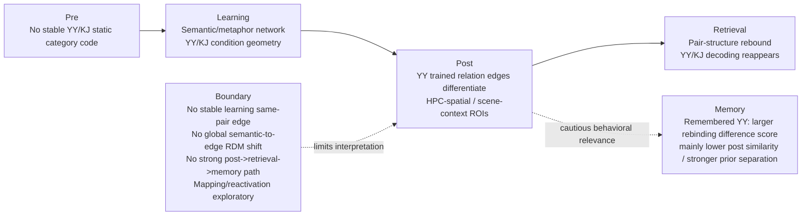

# Stagewise Mechanism Chain Spec

更新时间：2026-05-10  
目标：围绕老师新建议和当前已完成结果，稳扎稳打补强论文机制链。  
核心原则：**每一部分单独写代码、review 代码、执行分析、整理结果、解释结果、判断方案问题或代码 bug，经用户审核后再进入下一部分。**

## 0. 总体定位

当前最稳主线不是完整因果链：

```text
constituent reactivation
  -> learning edge trace
  -> post edge differentiation
  -> run7 rebinding
  -> memory
```

而是更保守、更符合已有数据的阶段性证据链：

```text
Behavior:
YY memory advantage

Learning:
YY/KJ condition-level geometry emerges in semantic/metaphor network

Post:
YY trained relation edges show specific differentiation,
especially in hippocampal-spatial / scene-context system

Retrieval:
YY pair-structure rebounds and YY/KJ decoding reappears;
remembered YY items show stronger hpc-spatial re-binding
```

一句话版主线：

```text
隐喻关系学习并不表现为学习阶段已经形成稳定 item-specific edge，
也不表现为全局 RDM 从语义模型转向 edge 模型；
更稳的模式是：学习阶段调动语义条件几何，
post 阶段出现 trained-edge differentiation，
retrieval 阶段发生任务相关 re-binding，
而行为相关性主要表现为 remembered YY items 具有更大的
hpc-spatial rebinding difference score，
但这一效应主要来自 post 阶段更低的 pair similarity /
更强的 prior post-stage separation，
而不是 retrieval similarity 本身更高。
```

边界：

```text
learning item trace,
semantic-to-edge global RDM shift,
post-to-retrieval item bridge,
source-to-target mapping
do not support a strong full causal chain.
```

因此，后续 Stage 4.5 和 Stage 5 的目的不是加强 causal chain，而是做 accuracy audit 和 evidence integration。

本 spec 的目的不是“继续找显著”，而是把几个理论上值得深入的分析重新实现为更准确的指标，并逐步判断：

```text
是阶段性证据支持？
是边界条件？
是指标实现不准？
还是代码/ID/控制项 bug？
```

## 1. Non-Destructive Rule

所有新代码和输出必须独立命名，不覆盖旧结果。

新脚本建议目录：

```text
metaphoric/final_version/brain_behavior/stagewise_mechanism/
```

新输出目录：

```text
E:/python_metaphor/paper_outputs/qc/stagewise_mechanism/
E:/python_metaphor/paper_outputs/tables_exploratory/stagewise_mechanism/
E:/python_metaphor/paper_outputs/figures_exploratory/stagewise_mechanism/
```

只读输入：

```text
E:/python_metaphor/pattern_root/
E:/python_metaphor/roi_library/manifest.tsv
E:/python_metaphor/stimuli_template.csv
E:/python_metaphor/materials_detail/实验材料整理.xlsx
E:/python_metaphor/paper_outputs/qc/learning_post_memory_prediction/
E:/python_metaphor/paper_outputs/qc/learning_reactivation_mapping/
E:/python_metaphor/paper_outputs/qc/retrieval_geometry/
E:/python_metaphor/paper_outputs/qc/edge_specificity/
E:/python_metaphor/paper_outputs/qc/mixed_effects/
```

禁止覆盖：

```text
result_new_meta_roi.md
result_new_meta_roi_v1.md
new_rerun_list.md
new_rerun_list_v1.md
existing qc result directories
```

每一阶段完成并经用户审核后，才考虑追加到结果文档。

## 2. Fixed Design Rules

### 2.1 ROI Policy

Confirmatory ROI 固定为：

```text
meta_metaphor: 8 ROIs
meta_spatial: 10 ROIs
```

解释规则：

- 不新增主 ROI。
- 不使用 learning-stage GLM ROI 作为主分析 ROI。
- 新 ROI、language/ToM、legacy mask、searchlight 只作为 SI / sensitivity。
- 每个 ROI 单独报告；必要时再做预定义 network composite。

### 2.2 Item ID Policy

YY 和 KJ 不能按数字 `pair_id` 配对。

正确 ID：

```text
condition_item_id = condition + "_" + original_pair_id
```

例子：

```text
yy_28 != kj_28
```

所有 mixed model / item random effect 必须使用 `condition_item_id`。

### 2.3 Memory Outcome Policy

当前 memory 为：

```text
0 / 0.5 / 1
```

它不应被直接塞进 binary logistic mixed model。

优先策略：

```text
memory_successes = memory * 2
memory_trials = 2
binomial mixed model: cbind(successes, trials-successes)
```

如果 Python 实现受限：

1. 主报告先用 network-level continuous sensitivity。
2. 严格二分 `0/1` 作为 sensitivity，`0.5` 单独标为 uncertain 或剔除。
3. ordinal model 作为可选高阶实现，不作为第一轮阻塞项。

### 2.4 Covariate Policy

固定材料协变量：

```text
sentence_char_len_z
word_frequency_mean_z
stroke_count_mean_z
valence_mean_z
arousal_mean_z
pre_pair_similarity_z
```

其中：

```text
pre_pair_similarity_z = neural pre-stage pair similarity
```

不是 BERT、词标签或文本相似度。

## 3. Iterative Execution Protocol

每一个分析阶段必须按以下循环执行，不允许跳步。

```text
Step 1. 写代码
Step 2. review 代码
Step 3. 小样本 / dry-run 执行
Step 4. 全量执行
Step 5. 整理结果
Step 6. 分析结果
Step 7. 判断：方案问题 or 代码 bug or 数据边界
Step 8. 若是 bug/指标错误，修正后重跑
Step 9. 汇报给用户
Step 10. 用户审核通过后，进入下一阶段
```

### 3.1 Code Review Checklist

每次代码 review 必须检查：

| 检查项 | 必须满足 |
| --- | --- |
| 输入目录 | 只读旧结果，不覆盖 |
| 输出目录 | 写入 `stagewise_mechanism/` 新目录 |
| ID | 使用 `condition_item_id`，不把 YY/KJ 数字 id 配对 |
| ROI | 使用 `meta_metaphor/meta_spatial` |
| run7 | 只用有 run7 neural pattern 的被试交集 |
| 相似度 | Fisher-z correlation，和现有 RSA 保持一致 |
| 控制项 | matched pseudo/control 或 `pre_pair_similarity_z` 按 spec 进入 |
| 统计 | 明确 primary contrast 与 FDR family |
| QC | 输出 n_subjects、n_items、n_rows、missingness、convergence |
| 结果解释 | 不把 exploratory 写成 confirmatory |

### 3.2 Result Diagnosis Rules

结果出来后先做诊断，不急着下结论。

| 情况 | 判断 | 下一步 |
| --- | --- | --- |
| QC failure / ID collision / missing source columns | 代码或数据整理 bug | 停止，修代码 |
| 方向完全反常且过程值异常 | 可能代码 bug | 抽查 item-level 原始行 |
| 主效应不显著但方向合理 | 数据边界或 power 问题 | 作为边界结果，不立刻放弃理论 |
| 主效应显著但 control 也显著 | 指标不够干净 | 增强 control / residualization |
| 主效应显著且 control 合格 | 可进入结果汇报 | 等用户审核 |
| 与旧结果矛盾 | 先查公式、ID、样本交集 | 不直接推翻旧结果 |

## 4. Stage 1: Post Differentiation -> Run7 Rebinding Coupling

### 4.1 Why First

Stage 1 是原始 post-to-retrieval bridge 检验，历史上用于检验 post separation 是否预测 run7 re-binding。已有结果曾显示：

```text
YY condition -> hpc-spatial post separation
hpc-spatial separation -> retrieval re-binding
```

但由于 post separation 和 retrieval re-binding 都包含 post similarity 项：

```text
post_edge_specificity / post_separation contains post_pair_similarity
retrieval_rebinding = retrieval_pair_similarity - post_pair_similarity
```

该阶段结果必须以后续 post-control sensitivity 和 Stage 4.5 difference-score audit 为准。Raw association 不能作为主机制桥，也不能单独写成 post separation -> retrieval re-binding 的强证据。

Stage 1 要进一步问 item-level：

```text
post edge differentiation stronger 的 item，run7 rebinding 是否也更强？
```

### 4.2 Core Metrics

对 subject `s`、ROI `R`、item `i=(a,b)`：

```text
post_edge_differentiation =
  pre_pair_similarity - post_pair_similarity
```

或优先使用更干净的：

```text
post_edge_specificity =
  trained_edge_drop - same_condition_pseudo_edge_drop
```

retrieval re-binding：

```text
retrieval_rebinding =
  retrieval_pair_similarity - post_pair_similarity
```

### 4.3 Primary Model

ROI-wise:

```text
retrieval_rebinding ~ post_edge_specificity_z * condition
                    + pre_pair_similarity_z
                    + material_covariates
                    + (1 | subject)
                    + (1 | condition_item_id)
```

Network-level confirmatory:

```text
hpc_spatial_rebinding ~ hpc_spatial_post_separation_z * condition
                      + pre_pair_similarity_z
                      + material_covariates
                      + (1 | subject)
                      + (1 | condition_item_id)
```

### 4.4 Primary Contrast

```text
post_edge_specificity_z -> retrieval_rebinding
post_edge_specificity_z × YY
```

重点看 `meta_spatial` 和 hpc-spatial composite。

### 4.5 Expected Outcomes

原始强结果假设：

```text
post separation positively predicts run7 rebinding,
especially in YY / hpc-spatial network.
```

但解释必须加 post-control / difference-score guard：

```text
If the effect disappears after controlling post similarity,
or if later memory effects are driven by the post component,
write Stage 1 as historical/sensitivity evidence rather than a main bridge.
```

中等结果：

```text
main slope positive, condition interaction not significant.
```

仍有价值，但只能写成 post separation 与 retrieval rebinding 的 historical/general coupling，并等待 post-control sensitivity 决定是否保留。

阴性结果：

```text
no item-level coupling, but network-level mixed model condition path remains stable.
```

说明已有结果更多是 condition/network-level stage evidence，不是 item-by-item mechanistic bridge。

### 4.6 Deliverables

```text
stage1_post_to_retrieval_item.tsv
stage1_post_to_retrieval_models.tsv
stage1_post_to_retrieval_qc.tsv
stage1_post_to_retrieval_review.md
```

### 4.7 User Gate

Stage 1 完成后必须向用户汇报：

```text
代码改了哪些文件
QC 是否通过
主结果是否支持
若不支持，是代码问题、指标问题还是数据边界
是否建议进入 Stage 2
```

用户确认后才能进入 Stage 2。

## 5. Stage 2: Learning-Phase Cross-Run Geometry

### 5.1 Purpose

回答：

```text
learning 阶段是否已经有 item-specific trace？
YY/KJ 的 learning-stage cross-run geometry 是否不同？
```

Stage 2 分为 2a 和 2b。2a 只检验同一学习材料从 run3 到 run4 是否有 item-specific stability；2b 使用完整 run3 × run4 similarity matrix，检验 condition-level geometry、same-pair trace 以及 same-pair × condition。

### 5.2 Stage 2a: Item-Specific Learning Trace

2a 不再作为 YY/KJ 主机制证据，因为 specificity 指标会主动扣掉 condition 内共享信息。它只回答：

```text
同一句子 / 同一 pair 是否从 run3 到 run4 有特异稳定痕迹？
```

计算三个指标：

```text
row_specificity_i =
  Sim(run3_sentence_i, run4_sentence_i)
  - mean Sim(run3_sentence_i, run4_sentence_j, j != i)

column_specificity_i =
  Sim(run3_sentence_i, run4_sentence_i)
  - mean Sim(run3_sentence_j, run4_sentence_i, j != i)

bidirectional_specificity_i =
  Sim(run3_sentence_i, run4_sentence_i)
  - 0.5 * [
      mean Sim(run3_sentence_i, run4_sentence_j, j != i)
      +
      mean Sim(run3_sentence_j, run4_sentence_i, j != i)
    ]
```

解释：

```text
row_specificity：run3 item 的 later self-match
column_specificity：run4 item 是否选择性继承自己的 run3 pattern，更符合时间方向
bidirectional_specificity：不依赖单一 anchor 的保守 item trace
```

2a 的主结果只看：

```text
specificity > 0, pooled across YY and KJ
```

2a 不估计 condition 主效应或 YY/KJ contrast。`condition` 只保留为数据列和 QC 标签，YY/KJ learning geometry 交给 2b 的 full matrix model。

pooled adjusted model:

```text
specificity_metric ~ pre_pair_similarity_z + material_covariates
```

### 5.3 Stage 2b: Cross-Run Matrix Model

2b 是真正回答 YY/KJ learning geometry 的分析。不要先 subtract condition baseline，而是保留完整矩阵：

```text
Sim(run3_i, run4_j) ~ same_pair_ij * condition
                    + row/column item controls where feasible
                    + subject clustering / random effect
```

关键项：

```text
condition：YY/KJ 整体 cross-run geometry 是否不同
same_pair：是否存在 item-specific trace
same_pair × condition：YY 是否有更强 item-specific trace
```

模型分两层：

```text
primary matrix model:
  cross_run_similarity ~ same_pair * condition

item-fixed sensitivity:
  FWL residualization against row_item + column_item,
  then cross_run_similarity_resid ~ same_pair_resid
                                  + same_pair_x_condition_resid
```

item-fixed sensitivity 不估计 condition 主效应，因为 row/column item fixed effects 会吸收 condition。只解释 same_pair / same_pair × condition。

### 5.4 Expected Outcomes

强结果：

```text
Stage 2a pooled bidirectional specificity > 0
Stage 2b same_pair > 0
Stage 2b same_pair × YY > 0
```

中等结果：

```text
Stage 2b condition effect or MVPA shows YY/KJ geometry,
but same_pair / same_pair × YY weak
```

可解释为：

> learning 阶段主要调动 condition-level geometry，而不是形成稳定 item-specific relation edge。

阴性结果：

```text
2a item-specific trace weak
2b same_pair weak
2b condition weak
```

说明 learning sentence pattern 中没有稳定 pair trace；保留已有 learning MVPA 作为 condition readout 证据。

### 5.5 Deliverables

```text
stage2a_learning_item_trace_item.tsv
stage2a_learning_item_trace_models.tsv
stage2b_cross_run_matrix.tsv
stage2b_cross_run_matrix_models.tsv
stage2_learning_trace_qc.tsv
stage2_learning_trace_review.md
```

### 5.6 User Gate

Stage 2 完成并汇报后，用户审核通过再进入 Stage 3。

## 6. Stage 3: Semantic-to-Edge Model Shift

### 6.1 Purpose

回答：

```text
神经几何是否从 static semantic geometry 转向 learned-edge geometry？
```

这是 relation-vector 原方案的更稳替代，不再只问某个 relation-vector beta 是否显著。

### 6.2 Models

对 pre/post word-level neural RDM：

```text
NeuralRDM ~ embedding_model
NeuralRDM ~ edge_model
NeuralRDM ~ embedding_model + edge_model
NeuralRDM ~ embedding_model + edge_model + condition_model + lexical_covariate_models
```

Primary index:

```text
semantic_to_edge_shift =
  (post_edge_unique_fit - pre_edge_unique_fit)
  - (post_embedding_unique_fit - pre_embedding_unique_fit)
```

### 6.3 Key Technical Requirement

必须检查 model collinearity：

```text
correlation among model RDMs
variance inflation / condition number
unique vs shared variance partitioning
```

如果 embedding、condition、edge 高度共线，不能只解释 beta。

### 6.4 Primary Model

```text
semantic_to_edge_shift ~ condition
                       + material_covariates
                       + (1 | subject)
                       + (1 | condition_item_id)
```

如果该指标只能在 subject-level 估计：

```text
semantic_to_edge_shift_subject ~ condition/network
```

并清楚标注层级。

### 6.5 Expected Outcomes

强结果：

```text
YY shows larger shift toward edge model than KJ,
especially in hippocampal-spatial and temporal-semantic ROIs.
```

中等结果：

```text
edge model increases post-learning, but YY-KJ weak.
```

可写成 learned-edge geometry emergence。

阴性结果：

```text
no unique edge shift after controlling embedding/condition.
```

说明 post edge specificity 更适合用 direct pair-similarity contrast 描述，而不是 global RDM model shift。

### 6.6 Deliverables

```text
stage3_semantic_edge_rdm_table.tsv
stage3_semantic_edge_model_collinearity.tsv
stage3_semantic_edge_shift_models.tsv
stage3_semantic_edge_shift_review.md
```

### 6.7 User Gate

Stage 3 完成并汇报后，用户审核通过再进入 Stage 4。

## 7. Stage 4: Subsequent-Memory Rework

### 7.1 Purpose

用经典 subsequent-memory 逻辑重做行为桥接：

```text
不是 memory ~ neural_metric 到处找相关，
而是 later remembered vs forgotten item 是否在 neural metric 上不同。
```

### 7.2 Primary Neural Metrics

只使用三个预定义指标：

```text
learning_edge_trace
post_edge_specificity / hpc_spatial_post_separation
retrieval_rebinding / hpc_spatial_rebinding
```

不做 18 ROI × 多指标全扫。

### 7.3 Primary Model

Network composite:

```text
neural_metric ~ memory_score * condition
              + material_covariates
              + (1 | subject)
              + (1 | condition_item_id)
```

Memory outcome sensitivity：

```text
main: memory as 0/0.5/1 continuous score
sensitivity A: binomial successes out of 2
sensitivity B: strict remembered vs forgotten, excluding 0.5
```

如果实现 binomial mixed model：

```text
memory_successes ~ neural_metric * condition
                 + material_covariates
                 + (1 | subject)
                 + (1 | condition_item_id)
family = binomial, trials = 2
```

### 7.4 Expected Outcomes

强结果：

```text
remembered YY items show stronger post separation and/or retrieval rebinding.
```

Interpretation guard:

```text
Any retrieval-rebinding memory effect must be decomposed in Stage 4.5
into retrieval similarity and post similarity components before interpretation.
```

中等结果：

```text
retrieval rebinding relates to memory, but learning/post metrics weak.
```

阴性结果：

```text
neural representational chain robust, but item-level memory prediction weak.
```

这不是失败，而是论文边界：

> neural representational re-binding is robust, but direct item-level behavioral prediction remains limited.

### 7.5 Deliverables

```text
stage4_subsequent_memory_item.tsv
stage4_subsequent_memory_models.tsv
stage4_subsequent_memory_sensitivity.tsv
stage4_subsequent_memory_review.md
```

### 7.6 User Gate

Stage 4 完成并汇报后，先进入 Stage 4.5 accuracy audit，而不是直接进入 Stage 5。

## 8. Stage 4.5: Accuracy Audits Before Integration

### 8.1 Purpose

Stage 4.5 只做三个准确性复核，目标是确认当前关键解释没有被 difference-score、pattern quality 或 Stage 3 model coding 误导。

这一步不是寻找新主结果；它决定 Stage 5 integration table 中哪些证据可以写强、哪些只能写边界。

### 8.2 Audit 1: Stage 4 Memory Bridge Difference-Score Decomposition

Stage 4 的核心行为桥接来自：

```text
hpc_spatial_rebinding = retrieval_pair_similarity - post_pair_similarity
```

因此必须拆开确认：

```text
memory_score -> retrieval_pair_similarity
memory_score -> post_pair_similarity
memory_score -> retrieval_minus_post_pair_similarity
```

Primary model:

```text
component_metric_z ~ memory_score * condition
                   + material_covariates
                   + (1 | subject)
                   + (1 | condition_item_id)
```

其中 `component_metric` 至少包括：

```text
hpc_spatial_retrieval_pair_similarity
hpc_spatial_post_pair_similarity
hpc_spatial_rebinding
```

Interpretation rule:

```text
如果 YY memory slope 主要出现在 retrieval similarity：
  write as retrieval endpoint re-binding / mnemonic reinstatement.

如果 YY memory slope 主要来自 lower post similarity：
  write as remembered items had stronger prior post separation,
  not retrieval-specific re-binding.

如果两者都贡献：
  write as difference-score composite and report component decomposition.
```

Deliverables:

```text
stage45_memory_difference_components.tsv
stage45_memory_difference_models.tsv
stage45_memory_difference_review.md
```

### 8.3 Audit 2: Stage 2b Condition Effect Pattern-Quality QC

Stage 2b 的 primary result 是 run3 × run4 cross-run matrix 中的 condition effect。因为该效应本质上是 cross-run similarity 主效应，需要确认它不是由 YY/KJ 的整体 pattern quality 差异造成。

需要输出的 QC：

```text
run3_pattern_norm
run4_pattern_norm
run3_voxelwise_sd / pattern_variance
run4_voxelwise_sd / pattern_variance
run3_within_run_mean_similarity_proxy
run4_within_run_mean_similarity_proxy
valid_voxel_count
```

Important naming rule:

```text
This is not item-level reliability.
Because each item has only one beta per run, strict split-half reliability
cannot be estimated from the current learning beta tables.
within_run_mean_similarity_proxy is a within-run geometry / quality proxy.
```

先做 descriptive YY/KJ QC：

```text
pattern_quality_metric ~ condition
                       + (1 | subject)
                       + (1 | condition_item_id)
```

再做 Stage 2b sensitivity：

```text
cross_run_similarity ~ condition
                     + same_pair
                     + condition:same_pair
                     + run3_pattern_norm
                     + run4_pattern_norm
                     + run3_pattern_variance
                     + run4_pattern_variance
                     + run3_within_run_mean_similarity_proxy
                     + run4_within_run_mean_similarity_proxy
                     + material_covariates
                     + clustered SE by subject
```

如果 within-run mean-similarity proxy 与 condition effect 重叠，应写成 condition geometry 与 run 内几何结构相关，而不是简单 SNR artifact；不要称其为严格 reliability。

Interpretation rule:

```text
如果 condition effect 在 quality controls 后仍稳定：
  Stage 2b supports learning-stage condition-level geometry.

如果 condition effect 明显衰减：
  Stage 2b must be written as condition geometry confounded with pattern quality / SNR.
```

Deliverables:

```text
stage45_stage2_pattern_quality.tsv
stage45_stage2_condition_quality_models.tsv
stage45_stage2_condition_quality_review.md
```

### 8.4 Audit 3: Stage 3 Edge-Model Direction Audit

Stage 3 是阴性/反向结果，不继续扩张分析，只做 coding audit：

```text
neural RDM is distance or similarity?
edge model 0/1 direction matches expected sign?
M8_reverse_pair means same-pair differentiation or convergence?
unique_edge_r2 = full R2 - reduced R2 has no sign by itself?
any sign interpretation comes from model coefficient / correlation direction?
```

必须明确：

```text
unique R2 is non-negative explained variance increment.
It cannot by itself indicate whether same-pair items are closer or farther.
Direction must be audited from model coding and coefficient/correlation sign.
```

Interpretation rule:

```text
如果 coding direction 正确：
  keep Stage 3 as boundary result and do not rerun.

如果 coding direction 反了：
  fix Stage 3 labels/interpretation, rerun only affected summary,
  then update Stage 3 review.
```

Deliverables:

```text
stage45_stage3_edge_direction_audit.tsv
stage45_stage3_edge_direction_review.md
```

### 8.5 User Gate

Stage 4.5 完成后必须先向用户汇报三个 audit 是否通过，再进入 Stage 5 integration。

## 9. Stage 5: Integrative Stagewise Summary

### 9.1 Purpose

Stage 5 必须是整合型 Stage 5，不再做任何新的强路径模型。

明确禁止：

```text
hpc_spatial_rebinding ~ hpc_spatial_post_separation
large-scale mediation
learning trace -> post -> retrieval -> memory causal path
```

原因：

```text
post -> retrieval path 已经被 shared-post / difference-score 问题削弱；
Stage 4.5 显示 memory bridge 主要来自 post component，
不是 retrieval similarity 本身更高。
```

Stage 5 的唯一目标是把已有结果收束为：

```text
Stage5-A: 阶段性结果整合表
Stage5-B: 最终故事模型图
Stage5-C: 边界条件表
```

### 9.2 Stage5-A: 阶段性结果整合表

Stage5-A 只汇总已有阶段结果，不重新估计路径。

核心表结构：

```text
stage
best_metric
current_conclusion
main_story_status
evidence_strength
key_estimate
p
q
source_output_file
notes
```

预期行：

| Stage | Most stable metric | Current conclusion | Main story? |
| --- | --- | --- | --- |
| Learning | Stage2b semantic condition geometry | YY/KJ condition-level geometry 被调动 | Yes, learning-state evidence |
| Post | Step5C + edge specificity | YY trained edge 特异性分化 | Yes, main mechanism |
| Retrieval | run7 rebound + MVPA | pair structure 重新出现，YY/KJ 可解码 | Yes, retrieval-state evidence |
| Memory | Stage4/4.5 | remembered YY 的 rebinding score 更大，主要由 lower post similarity 驱动 | Moderate, cautious |
| Boundary | Stage3 / reactivation / mapping | 不支持强 semantic-to-edge shift 或 source-to-target mapping | Supplement / boundary |

Interpretation:

```text
这些是阶段性 condition effects，
不是 mediation，
不是 causal proof，
不是 item-level path evidence。
```

### 9.3 Stage5-B: 最终故事模型图

Stage5-B 需要生成一个简洁模型图，把复杂结果压成一个清楚故事。图可以先用 Mermaid/Markdown 输出，后续需要时再渲染为 PNG/PDF。

图中必须包含以下节点和口径：

```text
Pre:
YY/KJ no stable static category code

Learning:
semantic/metaphor network shows YY/KJ condition geometry

Post:
YY trained edges show relation-edge differentiation
especially in hippocampal-spatial / scene-context ROIs

Retrieval:
pair-structure rebound and YY/KJ decoding reappear

Memory:
remembered YY items show larger rebinding difference score,
mainly reflecting stronger post-stage separation
```

图形规则：

```text
Pre -> Learning -> Post -> Retrieval 是阶段性表征链；
Post -> Memory 可以用 dotted / cautious arrow；
Retrieval -> Memory 不能画成主箭头；
Boundary results 放在旁边单独框中；
不要画 mediation path。
```

Mermaid skeleton:



### 9.4 Stage5-C: 边界条件表

必须显式列出“更强解释”为什么不成立。这个表的作用是向老师/审稿人说明：当前结果不是乱，而是已经分清支持什么、不支持什么。

| Stronger interpretation | Current evidence | Conclusion |
| --- | --- | --- |
| learning 阶段已形成 YY-specific same-pair edge | Stage2a / Stage2b same-pair × YY 不稳 | 不支持 |
| semantic reactivation 是上游前因 | reactivation 小且受 pre similarity 影响 | 不支持 |
| source-to-target directional mapping | corrected mapping 方向混合 | 探索性 |
| global RDM 从 embedding 转向 edge | Stage3 不支持 | 不支持 |
| post separation 直接预测 retrieval re-binding | post-control 后不稳 | 不支持强桥 |
| retrieval similarity 本身预测 memory | Stage4.5 不支持 | 行为桥主要来自 post component |

### 9.5 Memory Wording Rule

Stage 5 中 memory 相关结果必须使用 Stage 4.5 后的降级口径：

```text
YY remembered items show a larger hpc-spatial rebinding difference score,
but Stage 4.5 indicates this is mainly driven by lower post similarity /
stronger prior post-stage separation, not reliably higher retrieval similarity.
```

禁止写：

```text
remembered YY items show stronger retrieval reinstatement
retrieval similarity itself predicts memory
post separation -> retrieval re-binding -> memory
```

### 9.6 Deliverables

```text
stage5_evidence_integration_table.tsv
stage5_story_model.md
stage5_story_model.mmd
stage5_boundary_table.tsv
stage5_storyline_review.md
```

### 9.7 Final Storyline Template

Stage 5 review 的结论必须使用以下主线：

```text
本研究结果不支持一个完整的 learning trace -> post separation ->
retrieval re-binding -> memory 的强因果链。

更稳妥的解释是：
隐喻关系学习首先在学习阶段调动 semantic/metaphor network 中的
YY/KJ condition-level geometry；
学习后，YY trained relation edges 在 hippocampal-spatial /
scene-context network 中发生特异性分化；
最终 retrieval 阶段，pair-level structure 以 task-driven rebound
和 YY/KJ decoding 的形式重新出现。

行为上，YY 记忆优势稳定，且后续记住的 YY item 表现出更大的
hpc-spatial rebinding difference score；
但 Stage4.5 表明这一行为相关效应主要来自 post 阶段更低的
pair similarity / 更强的 prior separation，
而不是 retrieval similarity 本身更高。

因此，行为桥接应谨慎解释为 post-stage separation 与后续记忆相关，
而不是纯 retrieval reinstatement 机制。
```

一句话版：

```text
隐喻关系学习并不支持一条完整的 item-specific learning trace
到 post separation 再到 retrieval re-binding 和 memory 的强因果链；
更稳的模式是 learning semantic condition geometry、
post trained-edge differentiation、retrieval task-driven rebound，
而行为相关性主要来自 remembered YY items 的 stronger prior post-stage separation。
```

### 9.8 User Gate

Stage 5 完成后，先进入 Stage 5.5 exploratory readiness check。Stage 6/7 不能在未通过 precheck 的情况下全量执行。

## 10. Stage 5.5: Exploratory Readiness Check for Stage 6/7

### 10.1 Purpose

Stage 5.5 是 Stage 6/7 的轻量预检查，不改变主线，不寻找显著结果。它只回答：

```text
Stage6 matched controls 是否平衡？
Stage7 role coding 和公式方向是否锁死？
baseline asymmetry 是否接近 0？
```

如果 Stage 5.5 不通过，先修 matching / role coding / formula，不进入 Stage 6/7 全量分析。

### 10.2 Stage6 Precheck: Matched-Control Balance

在全量 constituent ERS 前，必须先构造并输出 control balance table。

每个 true constituent 的 matched control 至少满足：

```text
same condition
same role position
not the paired constituent
not from same learned sentence
similar word frequency
similar stroke count / character length
similar valence / arousal
similar pre word stability if available
similar pre_pair_similarity distribution if possible
```

Balance table:

| Variable | true | control | difference | p |
| --- | ---: | ---: | ---: | ---: |
| word frequency | | | | |
| character length / stroke | | | | |
| valence | | | | |
| arousal | | | | |
| pre word stability | | | | |
| pre pair similarity | | | | |

Decision rule:

```text
如果 matched controls 在核心材料变量上明显不平衡：
  stop and repair matching before Stage 6.

如果 balance 可接受：
  Stage 6 can proceed as exploratory upstream candidate.
```

### 10.3 Stage7 Precheck: Role Coding and Baseline Asymmetry

先锁死角色定义：

```text
YY:
RoleA = target/topic
RoleB = source/vehicle

KJ:
RoleA = object
RoleB = location/context
```

只允许使用 corrected mapping metrics：

```text
target_source_over_self =
  Sim(PostTarget, PreSource) - Sim(PostTarget, PreTarget)

source_target_over_self =
  Sim(PostSource, PreTarget) - Sim(PostSource, PreSource)

mapping_asymmetry =
  target_source_over_self - source_target_over_self
```

必须新增 baseline asymmetry sanity check：

```text
baseline_asymmetry =
  Sim(PreTarget, PreSource) - Sim(PreSource, PreTarget)
```

理论上相关相似度下 `baseline_asymmetry` 应接近 0。如果明显偏离 0，说明 role join、公式方向、Fisher-z 或 pattern lookup 可能有问题，必须先修，不进入 Stage 7。

Stage7 precheck deliverables:

```text
stage55_stage7_role_coding_table.tsv
stage55_stage7_baseline_asymmetry.tsv
stage55_stage7_precheck_review.md
```

### 10.4 Deliverables

```text
stage55_stage6_control_balance.tsv
stage55_stage6_matching_manifest.tsv
stage55_stage6_precheck_review.md
stage55_stage7_role_coding_table.tsv
stage55_stage7_baseline_asymmetry.tsv
stage55_stage7_precheck_review.md
stage55_exploratory_readiness_review.md
```

### 10.5 User Gate

Stage 5.5 完成后，用户审核是否允许进入 Stage 6。Stage 6/7 结果无论阳性阴性，都只能进入 supplementary / boundary，不改变主线。

## 11. Exploratory Stage 6: Matched-Control Constituent Reactivation / ERS

### 11.1 Position

理论价值高，但当前数据已有警告：

```text
old reactivation index small
reactivation predicts pre similarity
sentence pattern and word pattern are not同构
```

因此只作为 exploratory upstream candidate。

Stage 6 只能在 Stage 5 完成且 Stage 5.5 matched-control precheck 通过后执行。它是 exploratory upstream candidate，不是主线补强。

### 11.2 Metric

```text
constituent_ERS =
  Sim(learning_sentence, true_pre_constituent_words)
  - Sim(learning_sentence, matched_control_pre_words)
```

必须控制：

```text
same condition
same role position
pre_pair_similarity_z
lexical covariates
Stage5.5 control-balance diagnostics
```

### 11.3 Layered Interpretation Rule

必须分三层解释：

```text
ERS > 0:
  learning sentence is more similar to its true constituent words
  than to matched controls.
  This is general constituent reinstatement, not yet metaphor mechanism.

YY > KJ:
  possible YY-specific constituent reactivation.

ERS -> post separation:
  only then can it be considered an exploratory upstream mechanism candidate.
```

如果只有 `ERS > 0`，不要写成隐喻机制，只能写成 general constituent reinstatement。

### 11.4 Decision Rule

若仍被 pre similarity 强烈解释：

```text
do not promote
```

若 true-minus-control 稳定且能预测 Stage 2/3/5 指标：

```text
can be used as upstream exploratory support
```

Final writing rule:

```text
Positive Stage6:
Matched-control ERS showed that learning sentences reinstated their
constituent word patterns above matched controls. However, unless this
effect is YY-specific and predicts post-stage separation, it should be
interpreted as general constituent reinstatement rather than a
metaphor-specific upstream mechanism.

Negative Stage6:
A stricter matched-control ERS analysis did not provide robust evidence
for learning-induced constituent reactivation, supporting the conclusion
that learning-stage evidence is better characterized as condition-level
geometry rather than constituent reinstatement.
```

## 12. Exploratory Stage 7: Directional Mapping Boundary

### 12.1 Position

理论很漂亮，但当前结果方向混合。只作为 metaphor-specific boundary，不作为主链。

Stage 7 只能在 Stage 5 完成且 Stage 5.5 role/baseline precheck 通过后执行。

### 12.2 Corrected Metric

```text
target_source_over_self =
  Sim(PostTarget, PreSource) - Sim(PostTarget, PreTarget)

source_target_over_self =
  Sim(PostSource, PreTarget) - Sim(PostSource, PreSource)

mapping_asymmetry =
  target_source_over_self - source_target_over_self
```

Baseline sanity check:

```text
baseline_asymmetry =
  Sim(PreTarget, PreSource) - Sim(PreSource, PreTarget)
```

### 12.3 Primary Scope

只在 `meta_metaphor` 8 ROI 做 primary exploratory test。`meta_spatial` 只看是否存在 mapping-edge coupling，不解释为 metaphor assimilation。

Primary exploratory metrics 只保留三个：

```text
target_source_over_self in YY
mapping_asymmetry in YY
YY - KJ mapping_asymmetry
```

不要再加很多派生指标。

### 12.4 Decision Rule

如果方向混合：

```text
write as boundary condition
```

不要写：

```text
YY shows stable source-to-target assimilation
```

Final writing rule:

```text
Positive Stage7:
Exploratory evidence suggests possible source-to-target mapping.
Do not promote it to the main mechanism unless direction is stable,
theory-aligned, and robust across meta_metaphor ROIs.

Mixed / negative Stage7:
Directional mapping analyses did not reveal stable source-to-target
assimilation; therefore, metaphor learning in the current data is better
characterized by trained-edge differentiation than by uniform
target-toward-source representational shift.
```

## 13. Stop / Continue Rules

### 13.1 Immediate Stop

任何阶段出现以下问题，停止并先修：

```text
YY/KJ item ID collision
wrong run mapping
run7 subject intersection mismatch
formula using old invalid directional mapping
memory 0/0.5/1 treated as binary without justification
Stage4 rebinding difference-score interpreted without component decomposition
Stage2b condition effect interpreted without pattern-quality QC
Stage3 unique R2 interpreted as directional evidence without coding audit
Stage6 executed before matched-control balance precheck
Stage7 executed before role coding / baseline asymmetry precheck
outputs overwrite old result directory
primary contrast not specified before looking at results
```

### 13.2 Continue with Boundary Interpretation

以下情况不算失败：

```text
YY-KJ not significant but both conditions show pair trace
post-retrieval coupling main effect significant but interaction not significant
memory path weak
learning item trace weak but condition-level geometry stable
semantic-to-edge RDM shift null/reversed after direction audit
post-to-retrieval item bridge weak after post-control
behavior bridge is mainly stronger prior post-stage separation after Stage4.5
reactivation explained by pre similarity
directional mapping mixed across ROIs
Stage6 positive only for general ERS but not YY-specific or post-predictive
Stage7 baseline asymmetry ok but mapping directions mixed
```

这些都应该整理成机制边界，而不是直接删除。

### 13.3 Promote to Main Text

只有满足以下条件才进入主文：

```text
theory-aligned primary contrast
QC passed
control metric passed
FDR or predeclared composite significant
effect direction matches process values
result replicates or is consistent with existing main chain
```

## 14. Reporting Template Per Stage

每阶段给用户的汇报必须包含：

```text
1. 本阶段理论问题
2. 实际实现指标
3. 新增/修改代码文件
4. 输入与输出路径
5. QC 结果
6. 主结果表
7. 过程值 / 图示描述
8. 是否支持预期
9. 若不支持：方案问题、代码 bug、数据边界？
10. 下一步建议
11. 是否请求进入下一阶段
```

## 15. Final Integration Rule

所有阶段完成前，不重写主结果文档。每阶段只写独立 review：

```text
stagewise_mechanism/stageX_*_review.md
```

当用户审核某阶段通过后，再决定是否：

```text
append to result_new_meta_roi_v1.md
create result_new_meta_roi_v2.md
update new_rerun_list_v1.md
create new_rerun_list_v2.md
```

默认不改旧文件。

## 16. Planned Order

最终执行顺序：

```text
Stage 1: Post differentiation -> run7 rebinding coupling
Stage 2: Learning edge trace
Stage 3: Semantic-to-edge model shift
Stage 4: Subsequent-memory rework
Stage 4.5: Accuracy audits
  4.5a Stage4 memory bridge difference-score decomposition
  4.5b Stage2b condition effect pattern-quality QC
  4.5c Stage3 edge-model direction audit
Stage 5: Integrative stagewise summary
Stage 5.5: Exploratory readiness check for Stage6/7
  5.5a Stage6 matched-control balance precheck
  5.5b Stage7 role coding and baseline asymmetry precheck
Stage 6: Matched-control constituent reactivation / ERS  [optional]
Stage 7: Directional mapping boundary                    [optional]
```

当前已完成 Stage 1-4.5 的情况下，下一步应执行改版 Stage 5 integration，而不是继续做强路径模型。Stage 6/7 不能早于 Stage 5，也不能跳过 Stage 5.5 precheck。
