# 认知心理学论文图 & Python绘图资源整理

> **Nature级别论文图示例 + 完整代码**
>
> 本文档按**行为数据、fMRI/脑成像、显著性检验、EEG/ERP**四大类型分类，包含高质量示例图和可复现代码。

---

## 目录

- [一、行为数据可视化](#一行为数据可视化)
  - [1.1 云雨图 (Raincloud Plot)](#11-云雨图-raincloud-plot)
  - [1.2 小提琴图 (Violin Plot)](#12-小提琴图-violin-plot)
  - [1.3 学习曲线 (Learning Curve)](#13-学习曲线-learning-curve)
  - [1.4 信号检测论 ROC曲线](#14-信号检测论-roc曲线)
  - [1.5 带误差线的柱状图](#15-带误差线的柱状图)
- [二、fMRI/脑成像可视化](#二fmri脑成像可视化)
  - [2.1 脑区激活图](#21-脑区激活图)
  - [2.2 功能连接热力图](#22-功能连接热力图)
  - [2.3 脑网络可视化](#23-脑网络可视化)
- [三、显著性检验可视化](#三显著性检验可视化)
  - [3.1 统计检验对比](#31-统计检验对比)
  - [3.2 多重比较校正](#32-多重比较校正)
  - [3.3 效应量可视化](#33-效应量可视化)
- [四、EEG/ERP可视化](#四eegerp可视化)
  - [4.1 ERP波形图](#41-erp波形图)
  - [4.2 时频分析图](#42-时频分析图)
  - [4.3 脑地形图 (Topomap)](#43-脑地形图-topomap)
  - [4.4 多电极ERP对比](#44-多电极erp对比)
- [五、高阶论文图（小红书精选）](#五高阶论文图小红书精选)
  - [5.1 带Tukey HSD字母标记的箱线图](#51-带tukey-hsd字母标记的箱线图)
  - [5.2 分组小提琴图（带散点）](#52-分组小提琴图带散点)
  - [5.3 相关性散点回归图](#53-相关性散点回归图)
  - [5.4 多分类散点回归图](#54-多分类散点回归图)
  - [5.5 棒棒糖图 (Lollipop Chart)](#55-棒棒糖图-lollipop-chart)
  - [5.6 相关性气泡矩阵图 (Correlogram)](#56-相关性气泡矩阵图-correlogram)
  - [5.7 脑表面热图](#57-脑表面热图)
  - [5.8 脑网络可视化策略](#58-脑网络可视化策略)
- [六、核心工具库推荐](#六核心工具库推荐)
- [七、GitHub精选资源](#七github精选资源)

---

## 一、行为数据可视化

### 1.1 云雨图 (Raincloud Plot)

**适用场景**：反应时、正确率等行为数据的分布展示，是Nature/Science论文中的新宠。

**优势**：同时展示分布形态（半小提琴）、统计摘要（箱线图）和原始数据（散点），信息量远超传统柱状图。

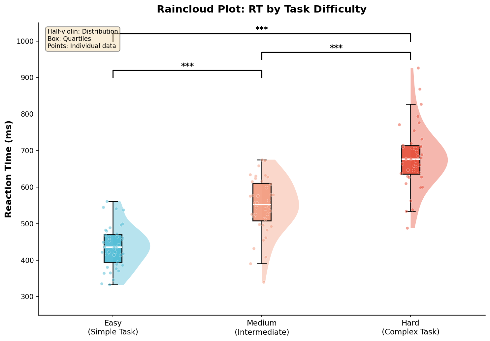

```python
import numpy as np
import matplotlib.pyplot as plt

# ===== 云雨图 (Raincloud Plot) =====
np.random.seed(42)

# 模拟数据：不同条件下的反应时
easy = np.random.normal(450, 60, 40)
medium = np.random.normal(550, 80, 40)
hard = np.random.normal(680, 100, 40)

fig, ax = plt.subplots(figsize=(10, 7))
colors = ['#4DBBD5', '#F39B7F', '#E64B35']  # Nature配色

for i, (data, label, color) in enumerate(zip([easy, medium, hard],
                                               ['Easy', 'Medium', 'Hard'], colors)):
    pos = i + 1

    # 1. 半小提琴图 (云)
    parts = ax.violinplot([data], positions=[pos], showmeans=False,
                          showmedians=False, showextrema=False, vert=True)
    for pc in parts['bodies']:
        pc.set_facecolor(color)
        pc.set_alpha(0.4)

    # 2. 箱线图 (伞)
    bp = ax.boxplot([data], positions=[pos], widths=0.12, patch_artist=True,
                    showfliers=False, vert=True)
    bp['boxes'][0].set_facecolor(color)
    bp['boxes'][0].set_alpha(0.9)
    bp['medians'][0].set(color='white', linewidth=2)

    # 3. 散点图 (雨)
    jitter = np.random.uniform(-0.08, 0.08, len(data))
    ax.scatter(np.ones(len(data)) * pos + jitter, data,
               alpha=0.5, s=20, color=color, edgecolors='white', linewidth=0.5)

# 显著性标注
def add_significance(ax, x1, x2, y, h, text):
    ax.plot([x1, x1, x2, x2], [y, y+h, y+h, y], 'k-', linewidth=1.5)
    ax.text((x1+x2)/2, y+h, text, ha='center', va='bottom', fontsize=12, fontweight='bold')

add_significance(ax, 1, 2, 900, 20, '***')
add_significance(ax, 2, 3, 950, 20, '***')

ax.set_xticks([1, 2, 3])
ax.set_xticklabels(['Easy', 'Medium', 'Hard'])
ax.set_ylabel('Reaction Time (ms)', fontsize=13, fontweight='bold')
ax.set_title('Raincloud Plot: RT by Task Difficulty', fontsize=15, fontweight='bold')
plt.tight_layout()
plt.savefig('raincloud_plot.png', dpi=150, bbox_inches='tight')
plt.show()
```

---

### 1.2 小提琴图 (Violin Plot)

**适用场景**：多组数据分布对比，如Stroop任务不同条件下的反应时。

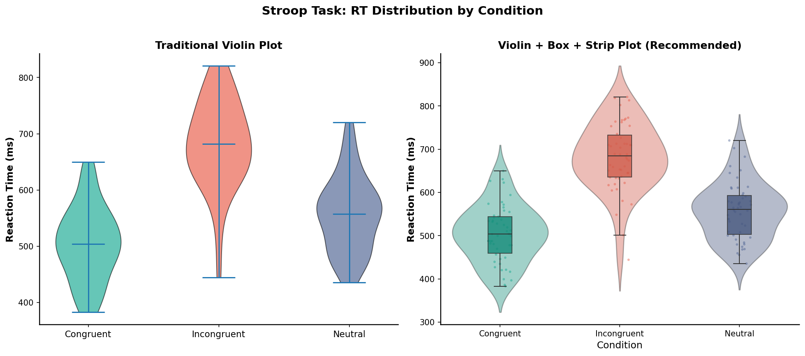

```python
import numpy as np
import matplotlib.pyplot as plt
import seaborn as sns
import pandas as pd

np.random.seed(42)

# 模拟Stroop任务数据
congruent = np.random.normal(520, 70, 50)
incongruent = np.random.normal(680, 90, 50)
neutral = np.random.normal(560, 65, 50)

# 组合数据
df_data = []
for d, label in zip([congruent, incongruent, neutral],
                     ['Congruent', 'Incongruent', 'Neutral']):
    for val in d:
        df_data.append({'Condition': label, 'RT': val})
df = pd.DataFrame(df_data)

fig, ax = plt.subplots(figsize=(10, 6))
colors = ['#00A087', '#E64B35', '#3C5488']

# 小提琴 + 箱线 + 散点组合
sns.violinplot(data=df, x='Condition', y='RT', ax=ax,
               palette=colors, inner=None, alpha=0.4)
sns.boxplot(data=df, x='Condition', y='RT', ax=ax,
            palette=colors, width=0.2, showfliers=False)
sns.stripplot(data=df, x='Condition', y='RT', ax=ax,
              palette=colors, size=3, alpha=0.4, jitter=True)

ax.set_ylabel('Reaction Time (ms)', fontsize=12, fontweight='bold')
ax.set_title('Stroop Task: RT Distribution by Condition', fontsize=14, fontweight='bold')
plt.tight_layout()
plt.savefig('violin_comparison.png', dpi=150)
plt.show()
```

---

### 1.3 学习曲线 (Learning Curve)

**适用场景**：记忆实验、技能学习等随试次/组块变化的数据。

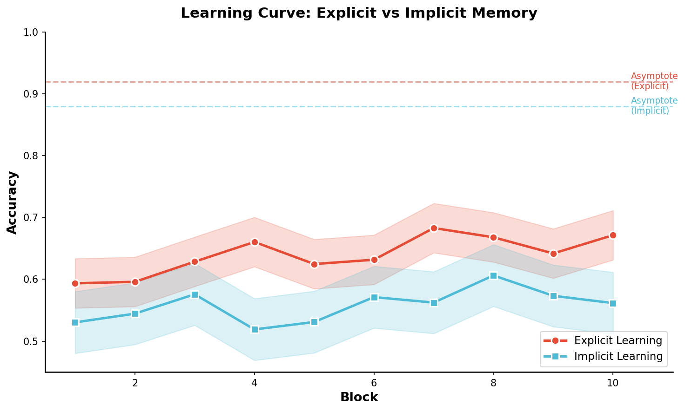

```python
import numpy as np
import matplotlib.pyplot as plt

np.random.seed(42)

blocks = np.arange(1, 11)

# 模拟两组学习曲线（对数增长模型）
explicit_mean = 0.55 + 0.045 * np.log(blocks + 1)
implicit_mean = 0.52 + 0.035 * np.log(blocks + 1)

explicit_data = explicit_mean + np.random.normal(0, 0.025, len(blocks))
implicit_data = implicit_mean + np.random.normal(0, 0.03, len(blocks))

fig, ax = plt.subplots(figsize=(10, 6))

# 填充区域（标准误）
ax.fill_between(blocks, explicit_data - 0.04, explicit_data + 0.04,
                alpha=0.2, color='#E64B35')
ax.fill_between(blocks, implicit_data - 0.05, implicit_data + 0.05,
                alpha=0.2, color='#4DBBD5')

# 主曲线
ax.plot(blocks, explicit_data, 'o-', color='#E64B35', linewidth=2.5,
        markersize=8, label='Explicit Learning', markeredgecolor='white')
ax.plot(blocks, implicit_data, 's-', color='#4DBBD5', linewidth=2.5,
        markersize=8, label='Implicit Learning', markeredgecolor='white')

ax.set_xlabel('Block', fontsize=13, fontweight='bold')
ax.set_ylabel('Accuracy', fontsize=13, fontweight='bold')
ax.set_title('Learning Curve: Explicit vs Implicit Memory', fontsize=15, fontweight='bold')
ax.legend(loc='lower right')
ax.set_ylim(0.45, 1.0)
plt.tight_layout()
plt.savefig('learning_curve.png', dpi=150)
plt.show()
```

---

### 1.4 信号检测论 ROC曲线

**适用场景**：信号检测任务、记忆再认任务等，评估被试的辨别能力。

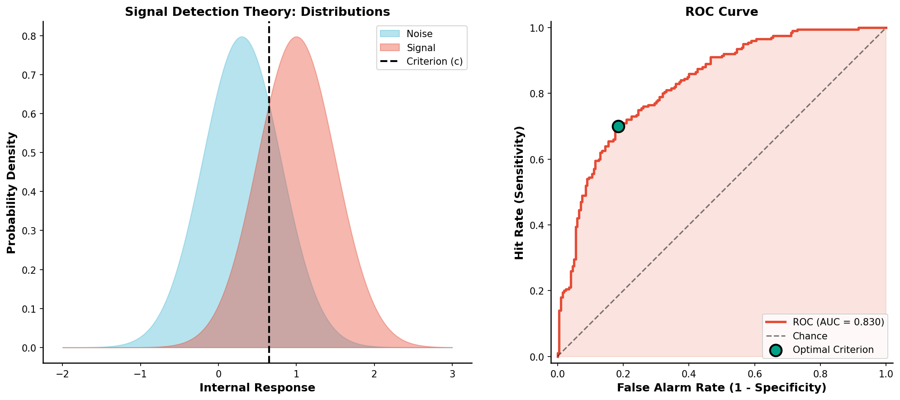

```python
import numpy as np
import matplotlib.pyplot as plt
from sklearn.metrics import roc_curve, auc
from scipy import stats

np.random.seed(42)

# 模拟信号和噪声分布
signal = np.random.normal(1.0, 0.5, 200)
noise = np.random.normal(0.3, 0.5, 200)

# 计算ROC曲线
y_true = np.concatenate([np.ones(200), np.zeros(200)])
y_scores = np.concatenate([signal, noise])
fpr, tpr, thresholds = roc_curve(y_true, y_scores)
roc_auc = auc(fpr, tpr)

fig, ax = plt.subplots(figsize=(8, 8))

ax.plot(fpr, tpr, color='#E64B35', linewidth=2.5,
        label=f'ROC (AUC = {roc_auc:.3f})')
ax.plot([0, 1], [0, 1], 'k--', linewidth=1.5, alpha=0.5, label='Chance')

# 最优点
j_scores = tpr - fpr
optimal_idx = np.argmax(j_scores)
ax.scatter(fpr[optimal_idx], tpr[optimal_idx], s=150, c='#00A087',
           edgecolors='black', linewidth=2, zorder=5, label='Optimal Criterion')

ax.fill_between(fpr, tpr, alpha=0.15, color='#E64B35')
ax.set_xlabel('False Alarm Rate', fontsize=12, fontweight='bold')
ax.set_ylabel('Hit Rate', fontsize=12, fontweight='bold')
ax.set_title('Signal Detection Theory: ROC Curve', fontsize=14, fontweight='bold')
ax.legend(loc='lower right')
ax.set_aspect('equal')
plt.tight_layout()
plt.savefig('sdt_roc.png', dpi=150)
plt.show()
```

---

### 1.5 带误差线的柱状图

**适用场景**：正确率、评分等汇总数据的组间比较。

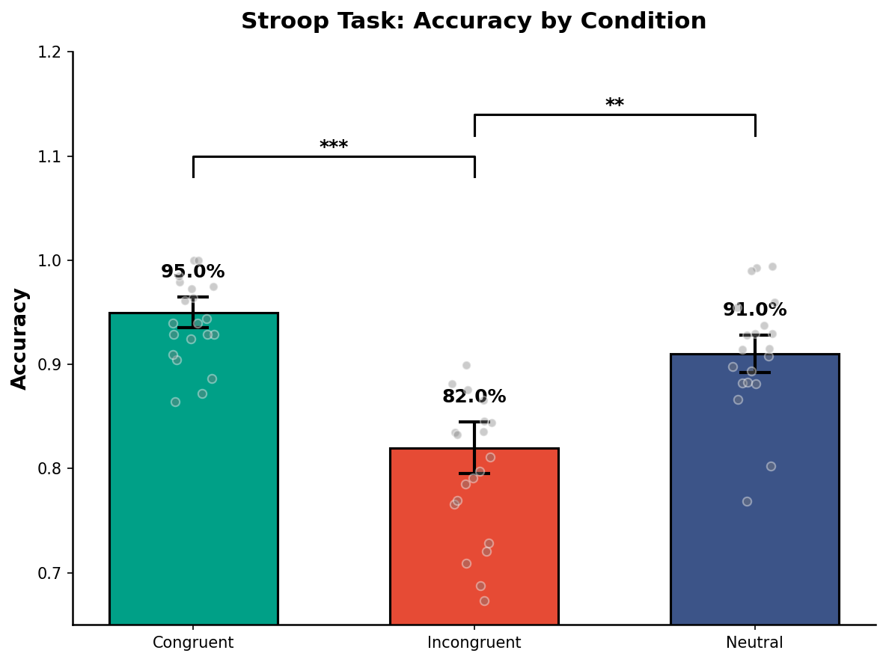

```python
import numpy as np
import matplotlib.pyplot as plt

np.random.seed(42)

conditions = ['Congruent', 'Incongruent', 'Neutral']
means = [0.95, 0.82, 0.91]
sems = [0.015, 0.025, 0.018]  # 标准误

fig, ax = plt.subplots(figsize=(8, 6))
colors = ['#00A087', '#E64B35', '#3C5488']

bars = ax.bar(conditions, means, yerr=sems, capsize=10,
              color=colors, edgecolor='black', linewidth=1.5, width=0.6,
              error_kw={'linewidth': 2, 'capthick': 2})

# 添加数值标签
for bar, mean, sem in zip(bars, means, sems):
    ax.text(bar.get_x() + bar.get_width()/2, bar.get_height() + sem + 0.015,
            f'{mean:.1%}', ha='center', fontsize=12, fontweight='bold')

# 添加个体数据点
for i, (mean, sem) in enumerate(zip(means, sems)):
    individual = np.random.normal(mean, sem*3, 20)
    individual = np.clip(individual, 0.6, 1.0)
    jitter = np.random.uniform(-0.08, 0.08, 20)
    ax.scatter(np.ones(20) * i + jitter, individual, alpha=0.4, s=30, color='gray')

ax.set_ylabel('Accuracy', fontsize=13, fontweight='bold')
ax.set_title('Stroop Task: Accuracy by Condition', fontsize=15, fontweight='bold')
plt.tight_layout()
plt.savefig('accuracy_barplot.png', dpi=150)
plt.show()
```

---

## 二、fMRI/脑成像可视化

### 2.1 脑区激活图

**适用场景**：展示任务条件下的脑区激活模式。

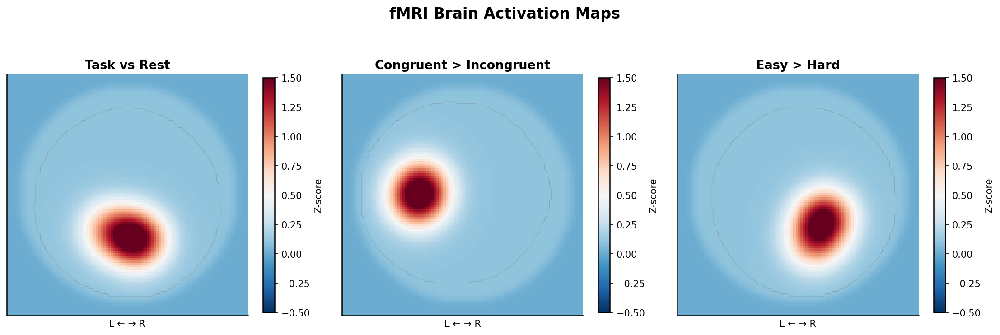

```python
import numpy as np
import matplotlib.pyplot as plt
from scipy.ndimage import gaussian_filter

np.random.seed(42)

fig, axes = plt.subplots(1, 3, figsize=(15, 5))

def create_brain_slice():
    brain = np.zeros((100, 100))
    for i in range(100):
        for j in range(100):
            dist = np.sqrt((i-50)**2 + (j-50)**2)
            if dist < 45:
                brain[i, j] = 0.1
    return brain

conditions = ['Task vs Rest', 'Congruent > Incongruent', 'Easy > Hard']
activation_coords = [(35, 45), (55, 40), (40, 55)]

for idx, (ax, title, coord) in enumerate(zip(axes, conditions, activation_coords)):
    brain = create_brain_slice()

    # 添加激活区域
    y, x = np.ogrid[:100, :100]
    for _ in range(3):
        cy, cx = coord[0] + np.random.randint(-10, 10), coord[1] + np.random.randint(-10, 10)
        activation = np.exp(-((x - cx)**2 + (y - cy)**2) / (2 * 8**2))
        brain += activation * np.random.uniform(0.5, 1.0)

    brain = gaussian_filter(brain, sigma=2)
    im = ax.imshow(brain, cmap='RdBu_r', vmin=-0.5, vmax=1.5, origin='lower')
    plt.colorbar(im, ax=ax, shrink=0.8, label='Z-score')
    ax.set_title(title, fontsize=13, fontweight='bold')
    ax.set_xticks([])
    ax.set_yticks([])

plt.suptitle('fMRI Brain Activation Maps', fontsize=16, fontweight='bold')
plt.tight_layout()
plt.savefig('brain_activation.png', dpi=150)
plt.show()
```

---

### 2.2 功能连接热力图

**适用场景**：展示脑区间的功能连接强度。

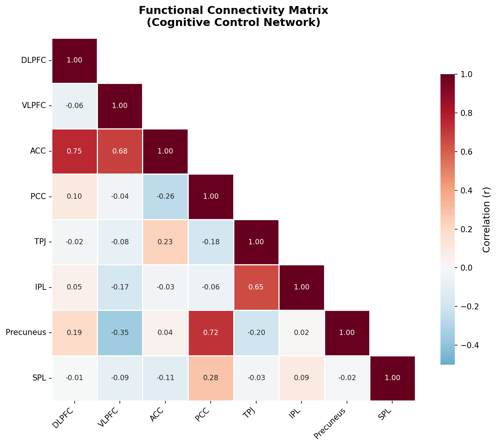

```python
import numpy as np
import matplotlib.pyplot as plt
import seaborn as sns

np.random.seed(42)

regions = ['DLPFC', 'VLPFC', 'ACC', 'PCC', 'TPJ', 'IPL', 'Precuneus', 'SPL']
n = len(regions)

# 模拟功能连接矩阵
conn = np.random.randn(n, n) * 0.2
conn = (conn + conn.T) / 2
np.fill_diagonal(conn, 1.0)

# 添加强连接
conn[0, 2] = conn[2, 0] = 0.75  # DLPFC-ACC
conn[3, 6] = conn[6, 3] = 0.72  # PCC-Precuneus

fig, ax = plt.subplots(figsize=(10, 8))
mask = np.triu(np.ones_like(conn, dtype=bool), k=1)

sns.heatmap(conn, mask=mask, annot=True, fmt='.2f',
            xticklabels=regions, yticklabels=regions,
            cmap='RdBu_r', center=0, vmin=-0.5, vmax=1.0,
            square=True, linewidths=0.5,
            cbar_kws={'shrink': 0.8, 'label': 'Correlation (r)'})

ax.set_title('Functional Connectivity Matrix', fontsize=14, fontweight='bold')
plt.xticks(rotation=45, ha='right')
plt.tight_layout()
plt.savefig('functional_connectivity.png', dpi=150)
plt.show()
```

---

### 2.3 脑网络可视化

**适用场景**：展示脑网络拓扑结构。

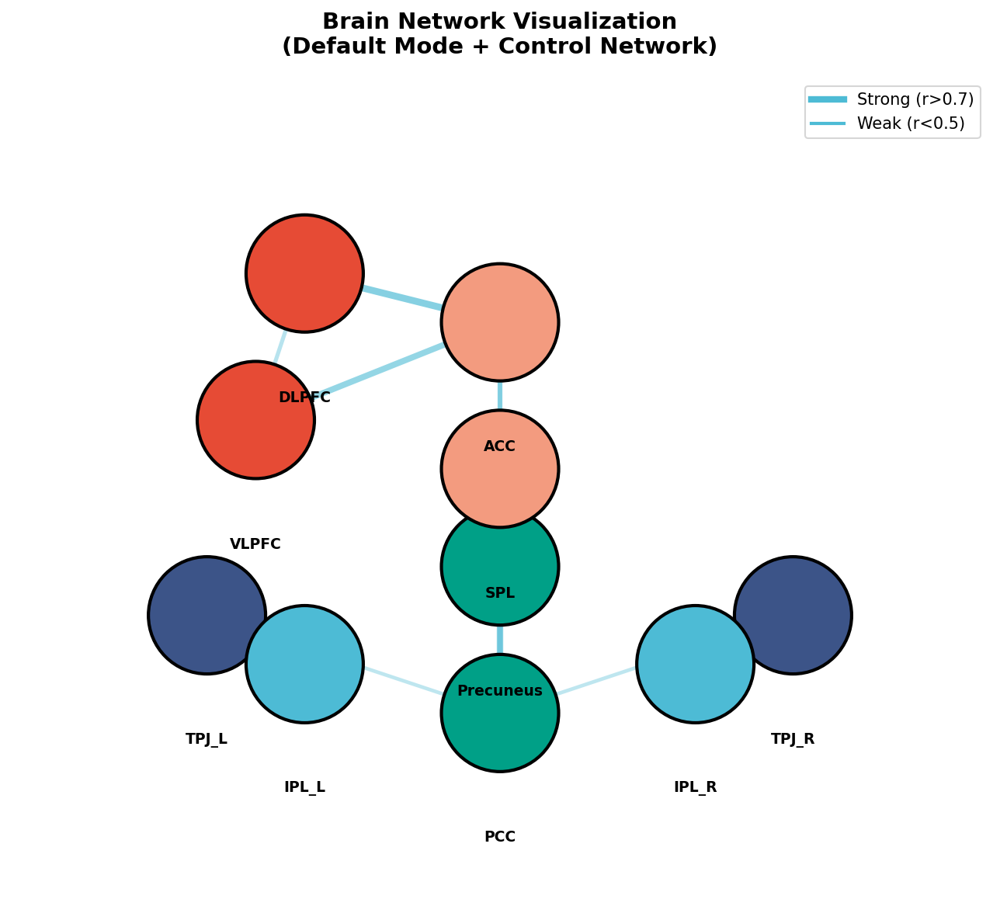

```python
import numpy as np
import matplotlib.pyplot as plt

np.random.seed(42)

fig, ax = plt.subplots(figsize=(10, 8))

# 定义节点位置
nodes = {
    'DLPFC': (0.3, 0.8), 'VLPFC': (0.25, 0.65), 'ACC': (0.5, 0.75),
    'PCC': (0.5, 0.35), 'TPJ_L': (0.2, 0.45), 'TPJ_R': (0.8, 0.45),
    'Precuneus': (0.5, 0.5), 'SPL': (0.5, 0.6)
}

# 定义连接
edges = [
    ('DLPFC', 'ACC', 0.85), ('VLPFC', 'ACC', 0.75),
    ('ACC', 'PCC', 0.6), ('PCC', 'Precuneus', 0.8),
]

# 绘制连接线
for n1, n2, weight in edges:
    x1, y1 = nodes[n1]
    x2, y2 = nodes[n2]
    ax.plot([x1, x2], [y1, y2], color='#4DBBD5',
            linewidth=weight*5, alpha=weight*0.8)

# 绘制节点
for name, (x, y) in nodes.items():
    circle = plt.Circle((x, y), 0.06, color='#E64B35', ec='black', linewidth=2)
    ax.add_patch(circle)
    ax.text(x, y - 0.1, name, ha='center', fontsize=9, fontweight='bold')

ax.set_xlim(0, 1)
ax.set_ylim(0.15, 1)
ax.set_aspect('equal')
ax.axis('off')
ax.set_title('Brain Network Visualization', fontsize=14, fontweight='bold')
plt.tight_layout()
plt.savefig('brain_network.png', dpi=150)
plt.show()
```

---

## 三、显著性检验可视化

### 3.1 统计检验对比

**适用场景**：展示t检验、配对t检验、方差分析结果。

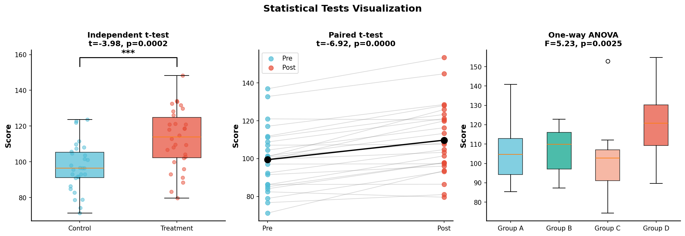

```python
import numpy as np
import matplotlib.pyplot as plt
from scipy import stats

np.random.seed(42)

fig, axes = plt.subplots(1, 3, figsize=(15, 5))

# 1. 独立样本t检验
ax1 = axes[0]
group1 = np.random.normal(100, 15, 30)
group2 = np.random.normal(115, 18, 30)
t_stat, p_value = stats.ttest_ind(group1, group2)

bp = ax1.boxplot([group1, group2], patch_artist=True, widths=0.5)
bp['boxes'][0].set_facecolor('#4DBBD5')
bp['boxes'][1].set_facecolor('#E64B35')

# 显著性标注
y_max = max(group1.max(), group2.max())
ax1.plot([1, 1, 2, 2], [y_max+5, y_max+10, y_max+10, y_max+5], 'k-', linewidth=1.5)
sig = '***' if p_value < 0.001 else '**' if p_value < 0.01 else '*'
ax1.text(1.5, y_max+10, sig, ha='center', fontsize=14, fontweight='bold')
ax1.set_title(f'Independent t-test\nt={t_stat:.2f}, p={p_value:.4f}', fontweight='bold')

# 2. 配对t检验
ax2 = axes[1]
pre = np.random.normal(100, 15, 25)
post = pre + np.random.normal(10, 8, 25)
t_stat2, p_value2 = stats.ttest_rel(pre, post)

for i in range(len(pre)):
    ax2.plot([1, 2], [pre[i], post[i]], 'gray', alpha=0.3)
ax2.scatter(np.ones(25), pre, s=50, color='#4DBBD5', label='Pre')
ax2.scatter(np.ones(25)*2, post, s=50, color='#E64B35', label='Post')
ax2.set_title(f'Paired t-test\nt={t_stat2:.2f}, p={p_value2:.4f}', fontweight='bold')
ax2.legend()

# 3. 单因素方差分析
ax3 = axes[2]
groups = [np.random.normal(100, 15, 20), np.random.normal(110, 15, 20),
          np.random.normal(95, 15, 20), np.random.normal(120, 15, 20)]
f_stat, p_value3 = stats.f_oneway(*groups)

bp3 = ax3.boxplot(groups, patch_artist=True, widths=0.5)
colors = ['#4DBBD5', '#00A087', '#F39B7F', '#E64B35']
for box, color in zip(bp3['boxes'], colors):
    box.set_facecolor(color)
ax3.set_title(f'One-way ANOVA\nF={f_stat:.2f}, p={p_value3:.4f}', fontweight='bold')

plt.suptitle('Statistical Tests Visualization', fontsize=15, fontweight='bold')
plt.tight_layout()
plt.savefig('statistical_comparison.png', dpi=150)
plt.show()
```

---

### 3.2 多重比较校正

**适用场景**：展示Bonferroni校正、FDR校正。

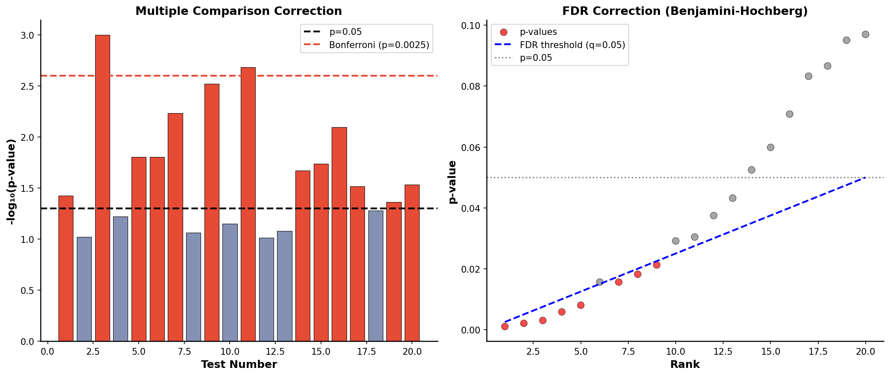

```python
import numpy as np
import matplotlib.pyplot as plt

np.random.seed(42)

fig, axes = plt.subplots(1, 2, figsize=(14, 6))

n_tests = 20
p_values = np.random.uniform(0, 0.1, n_tests)
p_values[2] = 0.001
p_values[8] = 0.003
p_values[15] = 0.008

# 1. p值分布
ax1 = axes[0]
tests = np.arange(1, n_tests + 1)
colors = ['#E64B35' if p < 0.05 else '#8491B4' for p in p_values]

ax1.bar(tests, -np.log10(p_values), color=colors, edgecolor='black', linewidth=0.5)
ax1.axhline(y=-np.log10(0.05), color='black', linestyle='--', linewidth=2, label='p=0.05')
ax1.axhline(y=-np.log10(0.05/n_tests), color='#E64B35', linestyle='--',
            linewidth=2, label=f'Bonferroni (p={0.05/n_tests:.4f})')
ax1.set_xlabel('Test Number', fontweight='bold')
ax1.set_ylabel('-log₁₀(p-value)', fontweight='bold')
ax1.set_title('Multiple Comparison Correction', fontweight='bold')
ax1.legend()

# 2. FDR校正
ax2 = axes[1]
sorted_p = np.sort(p_values)
q = 0.05
n = len(sorted_p)
fdr_threshold = (np.arange(1, n+1) / n) * q

significant = sorted_p <= fdr_threshold
ax2.scatter(np.arange(1, n+1), sorted_p,
            c=['red' if s else 'gray' for s in significant], s=60, alpha=0.7)
ax2.plot(np.arange(1, n+1), fdr_threshold, 'b--', linewidth=2, label=f'FDR threshold (q={q})')
ax2.axhline(y=0.05, color='gray', linestyle=':', linewidth=1.5, label='p=0.05')
ax2.set_xlabel('Rank', fontweight='bold')
ax2.set_ylabel('p-value', fontweight='bold')
ax2.set_title('FDR Correction (Benjamini-Hochberg)', fontweight='bold')
ax2.legend()

plt.tight_layout()
plt.savefig('multiple_comparison.png', dpi=150)
plt.show()
```

---

### 3.3 效应量可视化

**适用场景**：展示Cohen's d等效应量指标。

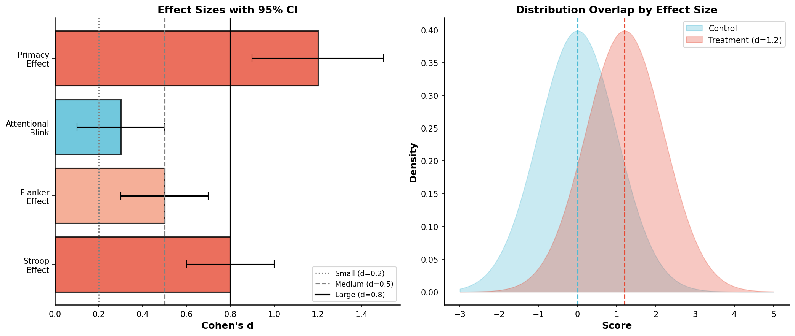

```python
import numpy as np
import matplotlib.pyplot as plt
from scipy import stats

np.random.seed(42)

fig, axes = plt.subplots(1, 2, figsize=(14, 6))

# 1. Cohen's d 森林图
ax1 = axes[0]
conditions = ['Stroop\nEffect', 'Flanker\nEffect', 'Attentional\nBlink', 'Primacy\nEffect']
d_values = [0.8, 0.5, 0.3, 1.2]
ci_lower = [0.6, 0.3, 0.1, 0.9]
ci_upper = [1.0, 0.7, 0.5, 1.5]

colors = ['#E64B35' if d >= 0.8 else '#F39B7F' if d >= 0.5 else '#4DBBD5' for d in d_values]

ax1.barh(np.arange(len(conditions)), d_values,
         xerr=[np.array(d_values)-np.array(ci_lower), np.array(ci_upper)-np.array(d_values)],
         color=colors, edgecolor='black', capsize=5, alpha=0.8)

ax1.axvline(x=0.2, color='gray', linestyle=':', label='Small (d=0.2)')
ax1.axvline(x=0.5, color='gray', linestyle='--', label='Medium (d=0.5)')
ax1.axvline(x=0.8, color='black', linestyle='-', label='Large (d=0.8)')

ax1.set_yticks(np.arange(len(conditions)))
ax1.set_yticklabels(conditions)
ax1.set_xlabel("Cohen's d", fontweight='bold')
ax1.set_title("Effect Sizes with 95% CI", fontweight='bold')
ax1.legend(loc='lower right')

# 2. 分布重叠
ax2 = axes[1]
x = np.linspace(-3, 5, 200)
ax2.fill_between(x, stats.norm.pdf(x, 0, 1), alpha=0.3, color='#4DBBD5', label='Control')
ax2.fill_between(x, stats.norm.pdf(x, 1.2, 1), alpha=0.3, color='#E64B35', label='Treatment (d=1.2)')
ax2.set_xlabel('Score', fontweight='bold')
ax2.set_ylabel('Density', fontweight='bold')
ax2.set_title('Distribution Overlap by Effect Size', fontweight='bold')
ax2.legend()

plt.tight_layout()
plt.savefig('effect_size.png', dpi=150)
plt.show()
```

---

## 四、EEG/ERP可视化

### 4.1 ERP波形图

**适用场景**：展示事件相关电位的时间进程，标注N1、P2、N2、P300等成分。

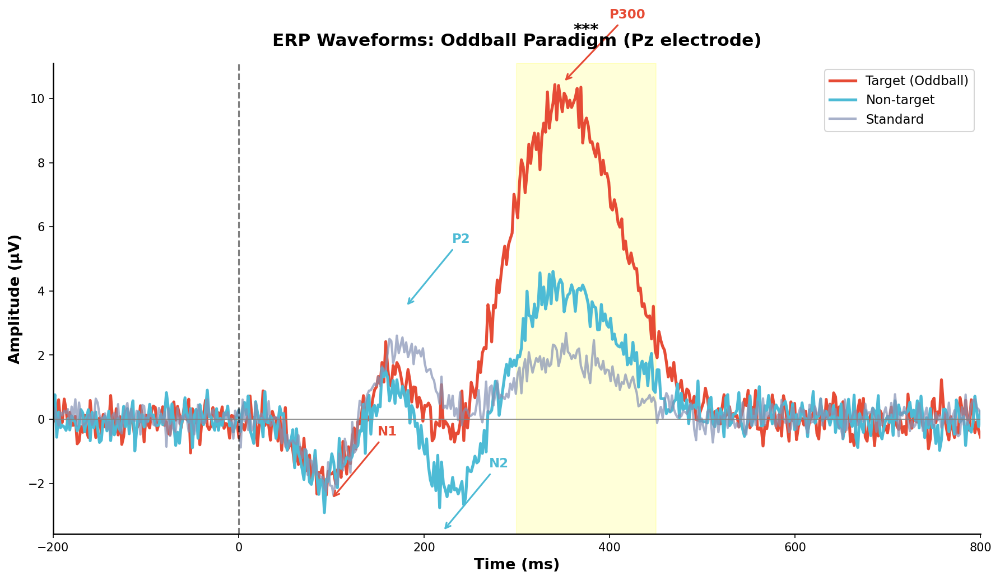

```python
import numpy as np
import matplotlib.pyplot as plt

np.random.seed(42)

fig, ax = plt.subplots(figsize=(12, 7))
times = np.linspace(-200, 800, 500)  # ms

def generate_erp(times, n1_amp=-2, p2_amp=3, n2_amp=-3, p3_amp=8, noise=0.3):
    signal = np.zeros_like(times, dtype=float)
    signal += n1_amp * np.exp(-((times - 100)**2) / (2 * 30**2))
    signal += p2_amp * np.exp(-((times - 180)**2) / (2 * 35**2))
    signal += n2_amp * np.exp(-((times - 220)**2) / (2 * 40**2))
    signal += p3_amp * np.exp(-((times - 350)**2) / (2 * 60**2))
    signal += np.random.randn(len(times)) * noise
    return signal

target = generate_erp(times, p3_amp=10, noise=0.4)
nontarget = generate_erp(times, p3_amp=4, n2_amp=-4, noise=0.4)

ax.plot(times, target, color='#E64B35', linewidth=2.5, label='Target (Oddball)')
ax.plot(times, nontarget, color='#4DBBD5', linewidth=2.5, label='Non-target')

ax.axvline(x=0, color='black', linestyle='--', linewidth=1.5, alpha=0.5)
ax.axhline(y=0, color='gray', linestyle='-', linewidth=0.8)

# ERP成分标注
ax.annotate('P300', xy=(350, 10), xytext=(450, 12),
            fontsize=11, fontweight='bold', color='#E64B35',
            arrowprops=dict(arrowstyle='->', color='#E64B35'))

ax.axvspan(300, 450, alpha=0.15, color='yellow')
ax.text(375, 12, '***', ha='center', fontsize=14, fontweight='bold')

ax.set_xlabel('Time (ms)', fontsize=13, fontweight='bold')
ax.set_ylabel('Amplitude (μV)', fontsize=13, fontweight='bold')
ax.set_title('ERP Waveforms: Oddball Paradigm (Pz electrode)', fontsize=15, fontweight='bold')
ax.legend(loc='upper right', fontsize=11)
plt.tight_layout()
plt.savefig('erp_waveform.png', dpi=150)
plt.show()
```

---

### 4.2 时频分析图

**适用场景**：展示脑电信号的频率成分随时间变化（ERS/ERD）。

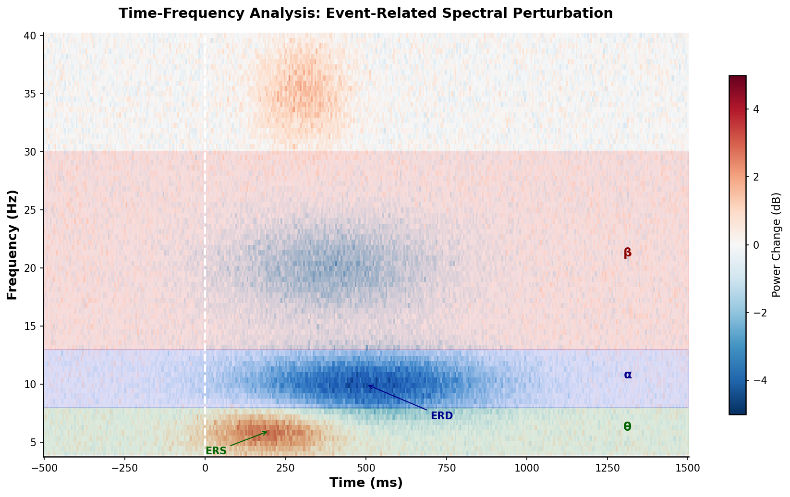

```python
import numpy as np
import matplotlib.pyplot as plt

np.random.seed(42)

fig, ax = plt.subplots(figsize=(12, 7))

times = np.linspace(-500, 1500, 400)
freqs = np.linspace(4, 40, 80)
T, F = np.meshgrid(times, freqs)

# 模拟时频数据
power = np.zeros_like(T)
power += 3 * np.exp(-((F - 6)**2) / (2 * 1.5**2)) * np.exp(-((T - 200)**2) / (2 * 150**2))  # Theta ERS
power -= 4 * np.exp(-((F - 10)**2) / (2 * 2**2)) * np.exp(-((T - 500)**2) / (2 * 300**2))  # Alpha ERD
power -= 2 * np.exp(-((F - 20)**2) / (2 * 3**2)) * np.exp(-((T - 400)**2) / (2 * 250**2))  # Beta ERD

power += np.random.randn(*power.shape) * 0.3

im = ax.pcolormesh(times, freqs, power, cmap='RdBu_r', shading='auto', vmin=-5, vmax=5)
ax.axvline(x=0, color='white', linestyle='--', linewidth=2)

# 频段标注
ax.axhspan(4, 8, alpha=0.1, color='green')
ax.axhspan(8, 13, alpha=0.1, color='blue')
ax.text(1300, 6, 'θ', fontsize=12, fontweight='bold', color='darkgreen')
ax.text(1300, 10.5, 'α', fontsize=12, fontweight='bold', color='darkblue')

plt.colorbar(im, ax=ax, shrink=0.8, label='Power Change (dB)')
ax.set_xlabel('Time (ms)', fontsize=13, fontweight='bold')
ax.set_ylabel('Frequency (Hz)', fontsize=13, fontweight='bold')
ax.set_title('Time-Frequency Analysis: ERSP', fontsize=14, fontweight='bold')
plt.tight_layout()
plt.savefig('time_frequency.png', dpi=150)
plt.show()
```

---

### 4.3 脑地形图 (Topomap)

**适用场景**：展示ERP成分在头皮上的空间分布。

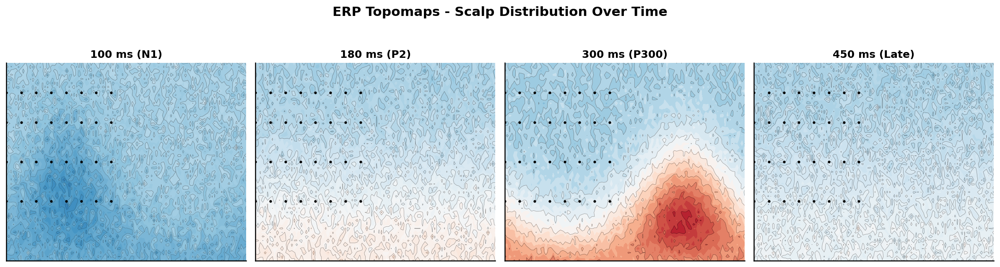

```python
import numpy as np
import matplotlib.pyplot as plt

np.random.seed(42)

fig, axes = plt.subplots(1, 4, figsize=(16, 4))
times = ['100 ms (N1)', '180 ms (P2)', '300 ms (P300)', '450 ms (Late)']

for idx, (ax, title) in enumerate(zip(axes, times)):
    theta = np.linspace(0, 2*np.pi, 100)
    r = np.linspace(0, 1, 50)
    T, R = np.meshgrid(theta, r)

    # 不同时间点的激活模式
    if idx == 0:  # N1 - 额叶
        Z = -2 * np.exp(-((R * np.cos(T) - 0)**2 + (R * np.sin(T) - 0.3)**2) / (2 * 0.3**2))
    elif idx == 1:  # P2 - 中央
        Z = 3 * np.exp(-((R * np.cos(T) - 0)**2 + (R * np.sin(T) - 0)**2) / (2 * 0.35**2))
    elif idx == 2:  # P300 - 顶叶
        Z = 8 * np.exp(-((R * np.cos(T) - 0)**2 + (R * np.sin(T) + 0.2)**2) / (2 * 0.25**2))
    else:
        Z = 2 * np.exp(-((R * np.cos(T) - 0)**2 + (R * np.sin(T) - 0)**2) / (2 * 0.4**2))

    Z += np.random.randn(*Z.shape) * 0.3

    ax.contourf(T, R, Z, levels=20, cmap='RdBu_r', vmin=-5, vmax=10)
    ax.set_title(title, fontsize=12, fontweight='bold')
    ax.set_yticks([])
    ax.set_xticks([])

plt.suptitle('ERP Topomaps - Scalp Distribution Over Time', fontsize=15, fontweight='bold')
plt.tight_layout()
plt.savefig('erp_topomap.png', dpi=150)
plt.show()
```

---

### 4.4 多电极ERP对比

**适用场景**：展示不同电极位置的ERP差异。

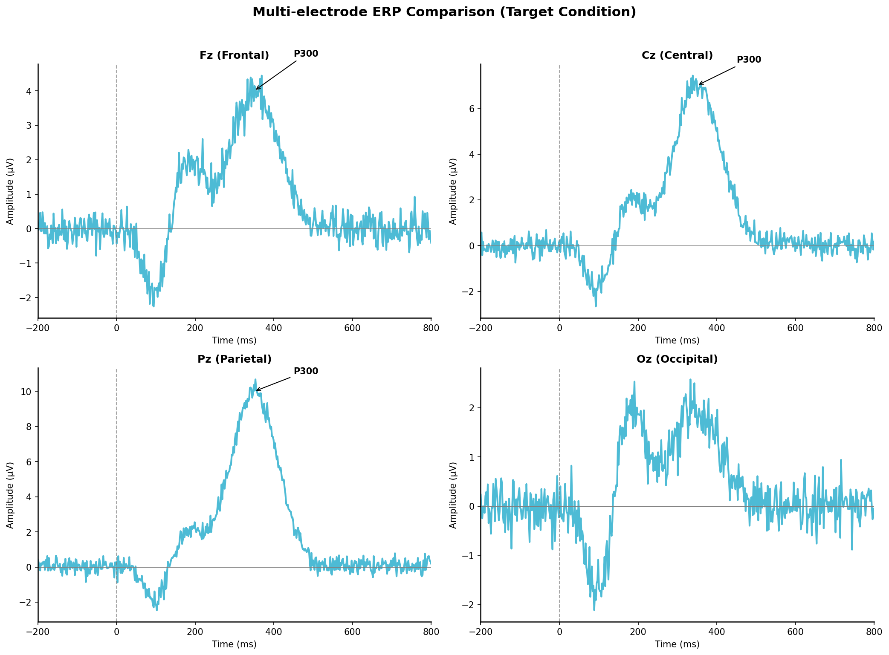

```python
import numpy as np
import matplotlib.pyplot as plt

np.random.seed(42)

fig, axes = plt.subplots(2, 2, figsize=(14, 10))
times = np.linspace(-200, 800, 500)

electrodes = ['Fz (Frontal)', 'Cz (Central)', 'Pz (Parietal)', 'Oz (Occipital)']
p3_amplitudes = [4, 7, 10, 2]

for ax, electrode, p3_amp in zip(axes.flat, electrodes, p3_amplitudes):
    signal = np.zeros_like(times, dtype=float)
    signal += -2 * np.exp(-((times - 100)**2) / (2 * 30**2))
    signal += 2 * np.exp(-((times - 180)**2) / (2 * 35**2))
    signal += p3_amp * np.exp(-((times - 350)**2) / (2 * 60**2))
    signal += np.random.randn(len(times)) * 0.3

    ax.plot(times, signal, color='#4DBBD5', linewidth=2)
    ax.axvline(x=0, color='gray', linestyle='--', linewidth=1, alpha=0.7)
    ax.axhline(y=0, color='gray', linestyle='-', linewidth=0.5)

    if p3_amp > 3:
        ax.annotate('P300', xy=(350, p3_amp), xytext=(450, p3_amp + 1),
                    fontsize=10, fontweight='bold',
                    arrowprops=dict(arrowstyle='->', color='black'))

    ax.set_xlabel('Time (ms)', fontsize=10)
    ax.set_ylabel('Amplitude (μV)', fontsize=10)
    ax.set_title(electrode, fontsize=12, fontweight='bold')

plt.suptitle('Multi-electrode ERP Comparison (Target Condition)', fontsize=15, fontweight='bold')
plt.tight_layout()
plt.savefig('erp_comparison.png', dpi=150)
plt.show()
```

---

## 五、高阶论文图（小红书精选）

> 以下图表类型来自小红书精选笔记，均为Nature/Science级别论文中常见的高阶可视化方法。

### 5.1 带Tukey HSD字母标记的箱线图

**适用场景**：多组比较后展示Tukey HSD事后检验结果，用字母标注组间差异。常见于微生物学、药理学、行为学论文。

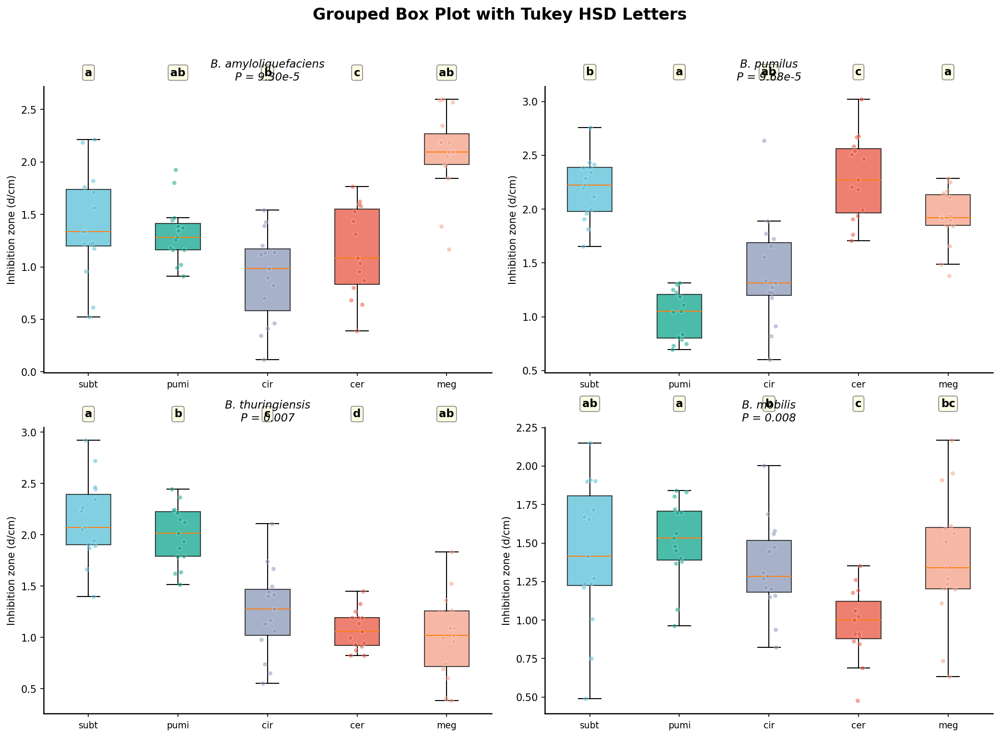

```python
import numpy as np
import matplotlib.pyplot as plt

np.random.seed(42)
fig, axes = plt.subplots(2, 2, figsize=(14, 10))

treatments = ['subt', 'pumi', 'cir', 'cer', 'meg']
colors = ['#4DBBD5', '#00A087', '#8491B4', '#E64B35', '#F39B7F']

for idx, ax in enumerate(axes.flat):
    data = [np.random.normal(np.random.uniform(1.0, 2.2), np.random.uniform(0.2, 0.5), 15)
            for _ in range(5)]
    bp = ax.boxplot(data, patch_artist=True, widths=0.5, showfliers=False)
    for i, (box, color) in enumerate(zip(bp['boxes'], colors)):
        box.set_facecolor(color); box.set_alpha(0.7); box.set_edgecolor('black')
    # 散点
    for i, d in enumerate(data):
        ax.scatter(np.ones(len(d))*(i+1) + np.random.uniform(-0.08,0.08,len(d)),
                   d, alpha=0.5, s=20, color=colors[i], edgecolors='white')
    # 字母标记
    letters = [['a','ab','b','c','ab'],['b','a','ab','c','a']]
    y_max = max([d.max() for d in data]) + 0.2
    for i, letter in enumerate(letters[idx % 2]):
        ax.text(i+1, y_max, letter, ha='center', va='bottom', fontsize=11, fontweight='bold',
                bbox=dict(boxstyle='round,pad=0.2', facecolor='lightyellow', edgecolor='gray', alpha=0.8))
    ax.set_xticklabels(treatments, fontsize=9)
    ax.spines['top'].set_visible(False); ax.spines['right'].set_visible(False)

plt.suptitle('Grouped Box Plot with Tukey HSD Letters', fontsize=16, fontweight='bold')
plt.tight_layout()
plt.savefig('boxplot_letters.png', dpi=150)
plt.show()
```

---

### 5.2 分组小提琴图（带散点）

**适用场景**：展示多组数据的分布形态，内部叠加箱线图和散点，信息密度极高。

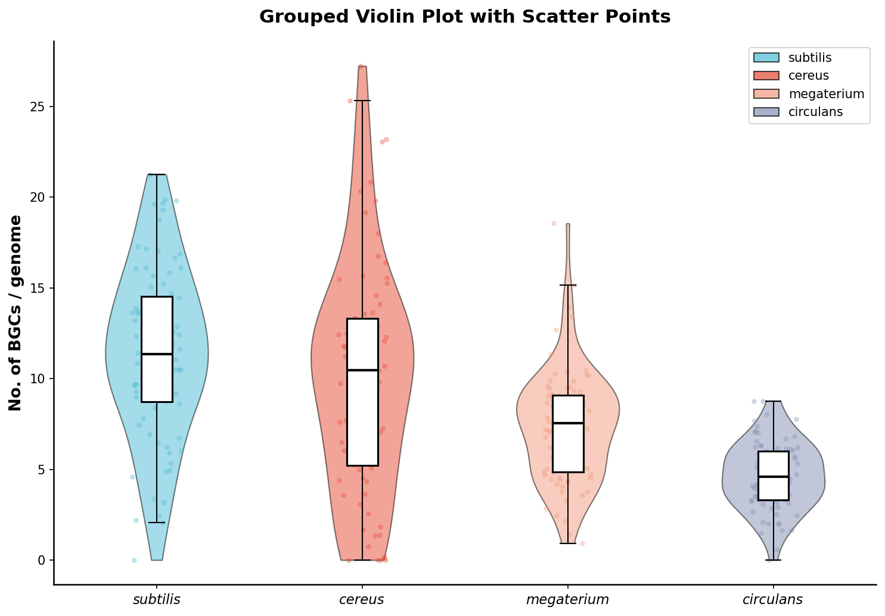

```python
import numpy as np
import matplotlib.pyplot as plt

np.random.seed(42)
fig, ax = plt.subplots(figsize=(10, 7))

groups = ['subtilis', 'cereus', 'megaterium', 'circulans']
colors = ['#4DBBD5', '#E64B35', '#F39B7F', '#8491B4']
data = [np.clip(np.random.normal(m, s, 80), 0, 30)
        for m, s in zip([12, 10, 7, 4.5], [5, 7, 3, 2])]

# 小提琴
parts = ax.violinplot(data, positions=[1,2,3,4], showmeans=False,
                      showmedians=False, showextrema=False)
for i, (pc, color) in enumerate(zip(parts['bodies'], colors)):
    pc.set_facecolor(color); pc.set_alpha(0.5); pc.set_edgecolor('black')

# 箱线
bp = ax.boxplot(data, positions=[1,2,3,4], widths=0.15, patch_artist=True, showfliers=False, zorder=3)
for box in bp['boxes']:
    box.set_facecolor('white'); box.set_edgecolor('black'); box.set_linewidth(1.5)
for m in bp['medians']:
    m.set(color='black', linewidth=2)

# 散点
for i, (d, color) in enumerate(zip(data, colors)):
    ax.scatter(np.ones(len(d))*(i+1) + np.random.uniform(-0.12,0.12,len(d)),
               d, alpha=0.3, s=10, color=color, zorder=2)

ax.set_xticks([1,2,3,4])
ax.set_xticklabels(groups, fontsize=11, fontstyle='italic')
ax.set_ylabel('No. of BGCs / genome', fontsize=13, fontweight='bold')
ax.set_title('Grouped Violin Plot with Scatter Points', fontsize=15, fontweight='bold')
ax.spines['top'].set_visible(False); ax.spines['right'].set_visible(False)
plt.tight_layout()
plt.savefig('grouped_violin.png', dpi=150)
plt.show()
```

---

### 5.3 相关性散点回归图

**适用场景**：展示两个连续变量间的线性关系，包含回归拟合线和置信区间。论文中常附带R²和P值。

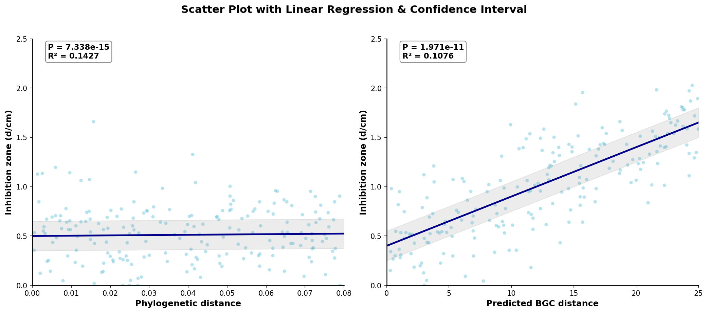

```python
import numpy as np
import matplotlib.pyplot as plt

np.random.seed(42)
fig, axes = plt.subplots(1, 2, figsize=(14, 6))

configs = [
    ('Phylogenetic distance', 'Inhibition zone (d/cm)', 0, 0.08, 0.3, 0.5, '7.338e-15', '0.1427'),
    ('Predicted BGC distance', 'Inhibition zone (d/cm)', 0, 25, 0.05, 0.4, '1.971e-11', '0.1076'),
]

for ax, (xlabel, ylabel, xmin, xmax, slope, intercept, p, r2) in zip(axes, configs):
    x = np.random.uniform(xmin, xmax, 200)
    y = slope * x + intercept + np.random.normal(0, 0.3, 200)
    ax.scatter(x, y, alpha=0.4, s=25, color='#4DBBD5', edgecolors='white', linewidth=0.5)
    x_line = np.linspace(xmin, xmax, 100)
    y_line = slope * x_line + intercept
    ax.plot(x_line, y_line, color='darkblue', linewidth=2.5, zorder=3)
    ax.fill_between(x_line, y_line - 0.15, y_line + 0.15, alpha=0.15, color='gray')
    ax.text(0.05, 0.92, f'P = {p}\nR² = {r2}', transform=ax.transAxes, fontsize=11,
            fontweight='bold', bbox=dict(boxstyle='round', facecolor='white', edgecolor='gray'))
    ax.set_xlabel(xlabel, fontsize=12, fontweight='bold')
    ax.set_ylabel(ylabel, fontsize=12, fontweight='bold')
    ax.spines['top'].set_visible(False); ax.spines['right'].set_visible(False)

plt.suptitle('Scatter Plot with Linear Regression & CI', fontsize=15, fontweight='bold')
plt.tight_layout()
plt.savefig('scatter_regression.png', dpi=150)
plt.show()
```

---

### 5.4 多分类散点回归图

**适用场景**：按分类（如物种、实验条件）着色的散点回归图，同时展示组间关系和整体趋势。

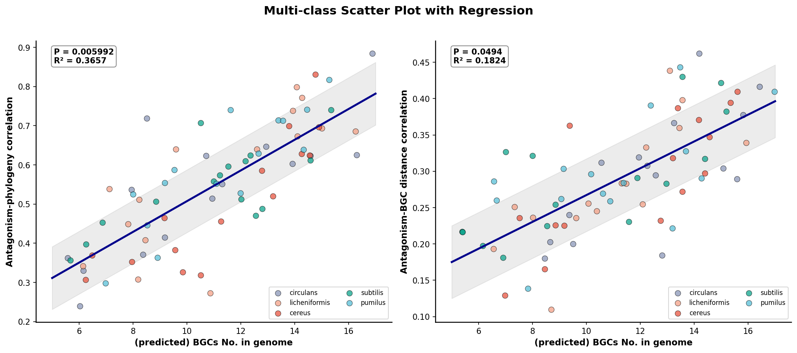

```python
import numpy as np
import matplotlib.pyplot as plt
from scipy import stats

np.random.seed(42)
fig, axes = plt.subplots(1, 2, figsize=(14, 6))

clade_colors = {'circulans': '#8491B4', 'licheniformis': '#F39B7F',
                'cereus': '#E64B35', 'subtilis': '#00A087', 'pumilus': '#4DBBD5'}

for ax in axes:
    x_all, y_all = [], []
    for name, color in clade_colors.items():
        x = np.random.uniform(6, 16, 15) + np.random.normal(0, 1, 15)
        y = 0.04 * x + np.random.normal(0.1, 0.1, 15)
        ax.scatter(x, y, alpha=0.7, s=50, color=color, label=name, edgecolors='black', linewidth=0.5)
        x_all.extend(x); y_all.extend(y)
    slope, intercept, r, p, se = stats.linregress(x_all, y_all)
    x_line = np.linspace(5, 17, 100)
    ax.plot(x_line, slope*x_line + intercept, color='darkblue', linewidth=2.5, zorder=4)
    ax.fill_between(x_line, slope*x_line + intercept - 0.08,
                     slope*x_line + intercept + 0.08, alpha=0.15, color='gray')
    ax.text(0.05, 0.92, f'P = {p:.4f}\nR² = {r**2:.4f}', transform=ax.transAxes,
            fontsize=10, fontweight='bold',
            bbox=dict(boxstyle='round', facecolor='white', edgecolor='gray'))
    ax.legend(fontsize=8, loc='lower right', ncol=2)
    ax.spines['top'].set_visible(False); ax.spines['right'].set_visible(False)

plt.suptitle('Multi-class Scatter with Regression', fontsize=15, fontweight='bold')
plt.tight_layout()
plt.savefig('multiclass_scatter.png', dpi=150)
plt.show()
```

---

### 5.5 棒棒糖图 (Lollipop Chart)

**适用场景**：柱状图的优雅替代方案，用圆点+线条展示排名和数值，适合展示地区/类别对比数据。

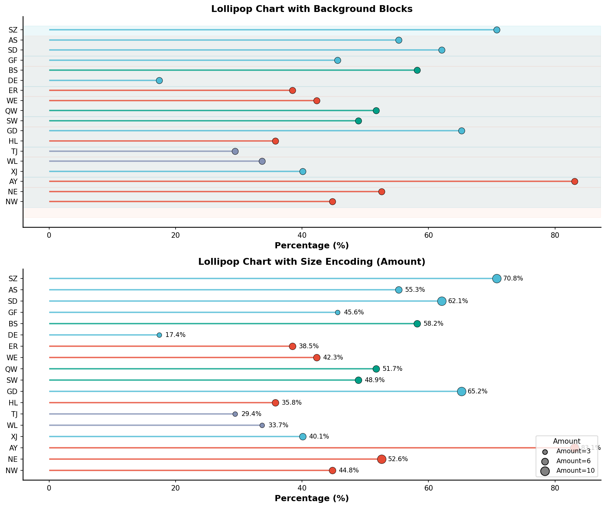

```python
import numpy as np
import matplotlib.pyplot as plt

np.random.seed(42)
fig, axes = plt.subplots(2, 1, figsize=(12, 10))

categories = ['SZ', 'AS', 'SD', 'GF', 'BS', 'DE', 'ER', 'WE', 'QW',
              'SW', 'GD', 'HL', 'TJ', 'WL', 'XJ', 'AY', 'NE', 'NW']
values = [70.8, 55.3, 62.1, 45.6, 58.2, 17.4, 38.5, 42.3, 51.7,
          48.9, 65.2, 35.8, 29.4, 33.7, 40.1, 83.1, 52.6, 44.8]
colors = ['#4DBBD5']*5 + ['#E64B35'] + ['#00A087']*2 + ['#E64B35']*2 + ['#00A087'] + \
         ['#4DBBD5'] + ['#E64B35'] + ['#8491B4']*2 + ['#4DBBD5'] + ['#E64B35']*2 + ['#E64B35']*2

# 上图：带背景色块
ax1 = axes[0]
y_pos = np.arange(len(categories))
for i in range(len(categories)):
    ax1.hlines(y_pos[i], 0, values[i], color=colors[i], linewidth=2, alpha=0.8)
    ax1.scatter(values[i], y_pos[i], color=colors[i], s=80, zorder=3, edgecolors='black', linewidth=0.5)
for i in range(0, len(categories), 3):
    ax1.axhspan(i-0.4, i+2.6, alpha=0.1, color='#4DBBD5')
ax1.set_yticks(y_pos); ax1.set_yticklabels(categories)
ax1.set_xlabel('Percentage (%)', fontsize=12, fontweight='bold')
ax1.set_title('Lollipop Chart with Background Blocks', fontsize=13, fontweight='bold')
ax1.invert_yaxis(); ax1.spines['top'].set_visible(False); ax1.spines['right'].set_visible(False)

# 下图：带数值标签
ax2 = axes[1]
for i in range(len(categories)):
    ax2.hlines(y_pos[i], 0, values[i], color=colors[i], linewidth=2, alpha=0.8)
    ax2.scatter(values[i], y_pos[i], color=colors[i], s=80, zorder=3, edgecolors='black', linewidth=0.5)
    ax2.text(values[i]+1, i, f'{values[i]}%', va='center', fontsize=9)
ax2.set_yticks(y_pos); ax2.set_yticklabels(categories)
ax2.set_xlabel('Percentage (%)', fontsize=12, fontweight='bold')
ax2.set_title('Lollipop Chart with Value Labels', fontsize=13, fontweight='bold')
ax2.invert_yaxis(); ax2.spines['top'].set_visible(False); ax2.spines['right'].set_visible(False)

plt.tight_layout()
plt.savefig('lollipop_chart.png', dpi=150)
plt.show()
```

---

### 5.6 相关性气泡矩阵图 (Correlogram)

**适用场景**：展示多个指标间的相关性结构，用气泡大小表示相关强度，颜色表示正负相关。常包含高相关计数条形图和筛选后矩阵。

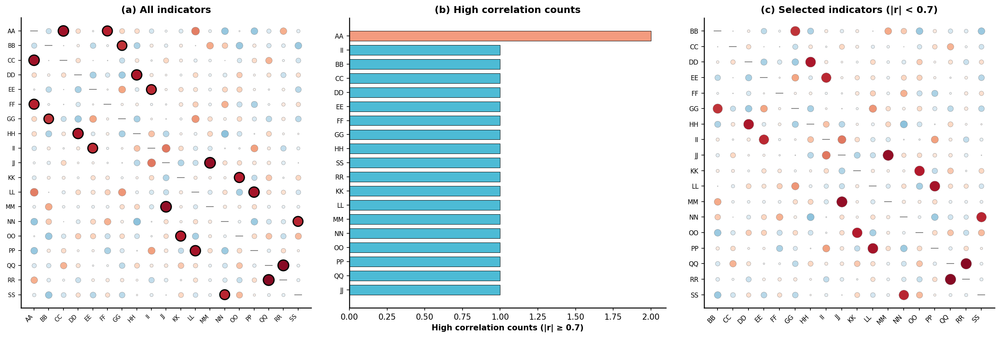

```python
import numpy as np
import matplotlib.pyplot as plt

np.random.seed(42)
labels = ['AA', 'BB', 'CC', 'DD', 'EE', 'FF', 'GG', 'HH', 'II', 'JJ',
          'KK', 'LL', 'MM', 'NN', 'OO', 'PP', 'QQ', 'RR', 'SS']
n = len(labels)

corr = np.random.randn(n, n) * 0.3
corr = (corr + corr.T) / 2
np.fill_diagonal(corr, 0)
corr[0, 2] = corr[2, 0] = 0.85
corr[3, 7] = corr[7, 3] = 0.82
corr[9, 12] = corr[12, 9] = 0.88

fig, axes = plt.subplots(1, 3, figsize=(18, 6))

# (a) 气泡矩阵
ax1 = axes[0]
for i in range(n):
    for j in range(n):
        if i != j:
            r = corr[i, j]
            size = abs(r) * 200
            color = plt.cm.RdBu_r((r + 1) / 2)
            ax1.scatter(j, i, s=size, c=[color], edgecolors='gray', linewidth=0.3)
            if abs(r) >= 0.7:
                ax1.scatter(j, i, s=size, facecolors='none', edgecolors='black', linewidth=1.5)
ax1.set_xticks(range(n)); ax1.set_xticklabels(labels, fontsize=7, rotation=45)
ax1.set_yticks(range(n)); ax1.set_yticklabels(labels, fontsize=7)
ax1.set_title('(a) All indicators', fontsize=12, fontweight='bold')
ax1.invert_yaxis(); ax1.set_aspect('equal')

# (b) 高相关计数
ax2 = axes[1]
counts = [sum(1 for j in range(n) if i != j and abs(corr[i, j]) >= 0.7) for i in range(n)]
sorted_idx = np.argsort(counts)[::-1]
bar_colors = ['#E64B35' if c >= 3 else '#F39B7F' if c >= 2 else '#4DBBD5' for c in [counts[i] for i in sorted_idx]]
ax2.barh(range(n), [counts[i] for i in sorted_idx], color=bar_colors, edgecolor='black', height=0.7)
ax2.set_yticks(range(n)); ax2.set_yticklabels([labels[i] for i in sorted_idx], fontsize=8)
ax2.set_xlabel('High correlation counts (|r| ≥ 0.7)', fontsize=10, fontweight='bold')
ax2.set_title('(b) High correlation counts', fontsize=12, fontweight='bold')
ax2.invert_yaxis(); ax2.spines['top'].set_visible(False); ax2.spines['right'].set_visible(False)

# (c) 筛选后矩阵
ax3 = axes[2]
low_idx = sorted(range(n), key=lambda x: counts[x])[:8]
sub_corr = corr[np.ix_(low_idx, low_idx)]
sub_labels = [labels[i] for i in low_idx]
ns = len(sub_labels)
for i in range(ns):
    for j in range(ns):
        if i != j:
            r = sub_corr[i, j]
            ax3.scatter(j, i, s=abs(r)*200, c=[plt.cm.RdBu_r((r+1)/2)],
                        edgecolors='gray', linewidth=0.3)
ax3.set_xticks(range(ns)); ax3.set_xticklabels(sub_labels, fontsize=8, rotation=45)
ax3.set_yticks(range(ns)); ax3.set_yticklabels(sub_labels, fontsize=8)
ax3.set_title('(c) Selected indicators', fontsize=12, fontweight='bold')
ax3.invert_yaxis(); ax3.set_aspect('equal')

plt.tight_layout()
plt.savefig('correlogram.png', dpi=150)
plt.show()
```

---

### 5.7 脑表面热图

**适用场景**：展示多模态神经科学数据在脑表面的空间分布，如分子表达、组织学、体内成像和元分析结果。

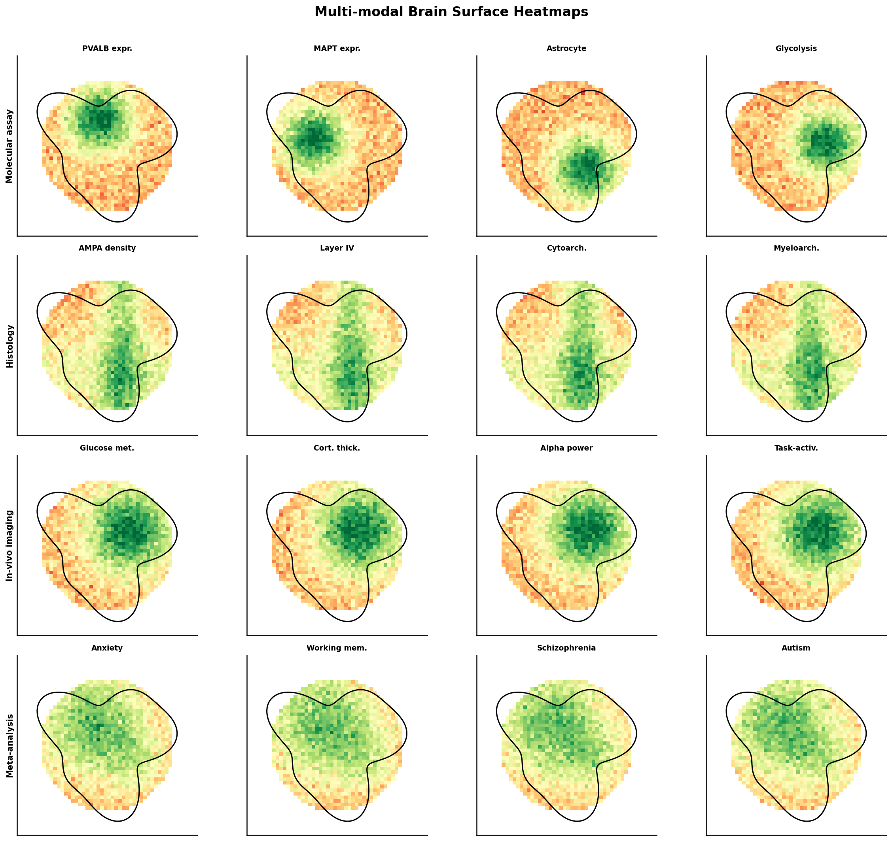

```python
import numpy as np
import matplotlib.pyplot as plt

np.random.seed(42)
fig, axes = plt.subplots(4, 4, figsize=(16, 14))

modalities = ['Molecular assay', 'Histology', 'In-vivo imaging', 'Meta-analysis']
metrics = [['PVALB expr.', 'MAPT expr.', 'Astrocyte', 'Glycolysis'],
           ['AMPA density', 'Layer IV', 'Cytoarch.', 'Myeloarch.'],
           ['Glucose met.', 'Cort. thick.', 'Alpha power', 'Task-activ.'],
           ['Anxiety', 'Working mem.', 'Schizophrenia', 'Autism']]

theta = np.linspace(0, 2*np.pi, 200)
r_base = 0.4 + 0.1*np.sin(3*theta) + 0.05*np.cos(5*theta)
x_brain, y_brain = r_base*np.cos(theta), r_base*np.sin(theta)

for row, (modality, row_metrics) in enumerate(zip(modalities, metrics)):
    for col, metric in enumerate(row_metrics):
        ax = axes[row, col]
        np.random.seed(row*4 + col + 42)
        X, Y = np.meshgrid(np.linspace(-0.6, 0.6, 50), np.linspace(-0.6, 0.6, 50))
        center = np.random.uniform(-0.2, 0.2, 2)
        Z = np.exp(-((X-center[0])**2 + (Y-center[1])**2) / (2*0.15**2))
        Z += np.random.randn(*Z.shape) * 0.1
        Z[np.sqrt(X**2 + Y**2) > 0.45] = np.nan
        ax.pcolormesh(X, Y, Z, cmap='RdYlGn', vmin=-0.5, vmax=1.0, shading='auto')
        ax.plot(x_brain, y_brain, 'k-', linewidth=1.5)
        if col == 0: ax.set_ylabel(modality, fontsize=10, fontweight='bold')
        ax.set_title(metric, fontsize=9, fontweight='bold')
        ax.set_xticks([]); ax.set_yticks([]); ax.set_aspect('equal')

plt.suptitle('Multi-modal Brain Surface Heatmaps', fontsize=16, fontweight='bold')
plt.tight_layout()
plt.savefig('brain_surface_heatmap.png', dpi=150)
plt.show()
```

---

### 5.8 脑网络可视化策略

**适用场景**：对比展示4种脑网络可视化方法：表面映射、低维嵌入、节点属性网络、边属性网络。

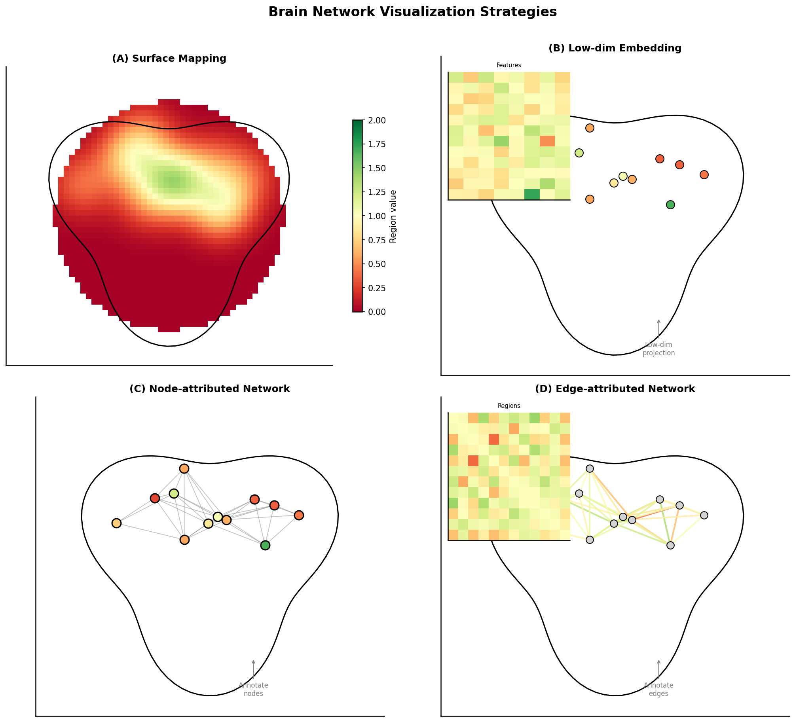

```python
import numpy as np
import matplotlib.pyplot as plt

np.random.seed(42)
fig, axes = plt.subplots(2, 2, figsize=(14, 12))

theta = np.linspace(0, 2*np.pi, 100)
r = 0.4 + 0.08*np.sin(3*theta)
x_brain, y_brain = r*np.cos(theta), r*np.sin(theta)

n_nodes = 12
angles = np.linspace(0.2, 2.8, n_nodes)
node_r = np.random.uniform(0.1, 0.35, n_nodes)
node_x, node_y = node_r*np.cos(angles), node_r*np.sin(angles)
node_values = np.random.uniform(0, 1, n_nodes)
cmap = plt.cm.RdYlGn

strategies = ['(A) Surface Mapping', '(B) Low-dim Embedding',
              '(C) Node-attributed Network', '(D) Edge-attributed Network']

for idx, (ax, title) in enumerate(zip(axes.flat, strategies)):
    ax.plot(x_brain, y_brain, 'k-', linewidth=1.5)
    if idx == 0:  # Surface
        X, Y = np.meshgrid(np.linspace(-0.5,0.5,50), np.linspace(-0.5,0.5,50))
        Z = sum(nv*np.exp(-((X-nx)**2+(Y-ny)**2)/(2*0.08**2))
                for nx, ny, nv in zip(node_x, node_y, node_values))
        Z[np.sqrt(X**2+Y**2) > 0.42] = np.nan
        ax.pcolormesh(X, Y, Z, cmap='RdYlGn', vmin=0, vmax=2, shading='auto')
    elif idx == 1:  # Embedding
        for nx, ny, nv in zip(node_x, node_y, node_values):
            ax.scatter(nx, ny, s=100, c=[cmap(nv)], edgecolors='black', linewidth=1, zorder=3)
    elif idx == 2:  # Node-attributed
        for i in range(n_nodes):
            for j in range(i+1, n_nodes):
                if np.sqrt((node_x[i]-node_x[j])**2+(node_y[i]-node_y[j])**2) < 0.25:
                    ax.plot([node_x[i],node_x[j]], [node_y[i],node_y[j]], 'gray', linewidth=0.8, alpha=0.5)
        for nx, ny, nv in zip(node_x, node_y, node_values):
            ax.scatter(nx, ny, s=120, c=[cmap(nv)], edgecolors='black', linewidth=1.5, zorder=3)
    else:  # Edge-attributed
        conn = np.random.randn(n_nodes, n_nodes)*0.3; conn = (conn+conn.T)/2; np.fill_diagonal(conn, 0)
        for i in range(n_nodes):
            for j in range(i+1, n_nodes):
                if np.sqrt((node_x[i]-node_x[j])**2+(node_y[i]-node_y[j])**2) < 0.25:
                    ax.plot([node_x[i],node_x[j]], [node_y[i],node_y[j]],
                            color=cmap((conn[i,j]+1)/2), linewidth=2, alpha=0.8)
        for nx, ny in zip(node_x, node_y):
            ax.scatter(nx, ny, s=80, color='lightgray', edgecolors='black', linewidth=1, zorder=3)

    ax.set_title(title, fontsize=12, fontweight='bold')
    ax.set_xticks([]); ax.set_yticks([]); ax.set_aspect('equal')
    ax.set_xlim(-0.6, 0.6); ax.set_ylim(-0.55, 0.55)

plt.suptitle('Brain Network Visualization Strategies', fontsize=16, fontweight='bold')
plt.tight_layout()
plt.savefig('brain_network_strategies.png', dpi=150)
plt.show()
```

---

## 六、核心工具库推荐

### 6.1 通用绘图库

| 库名 | 安装 | 适用场景 |
|------|------|---------|
| **Matplotlib** | `pip install matplotlib` | 基础绑图、高度定制 |
| **Seaborn** | `pip install seaborn` | 统计图形、美观默认样式 |
| **Plotly** | `pip install plotly` | 交互式图表 |

### 6.2 神经科学专用库

| 库名 | 安装 | 适用场景 |
|------|------|---------|
| **MNE-Python** | `pip install mne` | EEG/MEG/ERP数据处理与可视化 |
| **Nilearn** | `pip install nilearn` | fMRI统计分析与脑图绑制 |
| **NeuroKit** | `pip install neurokit2` | 生理信号处理（ECG, EDA, EEG） |

### 6.3 Nature配色方案

```python
# Nature期刊推荐配色
NATURE_COLORS = {
    'red': '#E64B35',
    'blue': '#4DBBD5',
    'green': '#00A087',
    'purple': '#3C5488',
    'orange': '#F39B7F',
    'gray': '#8491B4',
}

# Okabe-Ito 色盲友好配色
OKABE_ITO = ['#E69F00', '#56B4E9', '#009E73', '#F0E442', '#0072B2', '#D55E00', '#CC79A7']
```

---

## 七、GitHub精选资源

| 项目 | Stars | 说明 | 链接 |
|------|-------|------|------|
| **mne-tools/mne-python** | 3.2k+ | EEG/MEG/ERP 数据处理 | [GitHub](https://github.com/mne-tools/mne-python) |
| **nilearn/nilearn** | 1.2k+ | fMRI 神经影像分析 | [GitHub](https://github.com/nilearn/nilearn) |
| **RainCloudPlots/RainCloudPlots** | 700+ | 雨云图绑制工具 | [GitHub](https://github.com/RainCloudPlots/RainCloudPlots) |
| **neuropsychology/NeuroKit** | 1.5k+ | 生理信号处理 | [GitHub](https://github.com/neuropsychology/NeuroKit) |
| **mwaskom/seaborn** | 14k+ | 统计数据可视化 | [GitHub](https://github.com/mwaskom/seaborn) |
| **psychopy/psychopy** | 2k+ | 心理学实验设计 | [GitHub](https://github.com/psychopy/psychopy) |

---

> **文档信息**
> - 整理时间: 2026-04-27
> - 所有图片均为Python生成，代码可直接运行
> - 依赖安装: `pip install numpy matplotlib seaborn scipy scikit-learn`
